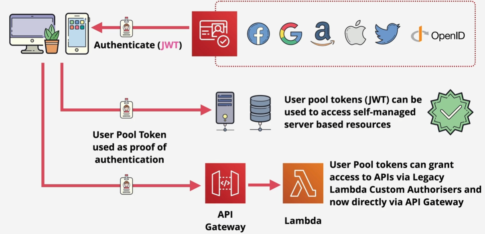
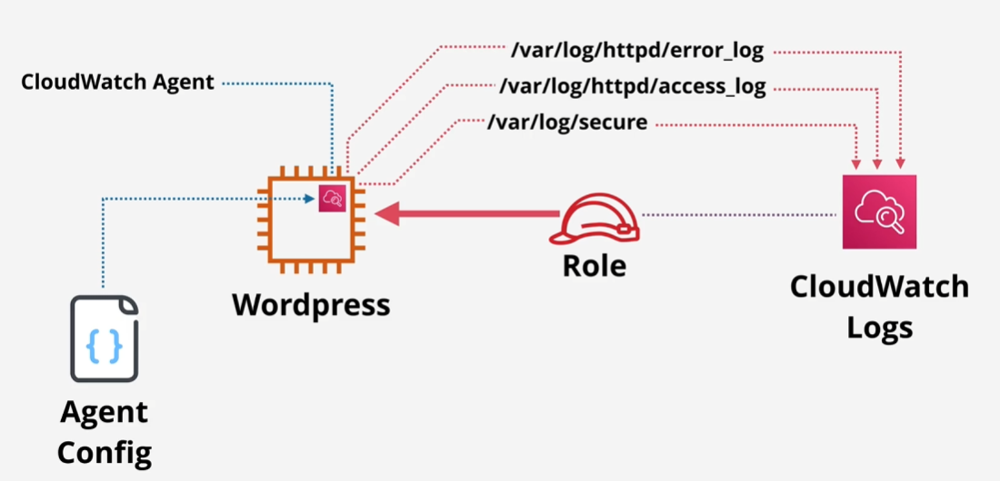
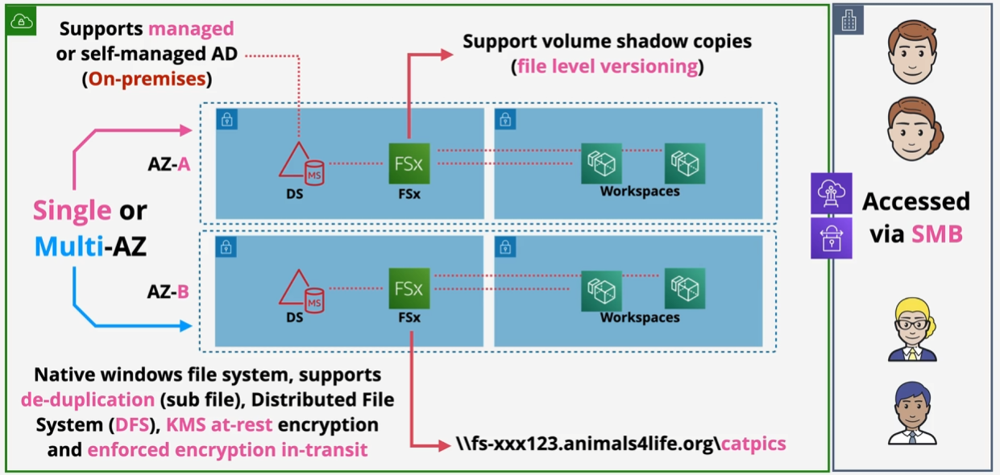
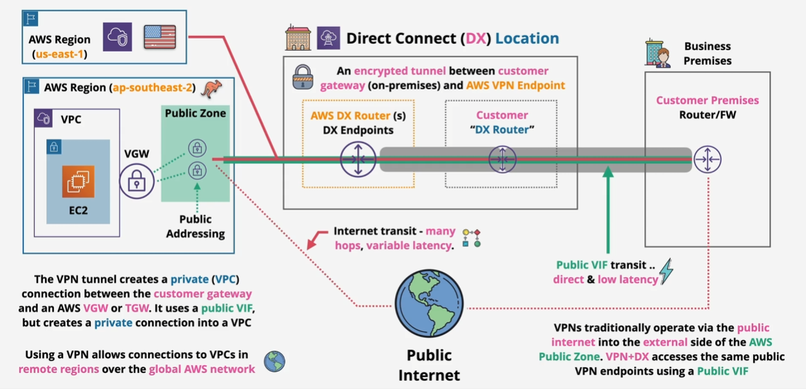
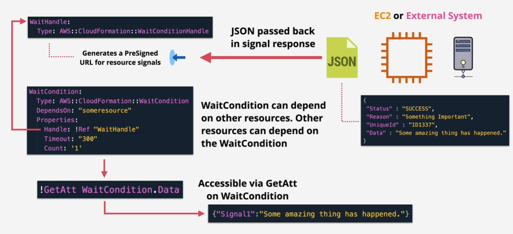

# Foundational Concepts

## Account

Each AWS account has a root user (email) assigned to it with full access. You can create users, groups, and roles with full or limited permissions.

IAM (Identity and Access Management) follows the principle of least privilege - always give minimum required access to users. Each account has its own IAM with a separate database, and data is secured across all AWS regions. 

Components:
- Users: People and applications that need AWS access
- Groups: Collection of related users (e.g., developers)
- Roles: Used by AWS Services or for granting external access when you cannot specifically identify who is accessing
- Policies: Documents that allow or deny access to AWS services when attached to users, groups, or roles

IAM is a global identity provider that authenticates identities and authorizes access to resources. It's free but has creation limits. As a global service, it can survive regional outages. It supports identity federation (e.g., Microsoft or company accounts).

Best practice: Root user should only be used to create an admin IAM user. Afterward, use IAM users for all operations.

IAM Access Keys:
- Long-term credentials requiring manual rotation
- Each user can have up to two access keys (active or inactive)
- Composed of Access Key ID and Secret Access Key (viewable only once at creation)
- To rotate: Create new key, update applications, then delete old key


## Public vs Private Services
Public and private refer only to networking. Private services running in a VPC can only be accessed from within the VPC or by those granted access.

Three zones:
- Public internet
- VPC AWS (private) - Can connect to on-premises networks
- AWS Public Zone - Not on public internet but connected to it. Hosts public services like S3


## Global Infrastructure
AWS infrastructure is distributed across global regions. Services typically operate in specific regions.

Edge locations are smaller facilities offering content delivery points, located in more places than full regions (e.g., Netflix content caching).

Geographic and geopolitical separation provides fault tolerance and performance control.

Regions are identified by region code or region name.

Each region has multiple availability zones (AZs) providing isolated infrastructure within the region (local fault tolerance).

Resilience levels:
- Globally resilient (requires global outage) - e.g., IAM
- Region resilient - Services operate in single regions but can replicate data between regions
- AZ resilient - Resilient only to single AZ outages

### ARN (Amazon Resource Name)


#### Key Differences:
- `/*` refers to **objects** within a resource.
- Without `/*` refers to the **resource itself**.


### Virtualization 

Virtualization allows multiple operating systems to run on the same hardware.

#### Traditional System Execution 
- The kernel of an OS runs in **privileged mode**. 
- Applications run in **user mode** and need to use system calls to interact with hardware. 

#### Virtualization Types 
1. **Software Virtualization** 
   - A hypervisor (running on a host OS) emulates hardware for the guest OS.  
   - The guest OS still thinks it's making system calls, but the hypervisor intercepts and translates them (binary translation). 
   - **Downside:** This method is **slow** due to the translation overhead. 

2. **Para-Virtualization** 
   - The guest OS is **modified** to use hypercalls instead of system calls. 
   - Requires OS support but improves performance compared to software virtualization. 

3. **Hardware-Assisted Virtualization** 
   - The CPU is **virtualization-aware** (Intel VT-x or AMD-V). 
   - The hardware natively supports multiple OS instances and redirects system calls to the hypervisor. 
   - **Much faster than software virtualization.** 

4. **SR-IOV (Single Root I/O Virtualization)** 
   - Used for **networking and hardware acceleration**. 
   - Hardware components (e.g., network cards) create multiple virtual network interfaces. 
   - **Bypasses the hypervisor, improving network performance.** 


## Shared Responsibility Model

Understanding management responsibilities is critical.


- AWS is responsible for **security OF the cloud** (global infrastructure and software).
- Customers are responsible for **security IN the cloud** (configurations, data, and access management).


## High Availability & Scaling

### High Availability (HA) vs. Fault Tolerance (FT) vs. Disaster Recovery (DR)

- **High Availability (HA)**: Ensures maximum system uptime with minimal disruptions during recovery (e.g., user re-authentication when switching servers).
- **Fault Tolerance (FT)**: Allows continuous operation despite component failures, preventing disruption (e.g., aircraft systems vs. a car’s spare tire).
- **Disaster Recovery (DR)**: A set of policies, tools, and procedures to restore technology infrastructure after a natural or human-induced disaster.

#### Global Level

At the global level, DNS (Route 53) can distribute traffic based on defined rules and health checks. 

Content Delivery Networks (CDNs) are used to cache content globally as close to the end users as possible. In AWS, this is accomplished using CloudFront.

#### Region Level

At the regional level, there are different tiers. Users typically enter through the web tier, which contains a load balancer or an API Gateway.

The compute tier consists of containers, Lambda functions, etc., which interact with the storage tier or a cache tier before accessing the database tier.


## ACID vs BASE

These are transaction models that follow the **CAP theorem**: **Consistency, Availability, and Partition tolerance (resilience).** You can only pick two at the same time.

- **ACID** = Focuses on **Consistency**
- **BASE** = Focuses on **Availability**

### ACID (Used in RDS)

- **Atomic**: All components of a transaction either succeed or fail together.  
- **Consistent**: Transactions move the database from one valid state to another valid state.  
- **Isolated**: Transactions cannot interfere with each other.  
- **Durable**: Once committed, transactions persist even if the database fails.  

**Transactions in RDS have scaling limitations.**

### BASE (Used in NoSQL)

- **Basically Available**: Read and write operations are available as much as possible but without consistency guarantees.  
- **Soft State**: The database does not enforce consistency; it's up to the developers.  
- **Eventually Consistent**: If you wait long enough, reads will be consistent across all locations.  

BASE offers **very high scalability and performance**. **DynamoDB** follows this model but also provides some ACID functionality through **DynamoDB transactions**.


## Database refresher

- **Column** = Attribute  
- **Row value** = Attribute value  

Key-value databases are very fast and scalable.

**Document database**: Documents have a structure, but each document can have a different structure. Each document has an ID.

**Column databases**: SQL databases are row-based, meaning that to read one value from a row, you need to read the entire row to locate it (**Online Transaction Processing - OLTP**). Column-based databases, on the other hand, store values in columns (e.g., all order IDs are stored together), making them highly efficient for reporting (you can retrieve all values of one category very quickly). AWS uses **Redshift** for this purpose (usually, row-based databases are transformed into column-based ones for analytics). Wide column stores have a partition key and other keys (like DynamoDB in AWS). Every row should have the same key structure. These keys can be grouped into tables. Each row can have attributes, but they can vary from row to row.

**Graph databases** are designed for relationship-based information. You can connect nodes with edges to describe relationships (these edges can also contain data).

## Storage Refresher

- **Direct/local attached storage**: Storage on the EC2 host (instance store) → if hardware fails, data is lost.
- **Network attached storage**: Volumes delivered over the network (EBS) → this is persistent storage.
- **Block storage**: Volume presented as a collection of blocks, no structure, mountable and bootable (OS creates a file system on it) → EBS volume.
- **File storage**: Presented as a file share and has structure, mountable but NOT bootable.
- **Object storage**: Collection of objects, flat structure, NOT mountable and NOT bootable → highly scalable.

### Storage Performance
In AWS, IOPS (Input/Output Operations Per Second) measures the number of operations per second, while throughput measures data transfer rate (MB/s). Block size impacts throughput but does not change the total IOPS, which is determined by the storage type and configuration.


## Docker Refresher

Virtual machines are resource-intensive (consuming significant disk space and memory). With containerization, instead of multiple operating systems, there is just a single OS with a container engine where containers run as processes inside the engine.

A Dockerfile creates a Docker image (it can start from scratch or from a base image). Images contain read-only layers.

A Docker container is a running Docker image with a read/write layer. Two containers from the same base image share the base layers—the difference is just in the read/write layer (which may be just a few MB).

A container registry (e.g., Docker Hub) is a repository for Docker images, and Docker hosts are systems with a Docker engine installed.

## Kubernetes refresher


Pods are the smallest compute unit in Kubernetes, usually following a **one container-one pod** model (pods manage containers inside them). Pods are temporary.  
On every node, besides the container runtime and **kubelet**, the **kube-proxy** runs (a network proxy that coordinates networking), enabling communication inside or outside the cluster.

### Control Plane Components:
- **kube-apiserver:** The front end of the Kubernetes control plane (can be horizontally scaled) that other nodes interact with.
- **etcd:** A highly available key-value store used within the cluster (the main backing store for the cluster, essentially its database).
- **kube-scheduler:** Identifies pods within the cluster with no assigned node and assigns a node based on resource requirements, hardware/software constraints, and policies.
- **kube-controller-manager:** Includes:
  - **Node controller:** Monitors and responds to node outages.
  - **Job controller:** Manages one-off tasks (pods).
  - **Endpoint controller:** Populates endpoints (links services to pods).
  - **Service account and token controller:** Handles account API token creation.
- **Optional: Cloud Controller Manager:** Interacts with the cloud provider.

### Key Concepts:
- **Cluster:** Handles deployment, management, and orchestration.
- **Node:** Provides computing resources; pods are placed on nodes to run.
- **Pods:** Contain one or more containers (usually one pod per container).
- **Services:** Abstractions of pods (a service running on one or more pods).
- **Job:** Ad hoc tasks that create one or more pods until completion.
- **Ingress:** Provides external access to a service (`Ingress -> Routing -> Service -> 1+ Pods`).
- **Ingress Controller:** Used to provide ingress (AWS Load Balancer Controller uses ALB/NLB).
- **Persistent Storage (PV):** A volume whose lifecycle extends beyond any single pod using it.


# Identity, Security & Governance

## IAM (Identity and Access Management)

### IAM Policies

- Grant or deny access to AWS features via IAM policy documents (JSON).
- Each identity can have multiple policies, each containing multiple statements.
- Statement components:
    - `sid`: Optional identifier for readability.
    - `actions`: Service operations (`service:operation`) or wildcards.
    - `resources`: Target resources (specific or wildcards).
    - `effect`: `"Allow"` or `"Deny"`.

#### Policy Evaluation Order:
1. **Explicit Deny** (overrides everything).
2. **Explicit Allow**.
3. **Default Deny** (implicit).

#### Policy Types:
- **Inline Policy**: JSON policy attached directly to a specific user (harder to maintain).
- **Managed Policy**: Standalone policy object assignable to multiple users (preferred method).  
  - You can use **AWS Managed Policies** (predefined by AWS) or create your own **Customer Managed Policies**.

#### Authentication & Authorization:
- In 99% of cases, IAM users are used.
- Authentication via username/password or access keys.
- Authenticated users become "Authenticated Identities."
- Authorization checks permissions for requested actions.

#### Limits:
- Maximum **5,000 IAM users** per AWS account.
- A user can belong to a maximum of **10 groups**.

For larger-scale environments, use **IAM Roles** and/or **identity federation**.

#### Policy Evaluation Logic  

When evaluating permissions, keep the following in mind:  
- Organization SCPs  
- Resource policies  
- IAM permission boundaries  
- Session policies  
- Identity policies  

  

If you are dealing with multiple accounts, both must allow the action (e.g., account A is performing an operation on resources in account B).  

### IAM Groups

- Containers for organizing IAM users.
- No direct login capability.
- Users can belong to multiple groups.
- Support both **inline** and **managed** policies.
- Policy evaluation combines all group and user policies.
- Cannot be referenced as a principal in resource policies.
- No default "all users" group.
- No nested groups.

#### Limits:
- **300 groups per account** (can be increased via a support ticket).

**Important:** Groups are not true identities and cannot be referenced as principals in policies.


### IAM Roles

A distinct identity type in AWS, different from IAM users. While an IAM user represents a single person/principal, **IAM Roles** are designed for:
- Unknown number of principals (beyond the 5,000 user limit).
- Temporary access requirements.
- AWS service permissions.
- Cross-account access.

#### IAM Role Policy Types:
1. **Trust Policy**:
    - Defines which identities can assume the role.
    - When assumed, AWS Security Token Service (STS) creates temporary security credentials via `STS:AssumeRole`.
2. **Permissions Policy**:
    - Defines what the role can do.

#### Common Use Cases:
- **AWS Services**: Lambda functions use execution roles instead of hardcoded credentials.
- **Emergency Access**: "Break Glass" scenarios using emergency roles.
- **Corporate Identity Federation**: Mapping company directory accounts to AWS roles.
- **Mobile Applications**: Role-based access for social media authentication (Google, Facebook, Twitter).
- **Partner Access**: Cross-account permissions for business partners.


#### Key Benefits:
- No credential management required.
- Dynamic security credentials.
- Centralized permission management.
- Scalable beyond IAM user limits.

#### Service-Linked Roles

IAM roles created for specific AWS services (predefined by AWS).  
They are usually created by the service itself, or the service allows you to create them.

- **You cannot delete a service-linked role until it is no longer needed by the service**.
- `PassRole` allows a user to configure a service with a role but **does not grant permission to modify the role** → ensures role separation (you need also permission to add a role to a service).


## AWS Security Token Service (STS)

AWS Security Token Service (STS) generates **temporary security credentials**.  
When you call `sts:AssumeRole`, STS returns:  
- **Access key ID**  
- **Secret access key**  
- **Session token**  

These credentials expire after a set duration (default: 1 hour; maximum varies by service).

Temporary credentials are always requested by an **identity**, which can be:

- **AWS identities** – IAM users or IAM roles within your AWS account.  
- **Federated identities** – External users authenticated through an identity provider (IdP) such as **SAML 2.0**, **OpenID Connect**, or **Amazon Cognito**.  
- **Cross-account roles** – IAM roles in another AWS account that you are allowed to assume.

## AWS Organizations

A service for managing multiple AWS accounts under a single organizational structure.

### Structure:
- A standard AWS account can be converted into a management account (formerly known as the master account).
- Existing AWS accounts can be invited to join as member accounts.
- The organization root sits at the top of the hierarchy.
- The structure contains Organizational Units (OUs) and member accounts.

### Key Benefits:
- **Consolidated billing:** Member accounts' charges roll up to the management account.
- **Volume pricing advantages** across all accounts.
- **Simplified account creation** within the organization.
- **Centralized identity management:**
    - A single account for managing identities.
    - Cross-account access via roles.


### Best Practices:
- Use IAM roles for cross-account access instead of creating separate identities in each AWS account. For example, a company can leverage identity federation to authenticate users into a central account, and then assume roles in other accounts to access resources as needed.
- Structure **OUs** based on business needs (e.g., by department, environment, or function).
- Keep the **management account focused** on organization administration.

If we want to access another user's account (impersonate), and we add this existing account to the organization, we need to add a specific role to this account. This role is created automatically if the account is created within the organization → **OrganizationAccountAccessRole**.


### Service Control Policies (SCPs)

SCPs are JSON policy documents that can be attached to the root container, one or more Organizational Units (OUs), or individual accounts within AWS Organizations. These policies propagate downward through the organization hierarchy.

The **management account** (formerly known as the master account) is never affected by Service Control Policies. Therefore, SCPs should be used to manage permissions in **member accounts**.

SCPs act as **permission boundaries**, limiting what actions can be performed within an account, including restrictions on the root user of member accounts.

SCPs **do not grant permissions** by themselves—they only define the maximum available permissions:

- By default, AWS Organizations includes the **"FullAWSAccess"** SCP, which allows all actions. This prevents SCPs from denying all access by default.
- For stricter control, you can implement an **"allow list"** approach by removing the **"FullAWSAccess"** policy and explicitly defining which services and actions are allowed.

### Control Tower

Provides a quick and easy setup of a multi-account environment (**landing zone**). It orchestrates multiple AWS services to deliver this functionality, including **Organizations, IAM Identity Center, and CloudFormation**. Think of it as AWS Organizations with enhanced capabilities.

#### Key Components:
- **Guardrails**: Detect or enforce rules and standards across all accounts.
- **Account Factory**: Automates and standardizes new account creation.
- **Dashboard**: Provides single-page oversight for the entire organization.


#### Landing Zone

A well-architected multi-account environment based on AWS best practices. It starts with a **Home Region** (from which you can specify additional allowed regions for member accounts).

##### Organizational Structure:
- Creates a **Security OU** containing:
  - **Log Archive Account**
  - **Audit Account**
- **Sandbox OU** for testing with less rigid security controls.

#### Features:
- Uses **IAM Identity Center** (formerly AWS SSO) for single sign-on across multiple accounts and identity federation.
- Enables monitoring and notifications through **CloudWatch and SNS**.

**AWS Control Tower** leverages **AWS Service Catalog** to deploy and manage standardized blueprints—called **Account Factory products**—for provisioning new AWS accounts. These products are preconfigured with guardrails, network settings, and best practices to ensure consistency and compliance across the environment. This allows organizations to automate account creation while maintaining governance and control over configurations.

#### Guardrails

Guardrails are rules that can be categorized as:
- **Mandatory**
- **Strongly recommended**
- **Elective**

They are created thanks to AWS Config. 

##### Types of Guardrails:
- **Preventive**: Stop actions before they occur (**Status: enforced or not enabled**).
- **Detective**: Monitor compliance (**Status: clear, in violation, or not enabled**).

#### Account Factory

Provides automated account provisioning that can be initiated by:
- **Administrators**
- **End users** (with appropriate permissions).

##### Benefits:
- Automatically applies guardrails to new accounts.
- Configures network settings automatically.
- Streamlines the account request and creation process.

## AWS IAM Identity Center

**AWS IAM Identity Center** (formerly AWS Single Sign-On) is a service that enables centralized management of workforce identities across AWS accounts and applications. It allows you to connect to external identity providers (like Microsoft Entra ID / Azure AD or Okta) or create users natively, then assign fine-grained access to AWS accounts, roles, and SAML-enabled applications. IAM Identity Center supports **single sign-on (SSO)** and **federated access**, giving your users one set of credentials to access multiple resources securely.

IAM Identity Center differs from **AWS Organizations**. Organizations manages account structure and policy boundaries, whereas IAM Identity Center manages **who** can access those accounts and **how**.

**AWS Control Tower** builds on Organizations and IAM Identity Center to provide an **opinionated landing zone**. While Organizations and IAM Identity Center provide the building blocks, Control Tower delivers a full **governance framework** out of the box.

In contrast, **Amazon Cognito User Pools** are designed primarily for **customer-facing applications**, allowing developers to add **user sign-up, sign-in, and authentication** to web and mobile apps. Unlike IAM Identity Center, which is for **workforce identity**.


## Key Management Service (KMS)

KMS is extensively used by many different AWS services. It is a **Regional** and **Public** service.

It allows you to manage cryptographic keys (symmetric and asymmetric) and perform cryptographic operations.

Keys never leave KMS, and it provides **FIPS 140-2 L2** (a U.S. security standard).

### KMS Keys
*KMS Keys* (previously called **Customer Master Keys - CMKs**, now a legacy term) are **containers** for the real key. They contain:
- An **ID**
- Creation **date**
- **Policy**
- **Description**
- **State**

Keys can be **generated** or **imported** (or store in CloudHSM), and they can be used for up to **4KB of data** → suitable for encrypting small bits of data or creating other keys. We can assign an **alias** to a key.

Everything stored on disk is **encrypted**, but **in-memory** data could be in **plaintext**.

For decryption, there's **no need to specify the key** manually, as the key ID is embedded in the encrypted data.

KMS enforces **strong role-based separation**, meaning different permissions exist for **managing keys, encrypting, and decrypting**.

### Data Encryption Keys (DEKs)
Another type of key that KMS can generate using KMS keys. DEKs allow encryption of **more than 4KB of data**.

- KMS **does not store DEKs** and does not use them for encryption or decryption—these operations are the responsibility of the consumer.
- When creating a DEK, KMS provides:
  - A **plaintext key** (usable immediately).
  - A **ciphertext version** of the same key (encrypted with the KMS key that generated the DEK).
- The **ciphertext version** can be stored with the encrypted data and later sent to KMS for decryption.
- Once data is encrypted, the **plaintext DEK should be discarded**, ensuring secure storage.

### Key Storage & Management
- By default, **KMS keys remain in the region** where they were created (but **multi-region keys** are available).
- There are two key ownership models:
  1. **AWS-Owned Keys**: Managed by AWS, limited control.
  2. **Customer-Managed Keys (CMKs)**: Fully configurable by the customer (primary focus for security-sensitive applications).

- Both key types support **key material rotation**, but:
  - **AWS-owned keys** have **mandatory** rotation **once a year**.
  - **Customer-managed keys** have **optional** rotation.
  
`GenerateDataKey` API generates a unique data key. `GenerateDataKeyWithoutPlaintext` returns only the encrypted copy of the data key.

### Key Policies
- KMS **key policies** (similar to resource policies) are **mandatory** for every key.
- A key policy must allow AWS to trust the **account**, enabling **IAM policies** for access control. By default, AWS KMS does not automatically grant your AWS account permissions to use a key.
- In **high-security environments**, permissions can be **entirely managed** within the key policy, avoiding broad account-level trust.

## Security

### AWS Config

**AWS Config** records configuration changes to your AWS resources over time. It is useful for auditing changes or checking compliance with standards, but it doesn’t prevent changes.

- It is a regional service but supports cross-region and cross-account aggregation.  
- It can generate SNS notifications and near-real-time events via EventBridge and Lambda.  

When AWS Config is enabled, it stores configuration snapshots and history in an S3 bucket (the Config bucket).

You can create **Config Rules** to evaluate resources and mark them as compliant or noncompliant. These rules often use Lambda functions for custom logic. You can then trigger notifications or EventBridge rules to remediate issues automatically (for example, by running a Lambda function to fix the configuration).


### AWS Macie

**Amazon Macie** is a data security and privacy service that helps you discover, monitor, and protect sensitive data in Amazon S3. It automatically identifies certain categories of data (for example, personally identifiable information).

Macie uses **data identifiers**:
- **Managed identifiers**: Built-in, using machine learning or pattern matching.  
- **Custom identifiers**: Created by you, using regular expressions.  

It detects sensitive data or specific policy violations (for example, if Block Public Access is disabled on a bucket). Macie can be centrally managed across an organization through AWS Organizations or by a Macie administrator inviting member accounts.

### Amazon GuardDuty

**Amazon GuardDuty** provides continuous security monitoring by analyzing supported data sources (such as VPC flow logs, AWS CloudTrail logs, and DNS logs) for suspicious or unauthorized activity. It uses machine learning, anomaly detection, and threat intelligence. If it detects suspicious behavior, GuardDuty generates a finding that can trigger a notification or an event (for example, via EventBridge to invoke a Lambda function).

### Amazon Inspector

**Amazon Inspector** scans your Amazon EC2 instances and container images for vulnerabilities and deviations from best practices. It produces a findings report that can include:

- **Network** assessments (agentless), checking network reachability.  
- **Host-based** assessments (with an agent), checking for Common Vulnerabilities and Exposures (CVE), Center for Internet Security (CIS) benchmarks, and AWS best practices. 


### CloudHSM

**CloudHSM** is a AWS-provisioned hardware security module (HSM). KMS also uses HSMs under the hood, but CloudHSM gives you direct control of a dedicated module.

- CloudHSM is **FIPS 140-2 Level 3** compliant (KMS is primarily Level 2, with some components at Level 3).  
- AWS has no access to the secure area where your keys reside.  

You can use CloudHSM via standard cryptographic APIs such as PKCS#11, Java Cryptography Extensions (JCE), or Microsoft CryptoNG. It doesn’t natively integrate with most AWS services, but you can offload SSL/TLS processing from web servers, among other custom use cases.

KMS can leverage CloudHSM as a **custom key store**, which is useful because KMS itself is more user-friendly and better integrated with AWS services.

CloudHSM runs in a dedicated cluster inside a special VPC. You connect to your own VPC using an Elastic Network Interface (ENI).

### AWS Shield

AWS Shield protects against DDoS attacks. **Shield Standard** (covering layers 3 and 4) is included at no additional cost. It mitigates large volumetric attacks (layer 3) and protocol attacks (layer 4). For layer 7 (application) attacks, you typically pair Shield with AWS WAF (web application firewall).

**Shield Advanced** costs \$3,000 per month for your organization (with a minimum one-year commitment). It must be explicitly enabled (it’s not automatic). It includes cost protection if your environment scales out during a DDoS attack, as well as proactive engagement from AWS. They will contact you if your service is adversely affected by a DDoS attack.


## Amazon Cognito

**Authentication, Authorization, and User Management** for web & mobile applications.

### User Pools (Authentication)
- **Sign-in service** (supports third-party providers like Google, Facebook, etc.).
- **Manages user directories and authentication**.
- **Returns JSON Web Token (JWT)** for authentication.



With adaptive authentication, you can configure your user pool to block suspicious sign-ins or add second factor authentication in response to an increased risk leve

### Identity Pools (Authorization)
- **Provides temporary AWS credentials** for accessing AWS resources.
- **Supports guest users** (unauthenticated access).
- **Can federate identities from external providers** (e.g., Google, Facebook, Amazon, SAML, OpenID Connect).

**Use Case**:  
Instead of managing multiple authentication tokens, Cognito User Pools handle user authentication, while Identity Pools exchange the user tokens for temporary AWS credentials.


## AWS Directory Service

A directory is a store of objects (users, groups, computers) arranged in a hierarchy. In Microsoft environments, multiple domains can be organized into a forest.

AWS Directory Service provides a **managed** directory service running in a VPC, with high availability across multiple AZs. Some AWS services need an AD-like directory to function (e.g., Amazon WorkSpaces).

You can have different modes:

1. **Simple AD**: Based on Samba 4 (for up to 500 or 5000 users, depending on the edition). It’s used standalone (no advanced Microsoft AD features).
2. **AWS Managed Microsoft AD**: A Microsoft Active Directory 2012 instance that can establish trust relationships with an on-premises AD over VPN or Direct Connect (it can also run standalone in AWS).
3. **AD Connector**: A proxy that forwards authentication to your on-premises AD, allowing AWS services to use your existing credentials without storing them in the cloud.

## AWS Artifact
Is a centralized resource within the AWS Management Console that provides on-demand access to AWS's compliance reports and security documentation. 

It allows users to download audit artifacts such as SOC reports, ISO certifications, and PCI reports, helping organizations meet internal security and compliance requirements. 

These reports are securely stored and kept up to date, making it easier for customers to demonstrate their own compliance using AWS infrastructure.


# Compute

## EC2 - Elastic Compute Cloud 
Amazon EC2 is an **Infrastructure as a Service (IaaS)** offering that provides **virtual machines (instances) as the primary cost unit**. It allows customers to provision, manage, and scale compute resources in the AWS cloud.

#### Key Characteristics
- **Instances as the Unit of Cost** – Charges are based on the chosen instance type and billing model. 
- **Private by Default** – Instances launch within a **VPC** and require network configurations for public accessibility. 
- **AZ Resilience** – Each EC2 instance runs in a **single Availability Zone (AZ)**, but **resilience** can be improved using features like **Auto Scaling Groups (ASG)** and **Elastic Load Balancing (ELB)**. 
- **Flexible Deployment** – Users can choose **instance sizes, CPU, RAM, storage, and networking options**. 

#### Billing and Storage Options
- **Billing Models:** On-Demand, Reserved, Spot, Dedicated Hosts, Savings Plans.  
- **Storage Options:** 
  - **Ephemeral Instance Store** (local, non-persistent block storage, lost on stop/terminate). 
  - **Elastic Block Store (EBS)** (persistent storage, attached separately). 

### EC2 Instance States
| State       | Description |
|-------------|------------|
| **Running**  | Full charges apply for compute, network, and storage. |
| **Stopped**  | No costs for CPU, memory, or networking; **EBS storage costs continue**. |
| **Terminated** | Instance is permanently deleted, and all attached instance store data is lost. **EBS volumes with "Delete on Termination" are removed**. |

### Amazon Machine Image (AMI) 

An **AMI (Amazon Machine Image)** is a **blueprint for launching EC2 instances**. It includes: 

- **Instance Configuration** – OS, applications, and settings.  
- **Root Volume** – The boot drive (EBS or instance store).  
- **Block Device Mapping** – Defines attached storage volumes.  
- **Permissions** – AMIs can be **public, private (owner-only), or shared with specific AWS accounts**.  

#### AMI Sources  

An AMI can come from different sources:  
- **AWS-provided**  
- **Community-created**  
- **AWS Marketplace** (may have associated costs)  

#### Key Characteristics  

- **AMIs are regional** – they can only be used in the region where they were created and have unique IDs.  
- **By default, AMIs are private** – they are only accessible by the owner’s AWS account, but can be made public or shared with specific accounts.  
- **AMIs can be created from an existing EC2 instance** – this includes capturing the current configuration.  
- **Creating an AMI involves snapshotting EBS volumes** – the AMI references these snapshots in its block device mapping.  
- **Before an AMI can be used, the instance must pass AWS health checks** (system status check and instance status check).  

#### AMI Creation Process  

- **AMIs cannot be modified directly** – to update an AMI, you must launch an instance from it, apply changes, and create a new AMI.  
- **Creating an AMI from a running instance is possible** – you can choose to skip the reboot, but this is not best practice due to potential data inconsistency.  

  


### Architecture and Resilience

EC2 instances run on **EC2 Hosts** within an **Availability Zone (AZ)**. There are **shared** and **dedicated** hosts. 

- **EC2 Hosts are tied to a single AZ** → If the AZ fails, all instances in it fail. 
- **EBS volumes also reside in a single AZ** → Cannot be accessed from another AZ. 
- **Instances remain on the same host unless:**
  - They are **stopped and restarted** (assigned to a different host in the same AZ). 
  - The underlying hardware fails, requiring migration. 

#### When to Use EC2? 
EC2 is the **default choice** unless specific requirements suggest another service. Best for: 
- Running an OS with applications. 
- Long-running compute workloads. 
- Server-style applications. 
- Workloads with **bursty** or **steady-state** demand. 
- Monolithic applications. 
- Migrated applications and disaster recovery setups. 


### EC2 Instance Types 

Factors that influence selection: 
- **Raw CPU, memory, and local storage.** 
- **Resource ratios** (e.g., more CPU for the price). 
- **Storage and network bandwidth.** 
- **System architecture/vendor support.** 
- **Additional features** (e.g., GPU acceleration). 

#### 5 Global Categories 
1. **General Purpose** – Default choice, balanced resources. 
2. **Compute Optimized** – High-performance computing (HPC), machine learning (more CPU). 
3. **Memory Optimized** – Large in-memory databases, SAP HANA (more RAM).  
4. **Accelerated Computing** – GPUs, FPGAs, specialized hardware. 
5. **Storage Optimized** – High I/O workloads (e.g., analytics, Elasticsearch).  


#### EC2 Naming Convention 
Example: **R5dn.8xlarge** 

| Component | Meaning |
|-----------|---------|
| **R** | Instance family (e.g., R = memory optimized) |
| **5** | Generation (e.g., 5th generation of the R family) |
| **dn** | Additional capabilities (e.g., network/storage enhancements) |
| **8xlarge** | Instance size (nano, micro, small, medium, large, 2xlarge, etc.) |

 

### EC2 Purchase Options (Launch Types)

#### On-Demand (Default)
- **Instances are isolated**, but multiple customers share underlying hardware.
- **Per-second billing** (only charges when running).
- **No capacity reservation**.

#### Spot Instances (Lowest Cost)
- Uses **unused EC2 host capacity**.
- **Significant discounts** but instances terminate if the spot price exceeds the set max.
- **Not suitable for workloads that require persistence**.

#### Reserved Instances
- **Long-term usage commitment (1 or 3 years)**.
- **Reduces per-second costs** (or eliminates them).
- **Must be used** since payment applies regardless of usage.
- **Can be AZ-specific or region-wide**.

##### Payment Options:
1. **All Upfront** – Maximum discount, no per-second charge.
2. **No Upfront** – Minimal discount, per-second billing even when not running.
3. **Partial Upfront** – Mix of upfront and per-second charges.


#### Reserved Instance Types:

1. **Standard Reserved**

   * Offers significant **cost savings** compared to On-Demand instances.
   * Requires **1- or 3-year commitment**.
   * Ideal for **steady-state workloads**.
   * **Unused reservations can be sold** on the **AWS Reserved Instance Marketplace**, allowing you to recoup some cost if your needs change.

2. **Scheduled Reserved**

   * Designed for **predictable, recurring workloads** that do not run continuously.
   * You reserve capacity for **specific time windows** (e.g., every Monday 9 AM–5 PM).
   * **Minimum commitment**: 1 year or 1,200 hours.
   * Cannot be sold on the Marketplace.

3. **Capacity Reservation**

   * Guarantees capacity in a specific Availability Zone **without requiring a long-term financial commitment**.
   * Useful for **short-term, critical workloads** that require availability assurance.
   * **No cost savings** – this is purely for capacity assurance.
   * Priority order for instance allocation: **Reserved → On-Demand → Spot**.


#### Dedicated Options 
- **Dedicated Host**: 
  - Pay for the **entire physical host**.
  - Useful for software **licensed per socket/core**.
  - Can configure instances to stay on the same host. 
  - Dedicated hosts are assigned to specific instance sizes (e.g., a host may only support medium instances). However, Nitro-based instances allow mixing different instance sizes on the same host.
- **Dedicated Instance**: 
  - Pay a **premium for single-tenant hardware**.
  - One-time regional fee.

##### Limitations:
- Certain AMIs (e.g., **SUSE Linux, Windows**) are **not supported**.
- **Amazon RDS is not supported**.
- **Placement groups cannot be used**.

##### Resource Sharing:
- You can **share dedicated hosts** with other accounts in the same organization using the **AWS Resource Access Manager (RAM).**

#### Savings Plans 
- Commit to an **hourly spend** for **1 or 3 years**.

##### Types:
1. **General Compute Savings Plan** 
   - **Up to 66% discount** (covers EC2 and Lambda).
   - Example: **$20/hour commitment for 3 years**.
   - Normal pricing applies beyond commitment. 
2. **EC2 Savings Plan** 
   - **Applies only to EC2**.
   - **Up to 72% discount**.


### Instance Status Checks and Auto Recovery

Two status checks for each instance (shown as 2/2 checks passed):

1. **System Status Check:** Monitors for:
   - Loss of system power
   - Loss of network connectivity
   - Host software/hardware issues

2. **Instance Status Check:** Monitors for:
   - Corrupted file system
   - Incorrect instance configuration
   - Incompatible network configuration

#### Auto Recovery:
- Triggers if a system status check fails
- Moves the instance to another host and attempts recovery
- Implemented as an alarm action (can also trigger reboot or other actions)

##### Limitations:
- Doesn't work with instance store volumes
- Only available for certain EC2 instance types

#### Additional Protection:
- Termination protection can be enabled for critical EC2 instances
- Requires separate permissions for better role separation

### Horizontal vs Vertical Scaling

#### Vertical Scaling
- Involves increasing the size of an EC2 instance
- Requires a reboot (causing temporary downtime)
- Cost increases non-linearly
- Limited by the maximum instance size available

#### Horizontal Scaling
- Can add multiple instances
- No downtime during scaling
- No upper limit on scaling
- Generally more cost-effective

##### Requirements:
- Requires a load balancer
- Session management considerations:
  - The application must support distributed sessions
  - Alternatively, implement off-host session management (e.g., using a database or cache)


### Instance Metadata
Instance Metadata Service provides data about the instance, including:
  - Instance configuration
  - Environment details
  - Networking information (including public IP)
  - Authentication data
  - User data

#### Access:
- Available at: `http://169.254.169.254/latest/meta-data`
- **Security Warning:** Metadata is not authenticated or encrypted
- Not reachable outside the EC2 instance (link-local address)


### Bootstrapping

Bootstrapping automates system configuration, allowing an EC2 instance to self-configure at launch.

#### User Data
- Provided to an EC2 instance at launch
- Can be accessed via: `http://169.254.169.254/latest/user-data` 
- Executed only **once** (if defined as script) at instance launch (not on reboot)
- Runs as the **root** user
- Not validated, so incorrect scripts can cause configuration failures
- **Security Warning:** User data is not secure—anyone with instance access can view it 

#### User Data Limitations:
- Maximum size: **16 KB** (for larger scripts, pass a script that downloads additional content)
- Can be modified while the instance is **stopped**, but it still executes only at launch

#### Boot Time to Service Availability
- Boot time + post-launch configuration can delay service availability
- Reduce boot time using:
  - Bootstrapping (configures the instance at launch)
  - AMI baking (pre-configuring instances with required software)
  - A combination of both for flexibility
  -
#### CloudFormation Init (cfn-init)
- Another method for passing complex configurations to EC2 instances
- Classified as a helper script

##### Comparison:
- **User Data:** Procedural execution
- **cfn-init:** Defines a desired final state (but can also be procedural)
- CloudFormation provides metadata, and `cfn-init` reads directives from the CloudFormation stack


- `cfn-init` can monitor CloudFormation metadata for updates and adjust the instance accordingly
- Supports post-launch verification—CloudFormation waits for a success signal


### EC2 Instance Roles and Profiles

#### What Are EC2 Roles?
- IAM roles that EC2 instances can assume to access AWS services securely

#### Instance Profiles:
- Wrappers around roles that allow attachment to EC2 instances
- If using CloudFormation, you must create both the **role** and **instance profile** (UI does this automatically)

#### How Instance Roles Work:
- When an EC2 instance assumes a role, it receives **temporary credentials**
- These credentials are delivered via **instance metadata** and are **automatically rotated** (so they never expire)

### Logging

What if we need to monitor activities inside the instance? By default, CloudWatch cannot capture data inside an EC2 instance. To achieve this, we need to install and configure the CloudWatch Agent with the necessary permissions.



### EC2 Placement Groups

When you launch an instance, AWS determines its placement within the selected location. Placement groups allow you to influence this placement decision.  

#### Three types:

- **Cluster:** Packs instances close together.
  - Launch all instances at the same time to ensure they are placed in the same location (if you launch additional instances later, there might not be enough resources available in the current host).
  - You do not specify an AZ; AWS allocates it at the first launch.
  - Enables up to **100 Gbps network performance** between instances (requires a supported network interface, available only in certain instance types).

- **Spread:** Ensures instances are placed on different hardware.
  - Provides maximum resilience and isolation.
  - Spans multiple AZs, and instances within the same AZ are placed in different racks.
  - Maximum of **7 EC2 instances per AZ** (hardware limitation to ensure they are on different racks).

- **Partition:** Groups instances into isolated partitions.
  - Similar to spread placement groups but allows more than 7 instances per AZ.
  - Supports up to **7 partitions per AZ**, with each partition having its own rack.
  - Allows launching **hundreds of EC2 instances** per group.
  - You can specify a partition manually or let AWS assign it.
  - Ideal for large-scale distributed applications like **Cassandra**.

### Enhanced Networking

Enhanced Networking improves network performance using **SR-IOV** (Single Root I/O Virtualization). The host separates the physical network card into logical virtual network interfaces (no need to go over the hypervisor)

#### Benefits:
- **Higher I/O performance**
- **Lower CPU usage**
- **More bandwidth**
- **Lower latency**
- **Higher packets per second (PPS)**

### EBS-Optimized Instances

EBS (Elastic Block Store) provides block storage over the network. Typically, EC2 instances share the network bandwidth between general traffic and EBS volume traffic.

#### EBS-Optimized Instances:
- Have **dedicated network bandwidth** for EBS traffic.
- Improve **performance and reliability** by isolating storage traffic.
- Enabled **by default** on newer instance types.

## ECS - Elastic Container Service

ECS is to containers what EC2 is to virtual machines.

**ECS Cluster:** You run containers inside the cluster.
1. **Container definition:** Specifies where the image is located and which ports are exposed.
2. **Task definition:** Includes container details, compatibility settings, resources, and task role (IAM role that can be assumed) to grant permissions to access AWS services. A task can contain multiple containers. It also includes networking mode and storage configurations.
3. **Service definition:** Defines how we want our tasks to scale.

Both modes have:


- **EC2 mode:** Uses EC2 instances with a container engine.  
  An ECS cluster is created inside a VPC (benefiting from multiple AZs). There is an Auto Scaling Group (ASG) that creates EC2 instances. Containers are deployed via tasks on the EC2 instances. You need to manage the cluster capacity and the hosts (you can use Spot pricing or Reserved EC2 instances).
  - Best for large workloads and price-conscious deployments.
- **Fargate:** A serverless approach—AWS manages a shared Fargate infrastructure, and you get resources from a shared pool. The network of these instances is injected into your VPC and has an elastic network interface.
  - Large workloads where you want to minimize operational overhead.
  - Small/burst workloads.
  - Batch/periodic workloads.

| **ECS Concept**         | **Kubernetes (K8s) Equivalent**      | **Description** |
|-------------------------|----------------------------------|----------------|
| **Task Definition**     | PodSpec (inside a Deployment, StatefulSet, or Job) | Defines the container(s), CPU/memory, networking, storage, and execution settings. |
| **Task**               | Pod                              | A running instance of a Task Definition (just like a Pod runs from a PodSpec). |
| **Service**            | Deployment / ReplicaSet         | Ensures that a specified number of tasks (pods) are running and replaces failed ones. |
| **Cluster**            | Kubernetes Cluster             | A logical group of computing resources where containers run. |

### ECS Task Placement Strategies

Amazon ECS uses task placement strategies to determine how tasks are distributed across container instances:

- **binpack** – Places tasks on instances with the least available CPU or memory to minimize the number of instances in use.  
- **random** – Distributes tasks randomly across available instances.  
- **spread** – Evenly spreads tasks based on a specified value, such as an attribute key-value pair, `instanceId`, or `host`.


### ECR - Elastic Container Registry

A managed container image registry (like Docker Hub for AWS).

An AWS account has both public and private registries. Each registry can have multiple repositories, with each repository containing multiple images. Images can have multiple tags.

For public repositories, everyone has read access, but write permissions need to be granted. For private repositories, permissions are required for all operations.

You can inspect images with the image scanning tool (enhanced version).

Real-time metrics (authentication, push, pull, etc.) can be tracked in CloudTrail and EventBridge.

Supports cross-region and cross-account replication.

## EKS - Elastic Kubernetes Service

AWS implementation of Kubernetes as a service (open-source & cloud-agnostic).
- Can be run on **AWS, Outposts (on-premises), or EKS Distro (open-source).**

The **control plane** scales and runs on multiple AZs, managed in an AWS-managed account.

EKS integrates with other AWS services.

**EKS Cluster = EKS Control Plane & EKS Nodes (managed by AWS).**  
**etcd** is distributed across multiple AZs (managed by AWS).

### Node Types:
- **Self-managed:** EC2 instances managed by you.
- **Managed Node Groups:** AWS-managed EC2 instances.
- **Fargate Pods:**   execution of Kubernetes pods.

### Storage Providers:
Supports persistent storage options like **EBS, EFS,** etc.


### EKS Auto Scaling: Cluster Autoscaler and Karpenter

Amazon EKS supports dynamic scaling of compute resources through two key mechanisms: **Cluster Autoscaler** and **Karpenter**. 

The **Cluster Autoscaler** is a Kubernetes-native component that automatically increases or decreases the number of nodes in a cluster based on pod resource requests and scheduling status. It works with predefined node groups and integrates closely with EKS-managed infrastructure. 
**Karpenter**, on the other hand, is a flexible, open-source provisioning tool that reacts to unschedulable pods by launching right-sized instances on demand, without relying on fixed node group configurations. It offers faster scaling, instance-type flexibility, and improved cost efficiency, making it well-suited for modern, dynamic workloads. 

Both tools aim to ensure that applications have the compute capacity they need while minimizing manual intervention. Karpenter is faster to react and require less configuration.


## Serverless and Application Services

### Serverless Architecture

Managing servers has a lot of overhead. **Serverless** helps eliminate this complexity.

- Serverless functions run in **stateless** and **ephemeral** environments.
- They are **easy to scale**.


### Lambda

Function-as-a-Service (FaaS) allows you to run a piece of code inside a specific runtime. The function executes within a configured runtime environment: you choose the amount of memory (from 128 MB up to 10,240 MB in 1-MB increments) and AWS allocates CPU and other resources proportionally based on that memory. 

For example, at around 1,769 MB of memory the function is allocated approximately one full vCPU.  At the maximum memory allocation of 10,240 MB, the function can receive up to six vCPUs. 

There is also ephemeral storage, ranging from **512MB to 10,240MB** in `/tmp` directory.

Lambda is **stateless** (usually), so it should be able to start clean every time.

A Lambda function can run for a **maximum of 900 seconds (15 minutes).**

#### What Can Trigger a Lambda?
- **S3 events**
- **DynamoDB events**
- **Cron events** (EventBridge or CloudWatch Events)
- **Streams** (Kinesis)

#### Networking

Lambda can operate in both **public** and **private** networks.

- **Public network**: A Lambda function can reach public AWS services and other internet endpoints. This setup provides the best performance since no custom VPC networking is required. However, you **cannot** reach resources inside a private VPC.
  
- **Private network**: A Lambda function can run inside a VPC and follow the same networking rules as other VPC services. It can **communicate with private VPC resources**, but by default, it **cannot access the internet unless configured properly (e.g., via a NAT Gateway).**  
  - Lambda functions inside a VPC do **not** actually run inside the user’s VPC. Instead, AWS provisions them elsewhere and attaches an **Elastic Network Interface (ENI)** to enable VPC communication.

#### Security

Each Lambda execution environment gets an **execution role** (IAM role attached to the Lambda function), which controls the permissions it has.

Lambda also has a **resource policy**, which controls which services and accounts can invoke the Lambda function.  
**Resource policies can be modified using the API, CLI, or AWS Console under the "Permissions" tab.**

#### Logging

Lambda uses **CloudWatch**, **CloudWatch Logs**, and **X-Ray** for monitoring and debugging:
- **Logs** go to **CloudWatch Logs**.
- **Metrics** go to **CloudWatch**.
- **X-Ray** can be used for distributed tracing (tracking the flow of a request across multiple AWS services).

*Remember to give Lambda permission to write logs by adding the necessary permissions to the execution role.*

#### Invocation

##### Call Types

AWS Lambda supports **two main invocation types** with the `invoke` operation — **synchronous** and **asynchronous** — plus a **dry run** mode for validation.

- **Synchronous (RequestResponse) - Default**
  * Invoked directly via **CLI/API, SDK, or API Gateway**.
  * The caller **waits for the function to finish** and receives the response or error.
  * Used for **real-time** operations where immediate feedback is needed.
  * The **client** is responsible for retrying on failure.

- **Asynchronous (Event)**
  * Invoked by **AWS services or custom apps** that **don’t wait** for a response.
  * The event is queued, and Lambda processes it **in the background**.
  * AWS automatically retries (up to two times) for internal errors.
  * Failed events can go to a **Dead Letter Queue (DLQ)**, **SQS**, or **SNS**.
  * Ideal for **background processing**, like image or data processing.

- **DryRun**
  * Used to **validate permissions and parameters** without running the function.

##### Event Source Mapping (Streams)
- AWS continuously **polls** event sources (e.g., DynamoDB Streams, Kinesis).
- A batch of events is sent to the Lambda function.
- The Lambda function **does not need permissions to access the source**, as the **Event Source Mapping handles permissions via the Lambda execution role**.

#### Versioning

A **version** in Lambda includes:
- **Code** + **Configuration**  
- Versions are **immutable** and get their own **Amazon Resource Name (ARN)**.  
- A version contains the function code, dependencies, runtime, settings, and environment variables.  
- A version is created when **published**.

- **$LATEST** always points to the most recent unpublished version.  
- **Aliases** (e.g., `DEV`, `STAGE`, `PROD`) can point to specific versions and be updated.  
  - An alias has a unique ARN but can be updated to point to another version without changing the ARN.  
  - Aliases can also use **traffic shifting** (e.g., 90% to one version and 10% to another).

- **Qualified ARN** → points to a specific version.  
- **Unqualified ARN** → points to the function ($LATEST) and not a specific version.


#### Environment Variables

- Environment variables are **key–value pairs**.  
- They are associated with **$LATEST** and, once a version is published, they are copied into that version.  
- Environment variables can be encrypted with **KMS**.


#### Monitoring, Logging, and Tracing

- All Lambda metrics are available in **CloudWatch** or via the monitoring tab on the function.  
- Metrics have different **dimensions** like function name, alias/version, etc.  
- Available metrics include: **Invocations, Errors, Duration, ConcurrentExecutions, DeadLetterErrors, DestinationDeliveryFailures**.

- Logs are sent to **CloudWatch Logs** (stdout and stderr).  
  - A log group is created for each Lambda: `/aws/lambda/<function-name>`.  
  - The **execution role** must include permissions to write logs.  

- **Tracing with X-Ray**:  
  - Can be enabled to see the flow of requests.  
  - Requires activating **Active Tracing** (`update-function-configuration --function-name <name> --tracing-config Mode=Active`).  
  - Requires the `AWSXrayDaemonWriteAccess` managed policy.  


#### Startup Time

When a Lambda function starts, the runtime and resources need time to initialize (**Cold Start**). This creates the **execution context**.  

- If the function is invoked frequently, the same execution context may be **reused** (**Warm Start**).  
- **One execution = One execution context.**  
- If 20 Lambda functions run simultaneously, there will be **20 cold starts**.  
- The execution context provides disk space in the `/tmp` directory.

To reduce cold starts:  
- Use **Provisioned Concurrency**, which keeps pre-initialized execution contexts ready.


#### Lambda Function Handler

Lambda executions run inside an **execution environment**, which goes through these phases:

- **INIT**: Creates (or unfreezes) the execution environment. Code outside the handler runs only once per cold start.  
- **INVOKE**: Runs the function handler (`lambda_handler`). First invoke = cold start. Subsequent invokes = warm start.  
- **SHUTDOWN**: If the Lambda is idle for a while, the environment is destroyed.  

Other notes:
- Use **provisioned concurrency** to pre-warm environments.  
- You can configure the **handler file and function name**.  

#### Lambda Layers

- If you use a large library for computation and you are not using layers, AWS will package everything into a big deployment zip archive.  
- If you have 10 similar but slightly different functions, you end up with 10 big archives.  

With **layers**, you can separate your own code from the libraries and reuse the shared libraries across functions.  

- If you use external modules (e.g., in Python), they are not loaded automatically.  
- You need to either package them in your deployment zip or create a **layer** (your own or an AWS-provided one).  


#### Lambda Container Images

- Lambda is a FaaS, but many teams use **containers** and **CI/CD** workflows.  
- Lambda supports running **container images**.  
- The image must include the **Lambda Runtime API**.  
- For local testing, you can use the **AWS Lambda Runtime Interface Emulator (RIE)**.  


#### Lambda and ALB

- Lambda can be triggered by **API Gateway**, other AWS services, or an **Application Load Balancer (ALB)**.  
- An ALB can translate HTTP/S requests into a Lambda-compatible event (JSON) and return a response.  


- If a request contains multiple values (e.g., `xxxx.com?search=test1&search=test2`):  
  - Without multi-value headers, the Lambda receives only `test1`.  
  - With multi-value headers enabled, the ALB passes `multiValueQueryStringParameters`, which contains an array of all values.  


#### Lambda Resource Policies

- Similar to **S3 bucket policies**, every Lambda function has **two security layers**:  
  1. **Execution Role** – assumed by Lambda to interact with other AWS services.  
  2. **Resource Policy** – controls who can invoke or manage the function.  


- Within the same account, access can be granted using:  
  - **Identity policies** (attached to IAM users/roles) → “this identity can invoke Lambda.”  
  - **Resource policies** (attached to Lambda) → “this Lambda can be invoked by this identity.”  

- For **cross-account access**, resource policies must be used in addition to identity policies.  

- By default, a Lambda trusts **only the identity that created it**.  
  - Example: An S3 bucket cannot invoke the Lambda until you explicitly add a permission in the Lambda **resource policy**.  

### Concurrent Executions

Concurrent executions represent how many instances of your Lambda function are running at the same time. For non-poll-based event sources (like S3 or API Gateway), each incoming event triggers a new invocation, contributing to concurrency. You can estimate it using the formula:

**concurrent executions = (invocations per second) × (average execution duration in seconds)**

Lambda automatically scales based on demand, starting with a burst capacity (500–3000 concurrent executions depending on the region) and then increasing by 500 per minute. The default regional concurrency limit is **1,000**, which can be increased by requesting a higher limit from AWS.


### Step Functions

Lambda has limitations:
- **Max execution time**: 15 minutes
- **Stateless execution** (does not maintain data between invocations)

Step Functions provide **stateful, serverless workflows** with a **State Machine**, allowing you to coordinate multiple AWS services reliably.

#### Execution Duration
- **Standard Workflow**: Max **1 year** (for long-running processes)
- **Express Workflow**: Max **5 minutes** (for high-volume, real-time processing)

#### State Types
Step Functions use different **states** to define workflow logic:

- **SUCCESS / FAIL** → Terminal states that **end execution**.
- **WAIT** → Delays execution for a specified time.
- **CHOICE** → Branches execution based on conditions.
- **PARALLEL** → Runs multiple actions **concurrently** and waits for all to complete.
- **MAP** → Iterates over a list of inputs.
- **TASK** → Executes an action using another AWS service (e.g., Lambda, SNS, DynamoDB, ECS).

#### Why Use Step Functions?
**Stateful execution** – Keeps track of progress between steps.  
**Error handling & retries** – Can retry failed tasks automatically.  
**Orchestration of multiple AWS services** – Not limited to Lambda.  
**Reduced Lambda complexity** – Avoids using Lambda just for workflow logic.  
**Parallel execution & decision making** – Improves efficiency.  

#### waitForTaskToken
`waitForTaskToken` pauses a **TASK** until an external system signals completion.  
The token (from the state machine context) is passed to the external process, which later calls `SendTaskSuccess` or `SendTaskFailure` to resume execution.  
No cost is incurred while paused—ideal for async or event-driven workflows.

##  Amazon Elastic MapReduce
Amazon EMR is a managed cluster platform that simplifies running big data frameworks, such as Apache Hadoop and Apache Spark, on AWS to process and analyze vast amounts of data. 
By using these frameworks and related open-source projects such as Apache Hive and Apache Pig, you can process data for analytics purposes and business intelligence workloads. 
Additionally, you can use Amazon EMR to transform and move large amounts of data into and out of other AWS data stores and databases such as Amazon Simple Storage Service (Amazon S3) and Amazon DynamoDB.

## AWS AppSync

AWS AppSync is a fully managed service that makes it easy to develop GraphQL APIs by handling the heavy lifting of securely connecting to data sources like AWS DynamoDB, Lambda, and RDS. 

It enables real-time data synchronization and offline capabilities for applications, making it ideal for building modern, responsive apps. AppSync also integrates with AWS Amplify and provides features like fine-grained access control, subscriptions for real-time updates, and caching to improve performance.

# Elastic Beanstalk (EB)

Elastic Beanstalk is a **PaaS** service, developer-focused and high-level. It manages the **application environment** for you: the user provides code, and EB handles provisioning and managing the environment.  

EB is **fully customizable** since it uses underlying AWS services. You can define aspects of the infrastructure, but EB manages most of it.  

You may need to adapt your app slightly (you cannot always just drop it onto EB).  


### Supported Platforms

EB supports multiple languages and platforms:  

- Languages: Go, Java, .NET, Node.js, Python, Ruby, PHP, etc.  
- **Docker**: single-container or multi-container setups.  
- **Preconfigured Docker images**: allows support for a language before it becomes natively supported.  
- **Custom platforms**: you can use **Packer** to create your own custom EB platform.  


### EB Concepts

- **Application**: a collection of components related to the app (code, infrastructure, configuration).  
- **Application version**: a specific, labeled version of deployable code, stored in **S3** (source bundle).  
- **Environment (env)**: a sub-part of the application, with its own infrastructure, where you deploy application versions.  
- **Tier**:  
  - **Web server tier**: handles incoming HTTP requests.  
  - **Worker tier**: processes background jobs.  
  - Web and worker tiers communicate via **SQS queues**. Worker scaling is based on queue depth, web scaling on incoming requests.  


### Database Integration

- A database can be **created inside EB** or **externally**.  
- For **blue/green deployments**, it’s recommended to keep the DB outside EB (since environments may be deleted and take the DB with them).  
- Use **environment variables** to reference DB connection strings.  
- If DB is inside EB:  
  - You can enable **delete protection** on RDS.  
  - If an environment is deleted, the CloudFormation stack may fail with status `DELETE_FAILED`. You’ll need to manually delete or retain the RDS resources.  


### Infrastructure Management

- EB uses **CloudFormation** under the hood to create resources.  
- **`.ebextensions`**:  
  - Since EB uses CloudFormation, you can customize resource creation.  
  - Inside your application bundle, create a `.ebextensions/` folder.  
  - Add `.config` files (YAML or JSON) with CloudFormation-like syntax (e.g. `xray-daemon.config` to configure X-Ray).

You can also **clone environments**:  
- Creates a new environment with the same configuration.  
- If RDS is included, it will be cloned but **data is not copied**.

`env.yaml` is a simple YAML file specifically meant to define environment variables for your Elastic Beanstalk environment.  

### Deployment Policies

- **All at once**: deploy to all instances at once (brief outage).  
- **Rolling**: deploy in batches (reduced capacity during deployment).  
- **Rolling with additional batch**: deploy in batches, but maintain 100% capacity.  
- **Immutable**: deploy new instances with the new version, then swap traffic (safer).  
- **Traffic splitting**: route a percentage of traffic to new instances (used for **A/B testing** or canary deployments).  

### Docker on Elastic Beanstalk

- **Single-container Docker**:  
  - Runs on EC2 with Docker installed (not ECS).  
  - Use `Dockerfile` or `Dockerrun.aws.json` (v1).  
  - Can also use `docker-compose.yaml`.  

- **Multi-container Docker**:  
  - Uses an **ECS cluster** with an ELB.  
  - Requires `Dockerrun.aws.json` (v2) inside the application source bundle.  


## AWS App Runner
is a modern, fully managed service for running **containerized** web apps and APIs directly from source code or container images. It abstracts away all infrastructure, offering a simpler alternative to Beanstalk, especially for microservices and container-native applications.

## Amazon Lightsail 
is designed for users who want to quickly launch **simple applications or virtual servers** with predictable pricing. It provides easy-to-use instances, containers, and databases — perfect for small apps, prototyping, or migrating from traditional VPS providers.

### AWS Amplify

**AWS Amplify** is a development platform that simplifies building, deploying, and hosting full-stack web and mobile applications on AWS. It provides tools and services for frontend frameworks like React, Vue, and Angular, as well as mobile platforms such as iOS and Android. Amplify integrates seamlessly with backend resources — including authentication (Amazon Cognito), APIs (AWS AppSync or API Gateway), and storage (Amazon S3, DynamoDB). With built-in CI/CD and easy environment management, Amplify helps developers quickly move from prototype to production with minimal DevOps overhead.


## Comparison Table

| Service              | Type                     | Best For                                     | Infra Management       | Autoscaling           |
|----------------------|--------------------------|-----------------------------------------------|------------------------|------------------------|
| **Elastic Beanstalk**| PaaS (on EC2)            | Traditional web apps with minimal setup       | Partial (some access)  | Built-in               |
| **App Runner**       | Fully managed container  | Modern containerized apps/APIs from Git/ECR   | Fully abstracted       | Fully managed          |
| **Fargate (ECS)**    | Serverless containers    | Microservices with custom networking & scaling| Full control (via ECS) | Per task               |
| **Lightsail**        | Simplified cloud hosting | Small apps, websites, prototypes              | Full (but simplified)  | Limited/basic          |
| **Lambda**           | Serverless functions     | Event-driven functions, microservices         | Fully abstracted       | Per invocation         |
| **Raw EC2**          | IaaS                     | Full control apps (DIY setup)                 | Manual (full control)  | Manual                 |
| **AppSync**          | Managed GraphQL API      | Real-time apps, GraphQL APIs, frontend/backend | Fully abstracted       | Built-in (real-time & cache scaling) |
| **Amplify**          | Full-stack development platform | Frontend + backend web/mobile apps | Fully abstracted | Built-in (frontend hosting + backend resources) |


# Storage

## S3 (Simple Storage Service)
Amazon S3 is a **global object storage platform** with **regional resilience**, meaning data is automatically stored across **multiple Availability Zones (Multi-AZ replication)** within a region. It provides **virtually unlimited storage**, **multi-user support**, and **cost-efficient pricing**.


### Objects
Objects in S3 are the fundamental storage units and consist of:
- **Key** – The unique identifier for the object within a bucket.
- **Value** – The actual data stored (size: **0 bytes to 5TB** per object).
- **Additional Attributes:**
  - **Version ID** – If versioning is enabled, objects have multiple versions.
  - **Metadata** – Custom key-value pairs to store additional data.
  - **Access Control Subresources** – Defines permissions at the object level.

### Buckets
Buckets are **regionally-scoped containers** for objects with the following properties:
- **Global Uniqueness** – Bucket names must be unique across all AWS accounts.
- **Regional Data Locality** – Data is stored within a single AWS region.
- **Unlimited Object Storage** – No limits on the number of objects.
- **Flat Storage Structure** – No traditional directory hierarchy; objects are stored in a **flat namespace**.
- **Folder-Like Organization** – Uses **prefixes** (`e.g., "old/photo.jpg"`) to simulate folders.
- **Bucket Naming Rules:**
  - Must be **3-63 characters** long.
  - Can contain **only lowercase letters, numbers, and hyphens (`-`)**.
  - **No underscores (`_`) or IP address format** (e.g., `192.168.1.1`).
  - Must **start with a lowercase letter or number**.
- **Bucket Limits:**
  - **100 buckets per AWS account (soft limit)**.
  - Expandable to **1,000 buckets per account (hard limit)**.
- **Access Control:**
  - Buckets are **private by default**.
  - **Public access requires explicit configuration** (IAM policies, ACLs, or bucket policies).
- **Uniquely Identified by ARN** (`arn:aws:s3:::bucket-name`).
- **Bucket Deletion Requirements:**
  - A bucket must be **empty before it can be deleted**.


## Usage Patterns
- **Designed for Object Storage** (not file/block storage).
- **Non-mountable** (unlike EBS or EFS).
- **Ideal for Large-Scale Data Storage**, including:
  - Website content (e.g., blog images, videos).
  - Backup and archival storage.
  - Big data analytics storage.
  - Serverless applications (e.g., Lambda event triggers).
- **AWS Service Integration:** Used by **EC2, Lambda, CloudFront, Athena, and many other AWS services**.


### Security

S3 is private by default. By default, all users, including the root user, need explicit permissions through IAM policies to access S3 buckets and objects. The bucket owner (AWS account) has full rights to the bucket.

**Resource policy** is similar to an identity policy but applies to resources. These are resource-based permissions that control access from the resource's perspective.

You cannot grant access to a user in another account using identity policies, but you can allow or deny access to the same or different accounts using resource policies. 
You can also allow or deny access to anonymous principals.

In an identity policy, the principal is you, so it is not included in the JSON file. In resource policy the principal is a required field.

You can:
- Block or allow specific IP addresses.
- Block specific prefixes.
- Allow only accounts that use two-factor authentication.

**Access Control Lists (ACLs)** are a legacy method of access control for objects and buckets. They cannot include conditions and cannot be assigned to multiple objects.

**Block public access** is an additional setting that prevents public access, implemented due to past issues with unintended public exposure of data.

You need to define CORS policy on the bucket with a json document. The rules are processed in order, the first rule which matches is used.

#### S3 Encryption Enforcement (SSE-KMS)

* The header **`x-amz-server-side-encryption`** specifies the encryption type:

  * `AES256` → **SSE-S3** (Amazon S3–managed keys)
  * `aws:kms` → **SSE-KMS** (AWS KMS–managed keys)

* The header **`x-amz-server-side-encryption-aws-kms-key-id`** specifies the **exact KMS key** to use.

If you just want to **require encryption**, check (e.g. in bucket policy) for `x-amz-server-side-encryption`. 
If you want to **enforce a specific KMS key**, also require `x-amz-server-side-encryption-aws-kms-key-id`.


### Static Hosting

By default, S3 is accessed via AWS APIs. To enable static website hosting, you must activate this feature, which generates a website endpoint. You also need to specify an index document and, optionally, an error document.

If using a custom domain via Route 53, the bucket name must match the domain name.

When to use static hosting:
- **Offloading:** While dynamic content that pulls from databases cannot be statically hosted, media assets can be. The main website can point to S3 for media content.
- **Out-of-band pages:** Hosting status or error pages on S3 ensures communication with customers when the primary infrastructure (such as EC2) is unavailable.

**Pricing:** Costs include storage, data transfer (in and out), and requests (PUT, COPY, POST).

### Object Versioning

Versioning is disabled by default. Once enabled, it cannot be disabled, only suspended.

Versioning allows you to store multiple versions of objects within a bucket. If you modify the content, S3 generates a new version, and the latest version becomes the current version. You can retrieve a specific version by providing its version ID.

If versioning is disabled, the object's version ID is null. If versioning is enabled, the version ID is **not** null.

When an object is deleted, S3 creates a new version (a **delete marker**) that hides all previous versions. You can restore deleted objects. To permanently delete an object, you must perform a **version delete**. Operations on versions are permanent.

Each version consumes storage space, so you are billed for all versions. To remove versions, you must either delete them manually or delete the entire bucket.

**MFA delete** is enabled in the versioning configuration. When enabled, you need MFA to change the bucket's versioning state and to delete object versions. To delete a specific version, you must provide the serial number of the MFA device and an authentication code with API calls.

### Performance Optimization

By default, S3 uploads a single data stream (PutObject). If the upload fails, the entire process must be restarted. For large uploads, speed and reliability are crucial. The maximum size for a single PUT request is 5GB.

**Multipart upload** improves speed and reliability. It is recommended for files larger than 100MB. The maximum number of parts is 10,000, with each part being at least 5MB (except the last part, which can be smaller). This allows a total maximum object size of 5TB. The transfer rate is determined by the combined speed of all parts uploaded in parallel, and individual parts can fail without affecting others.

**Accelerated Transfer:** When transferring data over long distances (e.g., from Australia to a bucket in the UK), the process can be slow. S3 Transfer Acceleration utilizes AWS edge locations to speed up data transfers. Data enters the nearest AWS edge location and then uses the AWS global network for faster delivery. This feature must be enabled (bucket names cannot contain periods), and a new endpoint is provided. The greater the distance between the source and the target, the more beneficial Transfer Acceleration becomes.

### S3 Requester Pays

By default, the **bucket owner** pays for all data transfer and request costs.  
With the **Requester Pays** setting (enabled at the **bucket level**), the requester becomes responsible for these costs.

Key points:
- Does **not** work with static website hosting.
- Applies to the entire bucket, not individual objects.
- All requests must be **authenticated** (no anonymous access).
- The requester must include the header:  
  `x-amz-request-payer: requester`  
  to confirm they accept the charges.

Use case:  
- Hosting popular files where you don’t want to pay for all download traffic, such as large public datasets or frequently accessed logs.


### Server-Side Encryption (SSE)

Server-side encryption is mandatory.

Buckets are not encrypted, but objects are. Data in transit between the user and the S3 endpoint is encrypted using HTTPS. Here, we focus on encryption at rest (disk).

- **Client-side encryption**: Encrypt everything so that S3 never sees the content. We are responsible for the keys. We use S3 only for storage.
- **Server-side encryption**: During transfer, data is inside an encrypted channel, but once it reaches S3, it is decrypted and then re-encrypted before being stored.
    - **SSE-C**: Uses customer-provided keys. The difference from client-side encryption is that encryption operations are performed by S3, offloading the CPU load to AWS while requiring trust in AWS with unencrypted data.
    
    - **SSE-S3**: The default encryption method that uses AWS S3-managed keys. An S3 full admin can decrypt the data. It uses AES-256 encryption.
    
    - **SSE-KMS**: Uses keys stored in KMS, providing better role separation. To decrypt data, access to KMS is required, meaning an S3 admin alone cannot decrypt it.
    

### Bucket Keys

For each PUT operation, a call to KMS is made, which can be costly and subject to throttling.


A **single time-limited bucket key** can be used instead of a separate key for each object. This reduces API calls, lowers costs, and increases scalability. Since the key is stored in the bucket, CloudTrail KMS events are not recorded for that bucket.

If objects are replicated across multiple buckets (or regions) and the source bucket has no encryption while the destination has default encryption enabled, data is encrypted during the transfer. This results in a change in the object's ETag (a hash of the content).

### Object Storage Classes

The **default class is S3 Standard**, where objects are replicated across at least three Availability Zones (AZs) within the region. It uses MD5 checksums and Cyclic Redundancy Checks (CRCs). Upon successful storage, the API responds with an `HTTP/1.1 200 OK`. 

#### S3 Standard
- Costs: Storage, data transfer out (inbound is free), and per 1000 requests.
- Latency: Milliseconds (first-byte latency).
- Objects can be publicly accessible.

**Use case:** Frequently accessed, important, and irreplaceable data.

#### S3 Standard Infrequent Access (IA)
- Similar to Standard but with lower storage costs.
- Retrieval incurs additional fees.
- Minimum duration charge: 30 days.
- Minimum object size: 128 KB.

**Use case:** Infrequently accessed, long-lived, large, important, and irreplaceable data.

#### S3 One Zone Infrequent Access
- Cheaper than Standard IA.
- Data is stored in only one AZ (if the AZ fails, data is lost).

**Use case:** Infrequently accessed, long-lived, **non-critical**, and **replaceable** data.

#### S3 Glacier Instant Retrieval
- Similar to Standard IA but with **higher retrieval costs** and **longer minimum duration (90 days)**.
- **Instant access is still available.**

**Use case:** Archival data requiring instant access but at a lower cost than Standard IA.

#### S3 Glacier Flexible Retrieval
- **Very cheap** for storage.
- Objects are **cold storage** (not immediately available).
- Retrieval types:
  - **Expedited**: 1-5 minutes (expensive). You can reserve capacity.
  - **Standard**: 3-5 hours.
  - **Bulk**: 5-12 hours.
- Minimum object size: 40 KB.
- Minimum duration: 90 days.

**Use case:** Archival data with retrieval times in **minutes or hours**.

#### S3 Glacier Deep Archive
- **Frozen storage** (cheapest but slowest retrieval).
- Minimum object size: 40 KB.
- Minimum duration: 180 days.
- Retrieval times:
  - **Standard**: 12 hours.
  - **Bulk**: Up to 48 hours.

**Use case:** Archival data with **retrieval times in hours or days**.

#### S3 Intelligent-Tiering
- Automatically moves objects between tiers based on access patterns.
- Five tiers:
  - Frequent Access
  - Infrequent Access
  - Archive Instant Access
  - Archive Access
  - Deep Archive Access
- Similar pricing to other classes but with **monitoring and automation costs per 1000 objects**.


| **Intelligent-Tiering Tier**       | **Comparable Standard Class**       | **Key Differences** |
|------------------------------------|------------------------------------|----------------------|
| **Frequent Access**               | S3 Standard                        | Same cost and performance as S3 Standard. |
| **Infrequent Access**             | S3 Standard-IA                     | Same cost as Standard-IA but with **no retrieval fee** (only monitoring cost). |
| **Archive Instant Access**        | S3 Glacier Instant Retrieval       | Same cost, **no retrieval fee**, transitions automatically. |
| **Archive Access**                | S3 Glacier Flexible Retrieval      | Same cost, requires **retrieval process** (3-5 hours for standard retrieval). |
| **Deep Archive Access**           | S3 Glacier Deep Archive            | Same cost, retrieval takes **12-48 hours**. |


### Lifecycle Configuration

A **set of rules** (transition or expiration actions) applied to a bucket or group of objects.

- **Automates** storage transitions or deletions.
- Cannot move objects **back up** the storage hierarchy (only downward transitions).
- **Use Intelligent-Tiering** if objects must move automatically between frequently accessed and infrequently accessed tiers.

#### Transitions
- The **transition follows a waterfall** approach (objects only move to lower-cost storage).
- **S3 One Zone-IA cannot transition to S3 Glacier Instant Retrieval.**
- **Minimum size and duration requirements** must be considered when transitioning.

A **single rule** cannot move an object from **Standard-IA → One Zone-IA → Glacier classes within 30 days** due to minimum duration requirements. Instead, use **two separate rules**.


### Replication

Two types:

- Cross-Region Replication (CRR)
- Same-Region Replication (SRR)

Both assume a role to replicate data to the destination bucket. If the buckets are in different accounts, the destination bucket does not inherently trust the source account and role. Therefore, you need to add a bucket policy to the destination bucket to grant trust to the role.


#### What can be replicated?

- All objects or a subset of them
- The storage class for the destination (e.g., a cheaper storage class). By default, it uses the same class as the source.
- Ownership: By default, the source account retains ownership. This is fine if both buckets are in the same account but needs to be overridden if they are in different accounts.
- **Replication Time Control (RTC)**: Ensures replication within 15 minutes (need to be enabled).

By default (unless batch replication is used), replication is **not retroactive**, and **versioning must be enabled**. Replication is **one-way only** (though bi-directional replication is now available).

S3 can replicate:
- Unencrypted objects
- SSE-S3 and SSE-KMS encrypted objects (requires additional configuration)
- SSE-C (server-side encryption with customer-provided keys)

However, replication **does not** include:
- System events
- Lifecycle actions
- Bucket configurations
- Tags
- ACLs
- Objects stored in **Glacier** or **Glacier Deep Archive** (cold storage objects)

By default, **delete markers are not replicated**, but you can enable this option.

#### When to use replication?

- Aggregating logs into a single bucket
- Syncing production and test environments
- Ensuring resilience across regions
- Reducing latency for geographically distributed users


### Presigned URLs

If we need to give access to an unauthenticated user, we have three options:

1. Assign an AWS identity
2. Provide AWS credentials
3. Make the bucket public

None of these are ideal. Instead, AWS provides **presigned URLs** as a secure alternative.


#### How to generate presigned URLs:

- **AWS CLI**
- **AWS SDKs**
- **AWS Console**

##### Use case:
If we have a private video in an S3 bucket that users need to view, we can either:
- Make the video **public** (not secure), or
- Generate a **presigned URL** that is valid for a configurable duration.

A user in our application generates this URL and returns it to the requesting user.


#### Important notes:
- You can create a presigned URL for an object **you do not have access to** and even for objects that **do not exist**.
- When using a presigned URL, **permissions match** the identity that generated it.
- **Do not use roles** to generate presigned URLs because when the temporary credentials for the role expire, the URL also becomes invalid (use IAM user).
- **Default expiration** is **3600 seconds (1 hour)**, but it can be modified.
- Presigned URLs can be used for both **uploads (PUT)** and **downloads (GET)**.


### Select and Glacier Select

Allows retrieving specific portions of an object. For example, if an object is **5TB**, downloading the entire file takes time and incurs significant data transfer costs. Instead of filtering client-side (after downloading 5TB), S3 can pre-filter data on the server side.

#### Features:
- Uses **SQL-like queries** to filter data **before retrieval**
- Supports **CSV, JSON, and Parquet** formats
- Works with compressed data (GZIP, BZIP2)
- **Reduces costs** by transferring only necessary data
- Works with objects stored in **Glacier** through **S3 Glacier Select**


### Events

S3 can notify other AWS services when specific **bucket events** occur. Notifications can be sent to **SNS, SQS, or Lambda**.

#### Supported events:
- **Object creation**: PUT, POST, COPY, CompleteMultipartUpload
- **Object deletion**: Delete, DeleteMarkerCreated
- **Glacier restore events**: Post, Completed
- **Replication failures**: If the 15-minute threshold is not met or an issue occurs

#### Important notes:
- **Maximum notification delay** is **15 minutes**
- **Event notifications are delivered at least once**
- **For versioned buckets**, event notifications can track specific object versions

S3 event notifications offer basic functionality. For a **more advanced event-driven architecture**, consider using **Amazon EventBridge**, which provides greater flexibility and integration options.


### Access Logs

We want to monitor activities related to the bucket and its objects and store the logs in another bucket.


### Object Lock

You can enable Object Lock on new buckets (for existing ones, you need to contact AWS Support). Once enabled, it cannot be disabled (you can add a retention policy on a object), and it requires versioning.

Write Once Read Many (WORM) -> No delete, no overwrite.

Object Lock is useful for enforcing a retention period and/or a legal hold.

#### Retention Period

You can specify the retention period in days or years.

- **COMPLIANCE Mode**: The retention settings cannot be adjusted, deleted, or overwritten, even by an administrator.


- **GOVERNANCE Mode**: Special permissions can be granted to allow modifications to the lock settings (`s3:BypassGovernanceRetention` or, in the console, `x-amz-bypass-governance-retention:true`, which is the default).


Additional notes:
- Retention periods can be extended but not shortened.
- A default retention period can be configured at the bucket level.
- Both Retention Period and Legal Hold can be applied simultaneously.

#### Legal Hold

- Can be set to **ON** or **OFF**.
- When **ON**, objects cannot be deleted or modified.
- To change this setting, you need the `s3:PutObjectLegalHold` permission.


### Access Points

Access Points simplify access management for S3 buckets and objects. Instead of having a single bucket policy, you can create multiple access points, each with its own access point policy and network access controls. 

Each S3 Access Point has its own unique DNS address, allowing network-level access control (e.g., IP filtering, VPC restrictions) to block unauthorized requests before authentication.

### S3 Object Lambda

S3 Object Lambda lets you add custom code to S3 GET requests to transform data on-the-fly without storing a separate copy.  
Useful for filtering, redacting, resizing, or dynamically processing data during retrieval.

## Elastic Block Store (EBS)

Blocks can be accessed by block IDs and can be encrypted using KMS. Instances can create file systems on EBS.

- **Restricted to one AZ** (resilient only within that AZ).
- **Can be attached to one EC2 instance** (in a cluster configuration, it can be attached to multiple instances, but only for read operations).
- **Can be detached and reattached** (persistent).
- **Snapshots can be created in S3** (region resilient due to S3) → useful for migration between AZs.
- **Billed on GB-month** (and in some cases for performance).


### GP2: General Purpose SSD

- Size ranges from **1GB to 16TB** with **IOPS credits**.
- Without credits, you **cannot perform I/O operations**.
- Maximum **5.4 million I/O credits**, replenishing at the rate of baseline performance (based on size), but a minimum of **100 IOPS per second**.
- For volumes larger than **33.33GB**, for each GB of volume, you get **3 IOPS per second**.
- You can burst up to **3,000 IOPS** (bucket starts full → great for startup).
- Need to **balance usage and credit replenishment**.
- **For volumes > 1,000GB**, the baseline is higher than the burst, and pricing changes (no credit system, up to **16,000 IOPS**).
- **Best for**: Boot volumes, low-latency interactive apps, development, and testing.

GP2 does not have a fixed block size, but AWS calculates IOPS based on 256 KB blocks.  A gp2 volume under 1,000 GiB with burst credits available has an IOPS limit of 3,000 and a volume throughput limit of 250 MiB/s. If you are using a 256 KiB I/O size, your volume reaches its throughput limit at 1000 IOPS (1000 x 256 KiB = 250 MiB).

### GP3 SSD

- **3000 IOPS & 125 MiB/s** by default (cheaper than GP2). No bursting, no credit depletion—you.
- By paying more, **up to 16,000 IOPS or 1,000 MiB/s** (faster than GP2’s max of **250 MiB/s**).
- With **GP3, extra IOPS must be explicitly provisioned** (unlike GP2, where IOPS scale automatically).

### io1/io2/BlockExpress

Provisioned IOPS SSD with **independent IOPS adjustment from volume size** and **low latency**. IOPS are delivered consistently, regardless of workload. No bursting, no credit system—you always get the IOPS you pay for.


| Feature               | io1                 | io2                 | io2 Block Express         |
|-----------------------|--------------------|--------------------|--------------------------|
| **Max IOPS/GB**       | **50 IOPS/GB**     | **500 IOPS/GB**    | **1,000 IOPS/GB**       |
| **Max IOPS per Volume** | **64,000 IOPS**   | **64,000 IOPS** (up to **256,000** in some cases) | **Up to 260,000 IOPS** |
| **Max Throughput**    | **1,000 MB/s**     | **4,750 MB/s**     | **7,500 MB/s**          |
| **Durability**        | **99.9% (0.1% failure rate)** | **99.999% (0.001% failure rate)** | **Same as io2 (99.999%)** |
| **Latency**           | **Low**            | **Lower & more consistent than io1** | **Ultra-low latency** |
| **Best For**          | **Databases, latency-sensitive workloads** | **High-performance, durable workloads** | **Extreme-scale workloads (SAP HANA, AI/ML, analytics, HPC)** |


**Best for**: High-performance, latency-sensitive workloads requiring small but fast volumes.

### EBS HDD-based Volumes

| Feature              | **ST1 (Throughput Optimized HDD)** | **SC1 (Cold HDD)** |
|----------------------|---------------------------------|------------------|
| **Optimized for**    | High-throughput workloads      | Cost-effective cold storage |
| **Volume Size**      | 125 GB – 16 TB                 | 125 GB – 16 TB |
| **Max IOPS**         | 500 IOPS                       | 250 IOPS |
| **Max Throughput**   | 500 MB/s                       | 250 MB/s |
| **Credit System**    | Yes: **40 MB/s per TB base**, **250 MB/s per TB burst** | Yes: **12 MB/s per TB base**, **80 MB/s per TB burst** |
| **Best Use Case**    | Frequently accessed workloads (e.g., streaming, log processing) | Infrequent access (e.g., backups, long-term storage) |


### EBS type comparison

| Volume Type | Best For                | IOPS                        | Throughput | Durability  | Cost  |
|-------------|-------------------------|-----------------------------|------------|-------------|-------|
| gp2         | General workloads       | Burst (3 IOPS/GB, up to 16k) | Moderate   | Standard    | $$    |
| gp3         | General workloads (better than gp2) | Provisioned (up to 16k)      | Higher     | Standard    | $     |
| io1         | High-performance DBs    | Provisioned (up to 64k)     | High       | 99.8–99.9%  | $$$   |
| io2         | Mission-critical DBs    | Provisioned (up to 64k+)    | High       | 99.999%     | $$$$  |
| st1         | Big data, log processing| Low                         | High       | Lower       | $     |
| sc1         | Cold, infrequent access | Very low                    | Low        | Lower       | $     |


### EBS Snapshots

Protects data and allows migration. Backup is stored in S3 and is resilient within the region.

Snapshots are **incremental**:
- The first snapshot is a full backup.
- Subsequent snapshots capture only changed blocks.
- If a snapshot is deleted, other snapshots remain functional.


#### Restoring from Snapshots 
- **Volumes can be created from snapshots** in the same or a different region.
- **Snapshots can be copied between regions** for disaster recovery or migration.

#### Performance Considerations 
- **New EBS volumes** provide full performance immediately.
- **Restoring from a snapshot is lazy** – blocks are fetched on demand.
- Two ways to optimize performance:
  1. **Pre-warm the volume** by reading all data before production use.
  2. **Use Fast Snapshot Restore (FSR)** for immediate performance (supports up to 50 snapshots per region at a higher cost).

#### Billing  
- **Charged per gigabyte-month of used data** (not allocated space).
- **Snapshot frequency does not impact cost** – taking a snapshot every 5 minutes costs the same as every hour.

### EBS Encryption

By default, **EBS volumes are not encrypted**, but they can be encrypted using AWS KMS.

#### Encryption Process 
1. When an EC2 instance starts, it requests KMS to **decrypt the Data Encryption Key (DEK)**.
2. The DEK is stored in memory while the instance runs.
3. Upon stopping the instance, the key is removed from memory.


#### Key Points
- **Snapshots of encrypted volumes remain encrypted**.
- **Any new volume created from an encrypted snapshot inherits encryption**.
- **No additional cost for encryption**.
- **Accounts can enable default encryption** (uses a default KMS key).
- **Each EBS volume, snapshot, and copy gets a unique DEK. Encryption is inherited**, but AWS KMS generates a new DEK for each resource.
- **Encrypted volumes cannot be converted to unencrypted**.
- **The OS is unaware of encryption**, ensuring no performance impact.
- **All data moving** between the volume and the instance are encrypted.

## Elastic File System (EFS)

EFS implements NFSv4, providing a shared filesystem that can be mounted on Linux EC2 instances. It operates as a private service within VPCs, requiring mount targets in each subnet (AZ).

## Performance Types:
- **General Purpose** (suitable for 99% of use cases)
- **Max I/O** (optimized for highly parallelized workloads)

## Throughput Options:
- **Bursting** (size-dependent)
- **Provisioned** (throughput independent of size)

## Storage Classes:
- **Frequent Access**
- **Infrequent Access**


## Instance Store Volumes

- **Block storage devices physically connected to an EC2 host (you get a dedicated instance store volume for instance)**.
- **Only accessible by instances on that host**.
- **Provides the highest storage performance in AWS**.
- **Included in the instance price** but **must be attached at launch**.
- **Data is lost if the host fails or the instance is moved** (ephemeral).

Performance examples:
- **D3 instances**: Up to **4.6 GB/s throughput**.
- **I3 instances**: Up to **16 GB/s throughput**.
- **Some instances**: Up to **2 million IOPS**!

## Compare EBS and Instance Store Volumes

- For general-purpose workloads & boot volumes: GP3 (or GP2)
- For high-throughput workloads (big data, streaming): ST1
- For cold storage (backups, rarely accessed data): SC1
- For latency-sensitive, high-performance workloads requiring consistently high IOPS, such as databases and transactional applications: IO1 or IO2.


- **Most economical**: **ST1 or SC1**.
- **Best for throughput/streaming**: **ST1**.
- **Boot volumes**: **NOT ST1 or SC1**.
- **GP2/GP3**: Up to **16,000 IOPS**.
- **io1/io2**: Up to **64,000 IOPS** (up to **256,000 in some cases**).
- **Multiple EBS (RAID0 + EBS)**: Up to **260,000 IOPS** (max per instance).
- **For more than 260,000 IOPS**: Use **Instance Store**.

## FSx

### FSx for Windows File Server

A fully managed, **native** Windows file server solution. It integrates with AWS Directory Service or a self-managed Active Directory. You can set it up as single-AZ or multi-AZ in your VPC. It supports scheduled and on-demand backups, SMB shares, Windows ACLs, DFS, etc.



- **VSS (Volume Shadow Copy Service)**: Allows self-service file and folder restore.
- **Native Windows file system** accessible over SMB.
- **Uses the Windows permission model**.
- **Supports DFS** for scale-out file systems.
- **No need to manage a file server**—AWS manages it.
- **Integrates with AWS Directory Service or your own AD**.

#### VS Storage Gateway (File Mode)
- Use FSx for Windows if you need a fully managed Windows file server in AWS with native Windows features (e.g., SMB shares, ACLs, DFS, backups).
- Use Storage Gateway (File Mode) if you need on-premises access to cloud storage (S3-backed), with a local cache for frequently accessed files.

### FSx for Lustre

A fully managed **Lustre** file system for HPC (High-Performance Computing) Linux clients, such as ML, big data, or financial modeling. It can achieve up to **100 GB/s throughput** with sub-millisecond latency.

- **Scratch mode**: Highly optimized for short-term processing (no replication). If the infrastructure has a hardware failure, data can be lost.
- **Persistent mode**: Long-term mode with HA (within one AZ) and self-healing. Data is retained even if a single component fails (though still within one AZ).

FSx for Lustre can be accessed over VPN or Direct Connect. It supports lazy loading of data from S3: newly referenced data is pulled from S3 on first access. You can also write back to S3, but it doesn’t automatically stay in sync.

Internally, Lustre stores metadata on **Metadata Targets (MDS)** and file data on **Object Storage Targets (OST)**.


You can perform manual or automatic backups to S3.

## Storage Gateway

The gateway should be placed in a private subnet for security. It will connect to AWS over a secure connection (using AWS Direct Connect, VPN, or a NAT Gateway for internet access).

### Volume Mode

Storage Gateway can be deployed as a hardware appliance or, more commonly, as a virtual machine. It presents storage via iSCSI (block storage), NFS, or SMB and integrates with EBS, S3, and Glacier. Common use cases include migrations, storage extension/tiering, and backups.

- **Stored Volume mode**:  
  The gateway presents volumes storage. All data is stored locally and then asynchronously uploaded to AWS through the gateway’s upload buffer. This is useful for full disk backups with quick on-premises restores. However, it doesn’t extend on-premises storage capacity since all data must fit locally.

  

- **Cached Volume mode**:  
  The primary data location is in AWS (S3 in a hidden bucket), while the local disk acts as a **cache**. Frequently accessed data is cached locally, and the rest resides in S3. This is useful for extending on-premises storage capacity.

  

### Tape (VTL) Mode

Physical tape libraries are commonly used for large backups (e.g., LTO-9, which officially supports ~18 TB native / ~45 TB compressed, though some vendors claim 24 TB / 60 TB compressed). A tape drive may or may not have a tape inserted, while a tape robot/loader moves tapes in or out of the drive.

Tape backups are **sequential** rather than random-access. The backup server typically connects via iSCSI to the tape drives.


With **Tape Gateway**, you replace physical tapes/drives with virtual tapes/drives stored in AWS. Data is saved to S3, and archived tapes are stored in Glacier. Virtual tapes are 100 GiB in size, and you can have up to 1 PB across 1500 virtual tapes. The archive (Glacier) capacity is effectively unlimited.


The gateway **emulates** an iSCSI tape library, changer, and drive.

### File Mode

Presents on-premises file storage via **NFS** or **SMB**, directly mapping to an S3 bucket (bidirectional). A local cache stores frequently accessed data.


You can map the S3 bucket to multiple on-premises locations. When uploading, **NotifyWhenUploaded** events can trigger further actions. Note that there is no built-in file locking across multiple locations. You can also replicate S3 data across Regions for high availability and use lifecycle policies to move data to different storage classes.

## AWS Backup

AWS Backup is a centralized, fully managed data protection service that supports cross-account and cross-region backup management.

It supports multiple AWS services, including EC2, EBS, Aurora, RDS, and S3.

### Components:
- **Backup Plans**: Define backup frequency, windows, and lifecycle policies.
- **Resources**: Specify backup targets.
- **Vaults**: Secure backup destinations with KMS encryption.
  - **Vault Lock** enables WORM (Write Once Read Many) protection, which becomes irreversible after 72 hours.
- **On-Demand Backup**: Allows manual backup creation.
- **Point-in-Time Recovery (PITR)**: Enables recovery of data to specific points in time.

## Data Transfer

### DataSync

A **data transfer** service to move data to and from AWS at scale (10 Gbps per agent, up to ~100 TB/day). Common use cases: migrations, archiving, DR, or large-scale ongoing data transfers. It preserves metadata (permissions, timestamps), runs on a pay-as-you-go model, and can transfer to S3, EFS, FSx, etc. It uses **tasks** (jobs defining what, where, and how quickly to transfer). DataSync can read/write via NFS or SMB. It is used usually to have two way sync or recurring uploads.


### AWS Transfer Family

A **managed file transfer service** that supports FTP, FTPS, SFTP, and AS2 protocols to exchange data with S3 or EFS in a Multi-AZ architecture. You can configure public access, VPC internet access, or VPC private access, and you can enable some or all of the protocols.

You can also create **workflows** (serverless) to process data after it’s uploaded (e.g., add tags, run Lambda functions).


### Snow Family (Snowball and Snowmobile)

Physical devices for moving large amounts of data **into** or **out of** AWS. Your data is encrypted (at rest) using KMS keys, and the transfer happens offline (you ship the devices).

#### Snowball

You order devices from AWS. Each Snowball stores either 50 TB or 80 TB of data, connected over 1 Gbps or 10 Gbps Ethernet. It’s typically economical for data sizes from **10 TB up to multiple PBs** (you can use multiple devices).

#### Snowball Edge

An updated version of Snowball with **both storage and compute**. It has a larger capacity and faster network connections than the standard Snowball. You can even run EC2 instances on it. Use Snowball Edge if you need local data processing or bigger/faster transfers.

#### Snowmobile

A portable data center in a **shipping container on a truck** for extremely large data migrations—**up to 100 PB**. This is a special service for organizations migrating exabytes or very large multi-petabyte datasets.

# Networking & Content Delivery

## VPC - Virtual Private Cloud

- Regional service (1 VPC = 1 account = 1 region)
- Private and isolated by default
- Types: Default VPC (1 per region) and Custom VPC (multiple per region)
- CIDR defines IP ranges: single CIDR for default VPC, multiple possible for custom VPCs
- An AZ can have zero, one, or multiple subnets – If you don't create a subnet in an AZ, that AZ remains unused within that VPC.


### Default VPC
- One per region (can be deleted, resulting in zero VPCs)
- VPC CIDR blocks are not globally unique and can be identical across all regions, but overlapping CIDR blocks can cause routing conflicts when interconnecting VPCs
- A /20 subnet is allocated in each Availability Zone within the region. Note: A /16 is twice the size of a /17, not the other way around.
- Features Internet Gateway (IGW), Security Group (SG), and NACL for controlling inbound and outbound traffic
- Subnets automatically assign public IPv4 addresses to all deployed resources

### VPC Sizing and Structure

#### Questions to Consider:
- What is the size of the VPC?
- Which network ranges can we not use? (Ask about other network IP ranges)
- Can we predict future scaling needs?
- What will the VPC structure look like? (tiers, resiliency)

A VPC can be as small as **/28 (16 IPs)** and as large as **/16 (65,536 IPs)**. It's best to avoid common IP ranges.

To choose the right range, we need to answer these questions:
- **How many subnets do we need?** (Consider Availability Zones)
  - Typically, **3 AZs** work in most regions, plus an additional one as a backup.
  - If we have **three layers** for our application (**web, app, DB**) and a separate subnet for services, we need **a total of 16 subnets**.
- **How many IPs do we need in total?** How many per subnet?

> Services run inside subnets, not directly in the VPC.


### Custom VPC

A **Regional Service** (available in all AZs in the region) that provides an **isolated network**. Nothing enters or exits without explicit configuration.

VPCs are **highly flexible** and can connect to other cloud providers and on-premises networks.

A VPC can have:
- **Default Tenancy** You control how resources are placed, with instances running on shared hardware by default.
- **Dedicated Tenancy** All resources are required to run on dedicated hardware, ensuring isolation from other AWS customers.

Each VPC has **one primary private IPv4 CIDR block** (minimum **/28**, maximum **/16**). After creating a VPC, you can add up to four additional IPv4 CIDR blocks (making it a total of five) to expand your address space.

For IPv6, AWS assigns a **/56 CIDR block** (or you can bring your own).  
> Unlike IPv4, **all IPv6 addresses are public**—there's no private/public distinction.

**DNS Configuration:**
- Provided by **Route 53** → Uses **Base IP +2** for DNS.
- Two configurable options:
  - **enableDnsHostnames** (Default: false) Assigns public DNS hostnames to instances that have public IPs
  - **enableDnsSupport**  (Default: true) Controls whether the VPC uses the AWS DNS resolver (Base IP +2)


### VPC Subnets

- Subnets start as **private** and require **configuration** to become public.
- Subnets provide **Availability Zone resilience** and exist **within a single AZ**.
- Each subnet is assigned a **subset of the VPC IPv4 CIDR** (must not overlap with other subnets).  
  Optionally, it can have an **IPv6 CIDR (/64)**.
- Subnets **can communicate** with other subnets in the VPC by default.
- Each subnet **reserves 5 IP addresses**:
  - **First** → Network address
  - **Network +1** → VPC router
  - **Network +2** → Reserved for DNS
  - **Network +3** → Reserved for future use
  - **Last** → Broadcast address

#### DHCP Options Set:
- Applied **at the VPC level** and inherited by subnets.
- **Cannot be modified**—you must create a new one if changes are needed.

#### Public vs. Private Subnets:
- You must decide whether subnets will **automatically assign public IPv4/IPv6 addresses**.


### VPC Router

- Every VPC has a **router** (**network +1 address in each subnet**) that routes traffic between subnets.
- Routing is controlled via **route tables** (one per subnet).
- Each VPC has a **default route table**—subnets use it unless explicitly assigned a custom one.
- **One route table per subnet**, but **a route table can be shared across multiple subnets**.

#### Route Prioritization:
- If there are multiple matches, the route with the **highest prefix (more specific match) wins**.
  - **Example**: A **/18** route is more specific than a **/16** and will take precedence.

#### Routing Targets:
- **Local traffic** (inside the VPC) is handled automatically.
- External traffic is directed to AWS **gateways** (e.g., IGW, NAT Gateway, Transit Gateway).


### Internet Gateway (IGW)

A **region-resilient gateway** attached to a **VPC**, covering **all AZs** in the region.

- A **VPC can have 0 or 1 IGW**.
- An **IGW can have 0 or 1 VPC**.
- It runs on the boarder of the **AWS public zone** and acts as a gateway between the **VPC and the internet/AWS public zone**.
- We can **reference it inside our route table**.

A Public Subnet Has a Route Table entry pointing 0.0.0.0/0 to the IGW.
### IPv4 Addresses with an IGW

- The **public IPv4** assigned to a service **never directly touches** the service inside the VPC.
- The **IGW maps private and public IPs**.
- Inside the VPC, services see **only private IPv4 addresses**.
- **IPv6 works differently** → The OS inside an EC2 instance **knows** its public address.


#### Bastion Host (Jumpbox)
- A **management point** used as an **entry point** to a **private VPC** (legacy use case).


### Stateful vs. Stateless Firewalls


- **Inbound vs. outbound** depends on perspective (**client or server?**).
- Firewalls need to account for both **request and response**.

#### Stateless Firewall:
- Treats request and response as **two separate events**.
- Requires **two rules** (one for inbound, one for outbound).
- Responses use **random ephemeral ports**, requiring a **large open range** → **Security risk**.

#### Stateful Firewall:
- Identifies request and response as **one connection**.
- Requires **only one rule**.
- **Less administrative overhead** and improved security.


### Network Access Control List (NACL)

A **traditional firewall** inside a **VPC**.

- Each **subnet** has **one NACL** that filters **inbound and outbound** traffic **crossing the subnet boundary**.
- **No checks** are performed between instances in the **same subnet**.

#### NACL Characteristics:
- **Stateless** (requires explicit rules for both request and response).
- Rules match **destination IP and port** and can **allow or deny**.
- **Rules have numbers** → The **lowest number takes priority**.
- **Implicit deny** for everything **not matched**.

#### Default vs. Custom NACLs:
- **Default NACL** (created with the VPC) **allows all traffic** (both inbound and outbound).
- **Custom NACLs** (created later) **deny all traffic by default** (`*` means everything is denied until rules are added).

#### Usage:
- Often used **with Security Groups** to add **explicit DENY rules** (e.g., block bad IPs).
- **A NACL can be associated with multiple subnets,** but a **subnet can only have one NACL**.

### Security Groups (SG)

#### Key Differences from NACLs:
- **NACLs are stateless**, **SGs are stateful**.
- **No explicit DENY in SGs** (only allow rules or implicit deny).
- **SGs cannot block specific actors** (this is why **SGs and NACLs are often used together**).

#### Security Group Behavior:
- **Attached to ENIs (Elastic Network Interfaces), not subnets or instances (Instance-Level Networking, Each instance must have at least one primary ENI)**.
- **Can specify another Security Group as a source**.
  - Example: If **SG A allows access from SG B**, all resources in **SG B** can communicate with **SG A**.
  - This is useful for **scaling services dynamically**.


#### Self-references in SGs
- Allows instances **with the same SG** to communicate **without specifying IPs**.
- **Handles dynamic IP changes automatically**.


### NAT Gateway

A **NAT (Network Address Translation) Gateway** is an AWS-managed service that allows instances in a **private subnet** to **access the internet or AWS services** while blocking inbound traffic from the internet.

#### Why Use a NAT Gateway?
Private instances **lack public IPs** and **cannot directly access the internet**. A NAT Gateway enables:
- **Outbound internet access** for updates, patches, or external API calls.
- **Access to AWS services** (without using public endpoints).
- **Security** by preventing unsolicited inbound connections.

#### How NAT Gateway Works
- **Deployed in a public subnet** and assigned an **Elastic IP (EIP)**.
- **Private instances route outbound traffic** to the NAT Gateway via a **route table**.
- The NAT Gateway **forwards traffic to the internet** using its **Elastic IP**.
- **Inbound traffic from the internet is blocked**, ensuring security.

#### NAT Instances (Legacy)
- Uses an **EC2 instance** to filter traffic.
- **Requires disabling Source/Destination checks**.
- Can filter traffic using **both NACLs and SGs** (**NAT Gateways only support SGs**).


#### NAT Gateway vs. NAT Instance
| Feature | NAT Gateway | NAT Instance |
|---------|------------|--------------|
| **Scalability** | Automatically scales | Manual scaling required |
| **High Availability** | AWS-managed, fault-tolerant | Requires manual HA setup |
| **Performance** | Up to **45 Gbps** | Limited by instance type |
| **Management** | Fully managed | Requires maintenance |
| **Cost** | Higher | Lower but requires management |
| **Security Filtering** | Supports **SGs only** | Supports **SGs and NACLs** |

#### IP Masquerading
- **Hides private CIDR blocks behind a single public IP**.
- **Useful due to IPv4 exhaustion**.

#### Resiliency Considerations
- **Each NAT Gateway is AZ-specific** – For high availability, deploy **one per AZ**.
- **Single NAT Gateway is not region-resilient** – Use **multiple NAT Gateways and separate route tables** for redundancy.

#### Cost Considerations
- **Elastic IP required** – At least **one public subnet** is needed.
- **Data transfer costs apply** – Use **VPC endpoints** for AWS service access to reduce costs.
- **Only enables outbound access** – For IPv6, use an **Egress-Only Internet Gateway (EIGW)**.

#### NAT and IPv6
- **NAT is not required for IPv6** (NAT Gateways do **not support IPv6**).
- Instead, use:
  - **Internet Gateway (IGW)** for bidirectional connectivity (`::/0` route).
  - **Egress-Only Internet Gateway (EIGW)** to allow outbound traffic while blocking inbound connections.
- IPv6 addresses are **globally routable**, meaning private IPv6 subnets do not require NAT. Instead, security is controlled via **routing and security groups**.

#### When to Use NAT Gateway?
- **Private EC2 instances** need **internet access** but must **remain private**.
- **You need automatic scaling and high availability**.
- **You prefer a fully managed solution** with minimal maintenance.


### VPC Flow Logs

Capture **metadata** (not content) about traffic at the **Elastic Network Interface (ENI)** level. If you need to capture actual packet data, you must use a packet sniffer, e.g., on an EC2 instance. Logs are **not real-time**.

VPC Flow Logs can be attached to:
- An entire **VPC** (capturing logs from all ENIs in that VPC).
- A **Subnet** (capturing logs from all ENIs in that subnet).
- **ENIs** directly.

Logs can be sent to **S3**, **CloudWatch Logs**, and **Athena** for querying.


### Egress-Only Internet Gateway

Allows outbound-only connections from the **VPC to the internet**. 

- **For IPv4**: A **NAT Gateway** enables instances in a private subnet to access the internet while blocking inbound traffic.
- **For IPv6**: Since IPv6 addresses are **public by default**, NAT does not work. Instead, an **Egress-Only Internet Gateway** allows outbound connections and their responses but blocks **new** inbound traffic.


### VPC Endpoints

#### Gateway Endpoints

- Work with **S3** and **DynamoDB** to enable private access from a VPC without requiring public IP addresses.
- **Highly available** across all Availability Zones (AZs) in a region.
- When you create a **Gateway Endpoint**, it **adds a prefix list to the route table**, directing traffic to the AWS service.
- You can attach an **endpoint policy** to control access (e.g., limit access to specific S3 buckets).
- Works **only within the same AWS region**.
- Not billed


#### Interface Endpoints

- Enable **private access to public AWS services**, similar to Gateway Endpoints.
- Support **many AWS services** (including S3 but **not DynamoDB**).
- **Not highly available by default**—each **Interface Endpoint is tied to a specific subnet in an AZ**. If that AZ fails, the endpoint goes down. You must **deploy it across multiple AZs** for resilience.
- Controlled using **Security Groups** and **Endpoint Policies**.
- Works **only with TCP and IPv4**.
- Uses **AWS PrivateLink**, enabling private connectivity to AWS services over the AWS backbone. AWS PrivateLink is a service that enables private, VPC-internal access to AWS services without exposing traffic to the internet, by routing requests through an Interface Endpoint (ENI) inside your VPC.
- Provides Regional DNS (accessible from any subnet in the AWS region), Zonal DNS (specific to a single Availability Zone for low-latency access), and Private DNS, which overrides the default public AWS service DNS to route traffic through the private ENI in the VPC, ensuring applications can connect privately without modification.Provides Regional and Zonal DNS that resolve to the best-performing endpoint (typically in the same AZ), and Private DNS, which replaces the public AWS service name with a private IP, ensuring even resources in public subnets route traffic through the Interface Endpoint


##### Key Differences:
- **Gateway Endpoints** → Use **route tables** (no app modification needed).
- **Interface Endpoints** → Use **DNS** (app may need modification, or you can use Private DNS to override default DNS). For s3 you can reach other regions. You have also fine-grained access control using security groups. Interface Endpoints with PrivateLink create additional ENIs to route private service traffic.

### VPC Peering

- Creates a **private, encrypted, direct network** connection between **two VPCs**, including **cross-region** and **cross-account** connections.
- Allows enabling **public hostnames to resolve to private IPs**, ensuring private connectivity.
- If within the same region, you can reference **security groups** from the other VPC.
- **Not transitive**: If **VPC A is peered with VPC B**, and **VPC B is peered with VPC C**, **A cannot communicate with C** unless a direct peering exists.
- Requires **route table updates** and **Network ACL (NACL) adjustments**.
- **CIDR ranges must not overlap**.


### Transit Gateway (TGW)

A **network transit hub** that allows you to connect multiple VPCs and on-premises networks. It reduces network complexity by allowing **transitive routing** via a central hub. You create attachments to other networks (e.g., VPC attachments, site-to-site VPN attachments, etc.).

Before TGW, connecting multiple VPCs and on-premises networks often required a complex mesh of direct connections, which was hard to scale. With TGW, you attach each VPC or on-premises connection to the transit gateway, and traffic can flow transitively. You can even connect TGWs across Regions or accounts.


### Network Interfaces (ENI)

Every EC2 instance has at least **one Elastic Network Interface (ENI)**. Secondary ENIs can be added, even in different subnets (within the same AZ).

#### ENI Components
- **MAC address** 
- **Primary Private IPv4 Address** 
  - Assigned when selecting a VPC.
  - Static and does not change.
  - Has a private DNS name within the VPC. 
- **0 or more secondary private IPv4 addresses** 
- **0 or 1 public IPv4 address** 
  - Dynamic: Changes on stop/start but remains on restart.
  - Has a public DNS name.
  - Inside VPC → Resolves to private IP.
  - Outside VPC → Resolves to public IP. 
- **Elastic IP** (1 per private IPv4) 
  - Tied to the AWS account.
  - If attached to the primary ENI, it replaces the public IP.
  - Persists across stop/start cycles. 
- **0 or more IPv6 addresses** (public only). 
- **Security groups** (rules apply to all ENI addresses). 
- **Source/Destination check**. 

#### Secondary ENI Features 
- Can be detached and attached to other instances. 
- Useful for:
  - **License management** (MAC address-based licenses).
  - **Multiple security groups** (each ENI can have different security groups).


## Route 53

Global DNS service providing domain registration, hosted zones (domain DNS databases), and managed nameservers (typically four, which handle DNS resolution). A single global service with regional replication (globally resilient).

Registry updates (e.g., .org) point to Route 53 nameservers. Hosted zones can be:
- **Public** for publicly accessible domains.
- **Private** for internal DNS resolution (e.g., within VPCs).

#### Key Concepts:
- A **Registry** maintains and operates the zones for a Top-Level Domain (TLD).
- A **Registrar** is an organization that has relationships with TLD zone managers (Registries) to facilitate domain registration (e.g., Route 53).

#### DNS Root Infrastructure:
- **13 DNS root servers**: **Distribute traffic** by responding to DNS queries with the correct TLD nameservers. **Managed by 12 organizations**.
- **Root zone managed by IANA**: The **authoritative database** of all **Top-Level Domains (TLDs)** and their associated nameservers.

### DNS Record Types


- **NS (Nameserver) Records**: Direct to authoritative servers (delegates the control of `.org` to the `.org` registry).
- **A and AAAA Records**: Host-to-IP mapping (`A` for IPv4, `AAAA` for IPv6).
- **CNAME Records**: Host-to-host mapping.
- **MX Records**: Mail server routing with priorities (lower value = higher priority).
- **TXT Records**: Text information for domains (e.g., ownership verification).

#### DNS TTL (Time To Live)
TTL is measured in seconds and applies to all record types, controlling cache duration.


### Public Hosted Zones

A globally resilient service. A hosted zone is created automatically when registering a domain, acting as the DNS database for that domain.

You can also create a hosted zone manually if you want to host your DNS elsewhere. However, there is a fee for storing the DNS database and querying it.

A hosted zone contains DNS records (A, AAAA, MX, etc.). 

When referenced, a hosted zone is **authoritative** for a domain.

It is accessible from the public internet and VPCs.

When creating a public hosted zone, Route 53 automatically assigns **four public name servers**. You then use NS records to point to these name servers. Inside the hosted zone, you create **resource records (RR)**.


-The Hosted Zone is like a Database (DB): It stores all DNS records (A, CNAME, MX, TXT, etc.), similar to how a database stores structured information.
- The Name Servers are like Compute Units: They handle the actual DNS resolution by responding to queries and directing traffic to the correct IP address.

### Private Hosted Zones

Similar to public hosted zones but only accessible via **VPCs** (which must be explicitly assigned). 

You can have both a **public and private hosted zone for the same domain simultaneously** (split-view DNS).


#### Split View


### CNAME vs Alias

- An **A record** maps a name to an IP address.
- A **CNAME record** maps a name to another name, but **you cannot use a CNAME for a naked/apex domain** (e.g., `catagram.io`).

Many AWS services use a DNS name (e.g., ELBs). Since a CNAME cannot be used for apex domains, **we need to use an ALIAS**.

- **Alias records** map a name to an **AWS resource** (both naked/apex domains and standard records).
- **No charge for alias queries pointing to AWS services** → **Use alias records by default**.
- You can create an alias for other record types, but it must match the type of what you are pointing to.

### Simple Routing

With simple routing, when the hosted zone receives a request, it returns all available IP addresses in random order, allowing the user's system to select one.

You should use this when you want to route traffic to a single service, such as a web service → **NO HEALTH CHECKS**.

### Health Checks

Health checks are separate from records but are used by them. Health checkers are located globally.

You can monitor any endpoint over the internet, typically every 30 seconds (can be reduced to 10 seconds).

You can even call a specific endpoint and search for a certain string in the response. Health checks can be TCP or HTTP/S.

An endpoint is classified as either **Healthy** or **Unhealthy**.

#### Types of Health Checks:
- **Endpoint**
- **CloudWatch alarm**
- **Checks of checks (calculated health checks)**

You can create an alarm when a health check fails.

Health checkers operate from multiple locations. If **at least 80%** of the health checks pass, the endpoint is considered **healthy**.

If an endpoint is unhealthy, it is **not returned** in DNS query responses.

### Failover Routing

Multiple records exist for the same name (primary and secondary). A **health check monitors the primary**; if it fails, the secondary record is returned.

Use failover routing when you want to configure **active-passive failover** (e.g., using a static website on S3 as a backup).

Active-Active Failover: use this failover configuration when you want all of your resources to be available the majority of the time. When a resource becomes unavailable, Route 53 can detect that it’s unhealthy and stop including it when responding to queries.

### Multi-Value Routing

A mix between simple and failover routing, where **all records have health checks**.

You can have multiple records with the same name, and the hosted zone returns **up to 8 healthy records** (if more than 8 are healthy, it returns a random selection).

This ensures that users do not receive an unhealthy record.

This improves availability but **is not a replacement for a load balancer**.

### Weighted Routing

A simple form of load balancing or canary releases.

You can set a **weight** for each record. The probability of a record being returned is calculated based on its **weight relative to the total weight**.

- A weight of **0** prevents a record from being returned.
- If **all** records have a weight of 0, then all are returned equally.

If a record has a health check, AWS first selects it based on weight and then checks if it is healthy. If unhealthy, AWS selects another record.

### Latency Routing

Use this when you want to **optimize performance and user experience**.

For each record, you specify a **region**. AWS maintains a latency table and selects the **best record based on latency** from the user's location.

If a record is unhealthy, the next lowest latency record is returned. However, the table **is not real-time**—network issues may not be reflected immediately.

### Geolocation Routing

Similar to latency routing, but instead of latency, it uses the **user's location** and the **resource's location tags**.

Resources are tagged as:
- **Country**
- **Continent**
- **Default (worldwide)**

When a user makes a request, AWS performs an **IP-based location check**.

AWS does **not return the closest record** but the **relevant record** for that location:
1. First, it checks for a country match.
2. If no match, it checks for a continent match.
3. If no match, it uses the **default record**.
4. If there is no default record, no answer is returned.

This allows you to **restrict content to specific countries** or **distribute traffic across regional endpoints**.

### Geoproximity Routing

This is based on **closeness (distance)**.

Records can be tagged with **AWS regions** or **latitude & longitude coordinates**.

You can apply a **bias (+/-)** to increase or decrease the size of a resource's reach.

### Interoperability

When registering a domain on Route 53, it performs two functions:

- **Domain Registration** (Registrar)
- **Domain Hosting** (DNS service)

Route 53 can perform **both functions** or just **one**.

#### Domain Registration Process:
1. **Pay the registration fee** (handled by the domain registrar).
2. **Assign four name servers** (handled by domain hosting).
3. **Create zone files on the name servers** (handled by domain hosting).
4. **Communicate with the TLD registry** to set the **NS records** and point to the four name servers (handled by the domain registrar).

*Note: Usually, domain registration is done through a separate registrar.*

### DNSSEC (DNS Security Extensions)

Uses **AWS KMS** to create **asymmetric keys** (public and private) in **us-east-1**.

- Route 53 also creates a **ZSK private key** (automatically rotated).
- Route 53 generates a **DNSKEY record** pointing to the KMS public key for verification.
- Route 53 uses the **private KMS key** to create an **RRSIG DNSKEY** (when a DNS request is made, Route 53 signs the response using the private KMS key), which can be verified using the public key.

To ensure security, you must **make the TLD trust your zone**. It is important to set up **alarms** to detect issues with signing.

You can also **enable DNSSEC validation for a VPC**—if something is invalid, it is not returned.


## CloudFront

CloudFront is a **content delivery network (CDN)** used to reduce latency and improve performance by caching content closer to users. It supports **SSL certificates (HTTPS)** and is primarily designed for **downloads** (uploads should go directly to the origin).

#### Key Components:
- **Distribution**: The configuration unit of CloudFront. It contains **Behaviors** (at least a default one mapping `*`). Additional behaviors define other paths. You can choose different **price classes** (e.g., limiting to the USA and Europe costs less).
- **Origin**: The source location of the content (**S3 origin** or **custom origin**).
- **Edge Location**: A local cache for data (**You cannot deploy EC2 instances in these locations**).
- **Regional Edge Cache**: A larger cache than an edge location (stores more data but is accessed less frequently).


### CloudFront Behaviors

At the **behavior level**, you can configure:
- Whether to accept **HTTP and HTTPS**, or **redirect HTTP to HTTPS**.
- Allowed **HTTP methods** (e.g., GET, POST, PUT, etc.). POST, PUT, etc. forward the requests to the origin.
- **Viewer access restrictions** using **trusted key groups** or a **trusted signer**.
- **Cache settings**.

#### Time to Live (TTL)
TTL impacts how quickly new content reaches users:
- Frequent cache hits **reduce origin load**.
- Default TTL: **24 hours** (content expires after this time).
- **Configurable min and max TTL**.
- Objects from **S3 or custom origins** can specify TTL via:
  - `Cache-Control: max-age=<seconds>`
  - `Cache-Control: s-maxage=<seconds>` (specific to shared caches like CloudFront)
  - `Expires: <date and time>`

When an object **expires**, it is marked as **stale**. If requested, the edge location checks the **origin** for updates:
- **304 Not Modified** (if unchanged)
- **200 OK** (if updated)

#### Cache Invalidation
Performed on a **distribution** and applies to **all edge locations**, but it takes time. You can **invalidate specific paths**.
- **Cost depends on the number of invalidation requests, not file count**.
- **Best practice**: Use **file versioning** (e.g., `img_v1.jpg` → `img_v2.jpg` and update the code reference). This avoids stale cache issues and improves logging.

### SSL in CloudFront

Each CloudFront distribution receives a **Default Domain Name (CNAME)** like `https://randompart.cloudfront.net`. 
- Using `*.cloudfront.net` enables **HTTPS by default**.
- To use **custom domain names** (e.g., `cdn.example.com`), you need to:
  - Add a **matching SSL certificate** in **ACM (AWS Certificate Manager)**.
  - Certificates for CloudFront **must be in us-east-1** (this is a requirement because CloudFront is a globally distributed service, and ACM in `us-east-1` is used for all distributions).

#### SSL Configuration Options:
1. **Allow HTTP and HTTPS**
2. **Redirect HTTP to HTTPS**
3. **HTTPS only**

#### SSL Connections
There are **two SSL connections** in CloudFront:
1. **Viewer → CloudFront**
2. **CloudFront → Origin** (both require **public certificates**, private ones do **not** work).

- Viewer Protocol Policy (VPP): Controls how users connect to CloudFront (HTTP, HTTPS, or redirect to HTTPS).
- Origin Protocol Policy (OPP): Controls how CloudFront connects to your origin (HTTP, HTTPS, or match viewer).

#### Geo Restriction
There are two types:  

- **CloudFront Geo Restriction** – Works like a whitelist or blacklist (based on country codes). It applies to the entire distribution.  
    

- **3rd-Party Geolocation** – Fully customizable.  
    


#### Field-Level Encryption
The connection between the client and the origin can be encrypted using **HTTPS**, but this means the information is still processed by the web server in plain text (HTTP).  

**Field-level encryption** allows certain data to be encrypted at the edge using a **public/private key pair** (in addition to HTTPS). This ensures that only entities with access to the private key can decrypt and view the sensitive data.  
### Origin Types

CloudFront **fetches** data from an **origin** if it's not found in edge locations. You can create **origin groups** for **higher resilience** (define a primary and secondary, for failover, origin for your distribution).

#### Categories of Origins:
1. **S3**
   - If **static website hosting** is **enabled**, CloudFront treats it as a web service **only when using the DNS name** (not the S3 bucket in the distribution setup).
   - Can specify a **specific path** inside S3.
   - Can **restrict access** to only the CloudFront distribution.
   - The protocol between **CloudFront and S3 matches the viewer's request**, unless explicitly configured otherwise.

2. **Custom Endpoint**
   - Specify **path, protocol** (HTTP, HTTPS, or **same as viewer**), and **custom ports**.
   - Set **minimum SSL version**.
   - To **secure the origin**, use **custom headers**.

### CloudFront Security

#### Security from Origin to CloudFront
##### For S3 Origins:
For S3 origins, you should use an **Origin Access Control (OAC)** to restrict direct access to your S3 bucket.
OAC is a secure mechanism that allows **CloudFront to sign and authenticate requests** to your private S3 bucket using **AWS Signature Version 4 (SigV4)**.
With OAC, your **S3 bucket policy** should **block all public access** and **allow access only through the OAC**.
OAC supports **HTTPS** and works with both **S3 REST APIs** and **S3 static website hosting endpoints**.

> *Note:* The older **Origin Access Identity (OAI)** method is now **deprecated** and should be replaced by OAC for new CloudFront distributions.


##### For Custom Origins:
1. **Custom Headers**: CloudFront adds a secret **header** that the origin expects (**secured by HTTPS**).
2. **Traditional Methods**: Restrict access to **CloudFront IP ranges** via **firewall rules**.


#### Security from CloudFront to Users
CloudFront operates in:
1. **Public mode** (open access).
2. **Private mode** (requires **signed cookies** or **signed URLs**).
   - **Signed URL**: Grants access to a **single object**.
   - **Signed Cookie**: Grants access to a **group of objects** (better for controlling access without exposing URLs).

##### Access Control Based on Behaviors:
- **Single behavior** → **Fully public** or **fully private**.
- **Multiple behaviors** → Some paths can be **private**, others **public**.

##### Private Content Security Options:
- **Legacy**: **Trusted signer**
- **New**: **Trusted key groups** (preferred method for access control)


### Lambda@Edge

You can run **lightweight Lambda functions** at **edge locations** to **modify requests and responses**.

#### Key Features:
- **Supported languages**: **Node.js** and **Python**.
- **No VPC** or **Lambda Layers** (package and share code or dependencies separately from your main Lambda function code) support.
- Common use cases:
  - A/B testing
  - Redirecting requests to different S3 origins
  - Device-based content modification
  - Customizing content by country


## Global Accelerator

Global Accelerator **optimizes data flow** between users and AWS infrastructure.

#### How It Works
- Provides **two Anycast IPs** (e.g., `1.2.3.4` and `4.3.2.1`).
- These **Anycast IPs** are available in **multiple AWS locations**.
- **User traffic is directed to the nearest AWS edge location**, reducing latency.

#### Global Accelerator vs CloudFront
| Feature | Global Accelerator | CloudFront |
|---------|------------------|-----------|
| **Purpose** | Optimizes network path | Moves content closer |
| **Supported Protocols** | **TCP & UDP** | **HTTP/S only** |
| **Data Caching** |  No caching |  Cached at edge |

**Global Accelerator minimizes the time spent on the public internet, reducing latency and improving reliability.**

BGP (Border Gateway Protocol) ensures that traffic goes to the nearest one from a network topology perspective.

### Border Gateway Protocol (BGP)

BGP consists of multiple **autonomous systems (AS)**, which act as black boxes, abstracting away internal complexity.

Each AS is identified by an **Autonomous System Number (ASN)**, which is assigned by IANA. The 16-bit ASN range is **0–65535**, with numbers between **64512 and 65534** reserved for private use. These private ASNs can be used internally without requiring an official IANA assignment.

BGP operates over **TCP port 179**, relying on TCP’s built-in reliability.

An AS must be manually configured to connect with others. Once it learns new information about network topology, it advertises its **best path** to all connected autonomous systems.

BGP is a **path-vector protocol**, meaning it advertises the best path to a destination between peers using the **AS_PATH** attribute.

- **iBGP** = Internal BGP (routing inside an AS)
- **eBGP** = External BGP (routing between AS)

For AWS networking, we primarily focus on **eBGP**.


In the diagram, the default route will be the pink one because it appears to be the shortest path. However, if the satellite link is slower and has higher latency, you can use **AS Path Prepending** to artificially lengthen that path, making it less preferred.


BGP is used by AWS e.g. AWS Direct Connect (DX) or AWS Site-to-Site VPN

## AWS Site-to-Site VPN

### IPSec VPN

A group of protocols to secure tunnels across insecure networks between peers (local and remote). It provides authentication and encryption for the data.

**Interesting traffic**: Traffic that matches specific parameters. Once interesting traffic is found, a tunnel is created.

- **Symmetric encryption** is fast but makes key sharing more difficult.
- **Asymmetric encryption** is slower, but public keys can be exchanged easily.
  
IPSec typically uses **both** (for example, using asymmetric methods to establish a shared symmetric key).

1. **IKE Phase 1 (slow and heavy)**:
   1. Authenticate using a pre-shared key or a certificate.
   2. Use asymmetric encryption to exchange a symmetric key via an IKE SA tunnel.

   

2. **IKE Phase 2 (fast and agile)**:
   1. Use the keys from Phase 1.
   2. Agree on an encryption method using an IPSec SA (Phase 2 tunnel, which runs over the Phase 1 tunnel).

   

- **Policy-based VPNs** are more complicated to set up but give more flexibility.
- **Route-based VPNs** are simpler but offer less flexibility.


### Site-to-Site VPN

A logical connection between a VPC and an on-premises network, where traffic is encrypted using IPSec (typically running over the public internet).

It is **highly available** (if configured correctly) and quick to provision (often under an hour).

Components of the VPN:
- **VPC**
- **Virtual Private Gateway (VGW)** associated with a single VPC (with 2 endpoints one in each AZ)
- **Customer Gateway (CGW)**: a logical configuration in AWS that represents the physical device on-premises
- **VPN connection** between the VGW and CGW


To achieve high availability on the customer router side, create a second router on-premises, with a new VPN and two new endpoints, forming a second VPN connection.


- **Static VPN**: uses static routes with IPSec.
- **Dynamic VPN**: uses BGP to exchange route information automatically. This provides high availability. (Route propagation is only available for dynamic VPNs.)


VPN bandwidth on the AWS side is limited to around 1.25 Gbps. Latency can be inconsistent because it goes through the public internet (if latency is critical, use Direct Connect).  
Costs include an hourly charge for the VPN plus data transfer out.  
VPNs are very quick to set up—often just a few hours—since it’s purely software configuration.

## Direct Connect (DX)

A **physical** connection to AWS offered at 1, 10, or 100 Gbps. It goes from your on-premises location to a DX location, then to an AWS Region. AWS provides you with a port at that DX location.

You pay an hourly cost based on the location plus outbound data transfer. You must also arrange how you’ll reach that port physically (e.g., via fiber providers). DX offers **low latency** and high speed (as it’s a private network).  
With DX, you can connect to both private services (VPC) and AWS public services, though not the internet itself unless you specifically configure it.

DX locations are not always owned by AWS; they may just have AWS cages/routers. You establish a cross-connect from your equipment (or a provider’s) to AWS’s port.


AWS’s side to the DX location is highly available. However, your cross-connect is typically a **single** connection, and your link from your router to on-premises might also be a single connection. Possible points of failure include the DX router, the DX location, the cable, or your on-premises router.

A more **highly available** approach is to use multiple ports on multiple DX routers in the DX location. You can further reduce risk by using **two DX locations**, each connected to separate on-premises sites.

### Public VIF and VPN

If you run a VPN **over** Direct Connect, you get the best of both worlds: security and reliable speed. This typically uses a **public VIF** plus VGW/TGW endpoints. Often, you start with a standard site-to-site VPN over the internet; when you later add DX, you can keep both or use the VPN as a backup.



- A **public virtual interface (public VIF)** enables access to AWS public services (e.g., Amazon S3 or AWS public endpoints).  
- A **private virtual interface (private VIF)** enables access to your VPC and private workloads.

### Public vs private VIF

- With DX alone (no VPN): You need VIFs (Private VIF for VPC access, Public VIF for AWS public services).
- With DX + VPN: You primarily need a public VIF, as AWS VPN endpoints are public. The VPN then provides the secure connection to your VPC.

## AWS Local Zones

Availability Zones (AZs) are resilient and allow for scaling. However, these zones can be far from an on-premises network, increasing latency.

We can address this issue by using AWS Local Zones (each Local Zone can be considered a single AZ). They are independent but tied to a parent Availability Zone (or region). They can have AWS Direct Connect, and you can extend your VPC to them.

Local Zones still rely on their parent for certain tasks. For example, an EBS snapshot to Amazon S3 goes through the parent region so it can replicate across multiple AZs, whereas the Local Zone itself is only a single AZ.


## Elastic Load Balancer (ELB)

There are three types of ELBs across two versions:
- **v1:** Classic Load Balancer (CLB) – legacy, not recommended for new implementations
- **v2:**  
  - **Application Load Balancer (ALB)** – for HTTP/HTTPS and WebSocket traffic  
  - **Network Load Balancer (NLB)** – for TCP and TLS traffic  

### Architecture

ELBs distribute workloads across compute instances and abstract failure management from users.

#### Key Features:
- Supports **IPv4** or **dual-stack** configuration
- When configured across **two or more Availability Zones (AZs),** it creates a node in each subnet
- **Scales automatically** with load (increases the number of ELB nodes)
- Uses **DNS A records** that resolve to all ELB nodes equally
- Can be configured as **public-facing** or **internal-only**
- Each node has **listeners** that accept traffic on specified ports and protocols
- Can connect to both **public and private** compute instances
- Requires at least **8 IP addresses** and a **/27 subnet** (minimum **/28**) for scaling
- Supports **chaining load balancers** for different scaling requirements at different application tiers


#### Cross-Zone Load Balancing

Initially, load balancers could only route traffic to instances within their own AZ, leading to uneven distribution. Modern ELBs support **cross-zone load balancing,** allowing each node to distribute connections across all AZs.

### Application Load Balancer (ALB) and Network Load Balancer (NLB)

Unlike the **Classic Load Balancer (CLB),** which was limited to **one SSL certificate,** modern load balancers support **multiple SSL certificates** through **target groups.**


#### Application Load Balancer (ALB)

ALB operates at **Layer 7 (Application Layer)** and provides:
- Support for **HTTP/HTTPS** protocols
- **Layer 7 content awareness** (cookies, custom headers, etc.)
- **Health endpoint monitoring**
- **SSL/TLS termination** at the ALB
- **Rules-based routing** with conditions and actions:
  - **Conditions:** host-header, path-pattern
  - **Actions:** forward, redirect, fixed response
- **Slower than NLB** due to additional network stack processing


#### Network Load Balancer (NLB)

NLB operates at **Layer 4 (Transport Layer)** and offers:
- Support for **TCP, TLS, and UDP** protocols
- **No HTTP-level features** (headers, cookies, session stickiness)
- **Basic health checks** via **ICMP/TCP handshake**
- **Extremely high performance** (millions of requests per second)
- **Static IP support** (beneficial for whitelisting)
- **Unbroken SSL/TLS encryption**
- **PrivateLink support**: provides secure, private connectivity between VPCs, enabling support for cross-VPC services without exposing traffic to the public internet or requiring VPC peering.

### SSL/TLS Configuration Options

1. **Bridging (ALB only):**
   - **HTTPS listener**
   - **SSL termination at the load balancer**
   - **New SSL connection to instances**
   - Certificates required at both the **load balancer** and **instance levels**

2. **Pass-through (NLB only):**
   - **TCP listener**
   - **SSL passed directly to instances**
   - Instance-level certificates only
   - **No AWS access** to certificates

3. **Offloading (ALB only):**
   - Similar to bridging but uses **HTTP** between the load balancer and instances
   - **Reduces instance resource requirements**
   - **Certificates are only required at the load balancer level**

### Session Stickiness

- Implemented via the **ALB cookie**
- Routes subsequent requests to the **same instance**
- Terminates if the **instance fails** or the **cookie expires**
- May cause **uneven load distribution**

### Gateway Load Balancer (GWLB)

GWLB facilitates the deployment and scaling of **third-party security appliances,** such as:
- **Firewalls**
- **Intrusion Detection Systems (IDS)**
- **Other security applications**

#### Key Features:
- **Traffic routing** through **GWLB endpoints**
- **Load balancing** across security services
- **Transparent traffic handling** using the **GENEVE protocol**
- **Bi-directional traffic inspection**


| Load Balancer | Best For |
|--------------|---------|
| **ALB (Application Load Balancer)** | web applications that need **host/path-based routing** and **SSL termination**. |
| **NLB (Network Load Balancer)** | **high-performance, low-latency applications**, **static IPs**, and **TCP-based services**. |
| **GWLB (Gateway Load Balancer)** | **security services** (firewalls, IDS/IPS) and **traffic inspection**. |

## Application Layer 7 Firewall

A traditional layer 3/4 firewall sees requests and responses as separate flows and cannot inspect application-level data (for example, HTTP headers). Stateful firewalls typically operate at layer 4 (though sometimes called layer 5 informally), meaning they track sessions and reduce administrative overhead, but still cannot parse detailed HTTP headers.

A true layer 7 firewall can understand HTTP/HTTPS traffic at the application layer. For HTTPS, it can terminate the TLS session, inspect the decrypted traffic, and then re-encrypt it before sending it to the backend. Because it can see the application data, it can block specific content, detect abnormal patterns, or allow/deny specific application behaviors.

### Web Application Firewall (WAF)

AWS WAF is Amazon’s layer 7 firewall implementation. It works with **web ACLs** (access control lists), which include various types of rules (managed or custom). You can update these rules manually or automate rule updates by analyzing firewall logs.


A **web ACL** has a default action—either “allow” or “block” all requests—and you add **rule groups** or rules to the ACL. These are processed in order. Each rule has a complexity metric measured in Web ACL Capacity Units (WCU), with a default maximum of 1,500 (more if you open a support ticket). A web ACL is then associated with a resource (one resource can only have one ACL, but a single ACL can be associated with multiple resources).

- **Rule groups**: Sets of rules managed by AWS, by you, or by third-party providers.  
- **Rules**: They can be regular or rate-based. The rule statement describes what traffic to match. By default, only the first 8,192 bytes of the request body are inspected. Each rule has an action (allow, block, count, log, CAPTCHA, or custom response).  

**Pricing** includes a monthly charge for each web ACL, plus charges per rule and per million requests. You can enable additional capabilities (like automated threat intelligence) for an extra cost.

###  AWS Network Firewall

**AWS Network Firewall** is a managed service that provides advanced network traffic filtering for your Amazon VPC. It allows you to define fine-grained security rules to control both inbound and outbound traffic at the VPC level. 

Operating at layers 3 and 4 of the OSI model, Network Firewall supports both **stateful** and **stateless** rule groups, enabling deep inspection of traffic, including filtering by IP, port, protocol, and domain names. 

It integrates with AWS Transit Gateway and VPC routing to deliver **centralized, scalable** protection across multiple subnets and VPCs. Common use cases include **east-west traffic inspection**, **egress filtering**, **threat prevention**, and **logging for compliance**.

### AWS Network Firewall vs AWS WAF

| Feature / Aspect              | AWS Network Firewall                        | AWS WAF (Web Application Firewall)              |
|------------------------------|----------------------------------------------|-------------------------------------------------|
| **OSI Layer**                | Layers **3–4** (Network & Transport)         | Layer **7** (Application - HTTP/HTTPS)          |
| **Traffic Type**             | IP-based traffic (TCP, UDP, DNS, etc.)       | Web traffic (HTTP/S only)                       |
| **Primary Use Case**         | VPC-level network traffic filtering          | Web app protection at the edge or app layer     |
| **Protects Against**         | - IP/domain-based threats                    | - **SQL injection**                             |
|                              | - Protocol misuse (e.g. port scanning)       | - **Cross-site scripting (XSS)**                |
|                              | - Malicious outbound connections (egress)    | - **Bot attacks**                               |
|                              | - Known bad IPs/domains                      | - **HTTP flood/DDoS (rate limiting)**           |
| **Payload Inspection**       | Basic to deep (stateful rules, domain names) | Deep (can inspect headers, URIs, bodies)        |
| **Deployment Scope**         | VPC/subnet level (via route tables)          | Tied to services like **ALB**, **CloudFront**, or **API Gateway** |
| **Threat Focus**             | Network-level intrusions, malware, tunneling | Application-layer exploits and abuses           |


## AWS Certificate Manager (ACM)

#### Key Features:
- **Regional service** (certificates cannot be moved across regions).
- **ALB requires certificates in the same region**.
- **CloudFront** (being global) requires certificates in **us-east-1**.

#### TLS/SSL and Certificate Trust
- HTTPS uses **SSL/TLS** to **encrypt in-transit data**.
- Certificates prove **identity** (via a **chain of trust** signed by a **trusted authority**).
- Public and private **Certificate Authorities (CAs)**:
  - **Public CAs**: Pre-installed in OS.
  - **Private CAs**: Require manual installation (e.g., in company laptops).

#### Certificate Management
- ACM can **generate** (with automatic renewal) or **import** certificates (manual renewal required).
- Certificates can be **deployed to supported services** (e.g., **CloudFront, ALB** but **not EC2**).


# Databases

## Relational Database Service (RDS)


### Databases on EC2

Using a database on **EC2 is usually not recommended**, but there are cases where it makes sense.

If you run a service on an EC2 instance that includes a **database, application, and web server**, and you decide to move the database to a separate node, you introduce **dependencies**. Additionally, if you place them in different **Availability Zones (AZs)**, you incur costs for cross-AZ data transfer.

### When to use EC2 for databases:

- You need **OS-level access**  
- You require **advanced database tuning** (root access required)  
- A **vendor requirement** mandates it  
- You need a **database or database version** that AWS does not provide  

#### Drawbacks of databases on EC2:

- **High administrative overhead**  
- **Manual backup management**  
- **EC2 instances run in a SINGLE AZ**, which impacts availability  

### RDS Architecture


- **RDS = Database Server as a Service (DBSaaS)** → You can have multiple databases on the same instance.  
- Supports **MySQL, MariaDB, PostgreSQL, SQL Server, and Oracle** (*AWS Aurora is a separate service*).  
- **Fully managed** → No **OS access** or **SSH access**.  
- Each RDS instance uses **dedicated storage (EBS)**.  
- If you have a **standby instance**, data is replicated **synchronously**.


#### Cost Factors

The cost of RDS depends on:

- **Instance size and type**  
- **Multi-AZ configuration**  
- **Storage amount**  
- **Data transfer**  
- **Backup storage**  
- **Licenses (if required)**  


### Multi-AZ RDS (Traditional)

Replicates synchronously to a **standby replica** in another AZ (same region). You access the database using the **database CNAME**, which always connects to the primary database.

If the **primary database fails**, the **CNAME** is updated to point to the standby instance (which becomes the new primary). This switch happens at the **DNS level**, so **there is some delay**.

### Multi-AZ Cluster

- Contains **one writer** (for read, write, and administration), which **replicates synchronously** to **two readers** in different AZs.  
- **RDS allows only 2 readers**, whereas **Aurora allows more**.  
- **Data is committed** once **at least one reader** confirms it has been written.  
- The **cluster endpoint** points to the **writer**.  
- The **reader endpoint** directs reads to an available **reader** (which may include the writer).  
- **Instance endpoints** point to **specific instances** (useful for testing but not for fault tolerance).  

This setup enables **read scaling** and **faster failover** using transaction logs.

### RDS Backup and Restore

RDS backups are stored in **S3** but are **only visible in the RDS console** (not in the S3 console). This provides **regional resilience**. **Backup operations occur on the standby instance.**

#### Backup Types:
1. **Snapshot**:  
   - **Manually triggered**  
   - Creates a **full copy** of the instance  
   - **Incremental** (subsequent snapshots store only changes from previous ones)  
   - **Persists even if the instance is deleted** (must be deleted manually)  

2. Automated Backup:  
   - Runs **daily** and is **incremental**  
   - **Transaction logs** are stored in S3 **every five minutes** (but are relatively slow to process)  
   - **Retention period:** 0 to 35 days  
   - Allows **point-in-time recovery** with **up to 5-minute granularity**  

#### Cross-Region Backups:
- **Snapshots and transaction logs** can be **replicated across regions** (additional configuration and cost required).  
- **Restoring from a backup creates a new RDS instance with a new address**.

### Read Replicas

**Read-only** replicas of the RDS instance function as extra instances. These replicas use **asynchronous replication** (the primary commits first, then replicates to read replicas).

#### Use Cases:
- **Up to 5 read replicas per DB instance** for additional read performance.  
- **Read replicas can be created from other read replicas**, but **lag increases significantly**.  
- **Provides zero RTO (Recovery Time Objective)** for failover scenarios (except in cases of data corruption, as replicas inherit the same corruption).  

### Data Security

- **Supports SSL/TLS for in-transit encryption** (can be enforced per user).  
- **RDS uses EBS volume encryption** via **KMS** (database-agnostic, encrypting storage, logs, snapshots, and replicas).  
- **Encryption is permanent once enabled** (cannot be removed).  

#### Additional Encryption Support:
- **RDS MSSQL and Oracle** support **TDE (Transparent Data Encryption)** at the database level.  
- **Oracle** supports **CloudHSM** for AWS-independent encryption.  


#### IAM Authentication
- IAM can be used to map IAM identities to **local RDS users**.  
- IAM **generates temporary 15-minute tokens** instead of using static database credentials.  


⚠ **Authorization is still managed by the database engine**. IAM **cannot be used for authorization** inside the database.

### RDS Custom

Bridges the gap between **RDS and EC2**, allowing more control over the OS while maintaining some management features.

#### Key Features:
- Works **only with MSSQL and Oracle**.  
- Supports **SSH, RDP, and Session Manager** connections.  


### RDS Proxy

**Managing database connections** consumes resources and introduces latency, especially in **serverless architectures** like Lambda. Traditional database proxies are **hard to scale and maintain**.

#### RDS Proxy:
- Applications connect to the **proxy**, which maintains a **connection pool** to the database.  
- **Runs in a VPC** across **multiple AZs** with **shared connections** to the primary database.  
- **Improves recovery handling** by managing active connections during failover.  

#### Use Cases:
- **High connection volume** (supports smaller database instances).  
- **Lambda functions** (reduces cold start delays).  
- **Long-running connections** requiring **low latency**.  
- **Enhanced resilience** for database workloads.  

### Database Migration Service (DMS)

DMS helps migrate databases while handling **ongoing changes**.

Requires a **source and target database** (at least one must be in AWS) with **compatible versions**.

#### Migration Types:
1. **Full Load** – One-time migration (requires downtime).  
2. **Full Load + CDC (Change Data Capture)** – Migrates full data and **syncs ongoing changes**.  
3. **CDC Only** – Only replicates **ongoing changes** (useful for minimal downtime).  
4. **Native Tooling** – Where available, native migration tools may be used instead of DMS.  


#### Schema Conversion Tool (SCT):
- Converts **between different database types** (e.g., Oracle → PostgreSQL).  
- Can **migrate a database to S3**.  
- **Not needed** for **same-type** migrations.  

For **large databases**, **AWS Snowball** can be used with SCT for physical data transfer.

## Aurora

Aurora is **distinct from RDS** and operates using a **cluster architecture** with **one primary instance** and **0+ replicas**. Replicas enhance **availability** and can also function as **read replicas**. Support MySQL and PostgresSQL.

Aurora uses **cluster volumes** for storage (**no local storage** contrary to RDS which uses EBS volumes), which is accessible by all instances in the cluster. Each cluster maintains **6 copies** of data across **3 Availability Zones (AZs)** (supports up to **15 replicas**). 

### Key Features
- **SSD-based storage**: Provides **high IOPS** and **low latency**.  
- **Storage scaling**: **Up to 128 TB**, billed based on actual usage.  
  


### Aurora Endpoints
- **Cluster Endpoint** – Always points to the **primary** instance.  
- **Read Endpoint** – **Load balances** across **read replicas** (points to primary if no replicas exist).  
- **Custom Endpoints** – User-defined endpoints to direct traffic to specific instances.  

### Pricing Model
Aurora **does not** have a **free tier**. Pricing includes:  
- **Hourly compute charges**  
- **Storage costs per GB-month**: High water mark billing: You are **charged based on peak storage utilization**.
- **I/O costs per request**  
- **Free backup storage** (up to **100% of the database size** if the database is active)  

### Backup & Restore
- **Backups** work **similarly to RDS**.  
- **Restoring** a backup creates a **new Aurora cluster**.  
- **Backtrack** allows **in-place rewinding** to previous points in time (without needing a restore).  
- **Fast Clones** create new databases **referencing original data**, storing only **differences** (useful for testing).  


### Aurora Serverless

Aurora **Serverless** uses **Aurora Capacity Units (ACUs)** and allows **on-demand scaling**. It can scale down to **0 ACUs** when idle.

#### Key Features
- **Pay-per-second billing model**  
- **Min/max scaling limits** (configurable)  
- **Proxy fleet** enables **seamless scaling**  


#### Use Cases
- **Infrequently used applications**  
- **New applications with unpredictable workloads**  
- **Variable workloads**  
- **Development & testing environments**  
- **Multi-tenant applications with revenue-based performance scaling**  


### Aurora Global Database

Aurora supports **cross-region replication** with up to **16 read-only replicas** across **secondary regions**. **Replication occurs at the disk level** with a **~1-second delay**.

#### Benefits
- **Cross-region disaster recovery**  
- **Low latency for global users**  
- **Secondary regions can be promoted** to read/write mode for **failover**  


### Aurora Multi-Master Writes

Unlike standard Aurora clusters, **Multi-Master Aurora** allows **all instances** to perform **read and write** operations.

#### Key Differences
- **No cluster endpoints** – Applications must connect to **specific instances**.  
- **Distributed write process**:
  1. A **write request** is sent to a database instance.  
  2. The instance **writes to all storage nodes** in the cluster (**fails if unsuccessful**).  
  3. **Successful writes** are then **replicated to other instances** (cached for efficiency).  


## NoSQL Databases - DynamoDB

DynamoDB is a fully managed NoSQL database service (key-value and document-based).

- No self-managed servers or infrastructure (unlike Aurora).
- Manual or automatic performance scaling, with high availability across AZs (and optionally global).
- Extremely fast with backup capabilities (on-demand cross-region or point-in-time recovery, PITR, up to 35 days).
- Events can be triggered when changes occur.
- More capacity means more speed. You specify the Write Capacity Unit (WCU) or Read Capacity Unit (RCU), and you pay only for operations on the database.

A table is a grouping of items with the same primary key (single value or composite). Each item must have multiple attributes, with a maximum size of 400KB per item.

- **Partition key**: This can be the only key (primary key).
- **Sort key**: If present, it creates a composite primary key.


### Operation, Consistency, and Performance

- **On-demand**: Best for unknown or unpredictable loads; you pay per million read or write units (more expensive than provisioned).
- **Provisioned**: RCU and WCU capacity per table, where each operation consumes at least 1 RCU or WCU.
  - **1 RCU**: Reads up to 4KB.
  - **1 WCU**: Writes up to 1KB.

- **Query**: Starts with a partition key and optionally a sort key or range. Capacity is consumed based on the size of all returned items. It is often better to retrieve multiple items at once to optimize RCU usage.
- **Scan**: Moves through a table, consuming capacity for every item


* **Scans are slow and expensive** when used on big tables — especially if your filter removes most of the results. This is because DynamoDB still has to look at **every single item** in the table before filtering.
* It’s better to use **Query**, **GetItem**, or **BatchGetItem** — these are faster and use less read capacity since they fetch only what you need.

A `projection expression` is a string that identifies the attributes you want. To retrieve a single attribute, specify its name. For multiple attributes, the names must be comma-separated.

If you really have to use a Scan, you can make it less heavy by:

1. **Reducing page size:** DynamoDB reads data in chunks (called *pages*, by default 1 MB each). If you ask for smaller pages using the `Limit` parameter, DynamoDB pauses between each read — so it uses less capacity at once and doesn’t block other requests.
2. **Isolating scans:** If your app has to scan a lot, you can run those scans on a different table that isn’t handling critical traffic — for example, a “copy” of your data used just for reporting or analytics.

Data is replicated across different AZs, with a leader storage node responsible for writes. If the leader node fails, a new one is elected.

#### Read Consistency
- **Eventually consistent reads**: Queries one node (updates may not have been fully replicated). Costs 50% less than strongly consistent reads.
- **Strongly consistent reads**: Always fetches from the leader node (does not scale well).

#### WCU/RCU Calculation
- **WCU** = `ceil(item size / 1KB) * average writes per second`
- **RCU** = `ceil(item size / 4KB) * average reads per second`

### Indexes
Indexes improve the efficiency of data retrieval and enable alternative access patterns.
- **LSI (Local Secondary Index)**: Same partition key, different sort key.
  - Must be created with the table (cannot be added later).
  - Max 5 LSIs per table.
  - Shares RCU/WCU with the base table.
  
  
  
- **GSI (Global Secondary Index)**: Different partition key and sort key.
  - Can be created at any time.
  - Max 20 GSIs per table.
  - Has its own RCU/WCU allocations.
  - Data stored in GSIs is eventually consistent (replication is asynchronous).
  
  

### Streams and Triggers
DynamoDB Streams capture changes in the database with a rolling 24-hour window. Streams must be enabled per table.

Stream views:
- **Keys only**: Stores only keys in the stream.
- **New image**: Stores the new version of an item after a change.
- **Old image**: Stores the previous version before a change.
- **New and old images**: Stores both versions.

Streams can trigger AWS Lambda functions to automate actions upon data changes.

### Global Tables
Multi-master cross-region replication allows tables to be created in multiple regions with automatic replication. The "last writer wins" strategy resolves conflicts.

- Supports reading and writing in any region (sub-second replication).
- Only eventually consistent reads across regions.

### DynamoDB Accelerator (DAX)
DAX is an in-memory caching layer integrated into DynamoDB.
- Reduces application workload by handling caching automatically.
- Faster reads and lower costs.
- Supports scaling up and out.
- Deployed within a VPC across multiple AZs.
- **Cache types**:
  - **Item cache**: Used for `GetItem`.
  - **Query cache**: Stores query results.
  
### TTL (Time to Live)
TTL enables the automatic deletion of items by setting an expiration timestamp (in seconds).
- A background process periodically checks for expired items and removes them.
- Expired items are removed from tables, indexes, and streams (if enabled).
- TTL deletions do not impact table performance and are free.
- TTL streams (24-hour rolling window of deletions) can be enabled.

### Concurrency Control in DynamoDB

#### Conditional Writes

- Core feature that allows writes (`PutItem`, `UpdateItem`, `DeleteItem`) only if a condition is true (`ConditionExpression`).
- Ensures **strong consistency** and prevents overwriting or deleting unexpected data.
- Examples:
	- `attribute_not_exists(id)` → insert only if item doesn’t exist.
	- `status = :open` → update only if the item is still open.
- Forms the foundation for optimistic locking and other integrity checks.

#### Optimistic Locking (built on Conditional Writes)

- **Idea:** Assume no conflicts — verify before commit.
- **How:** Each item has a **version attribute**; updates succeed only if the current version matches (`ConditionExpression: "version = :expectedVersion"`).
- **If conflict:** Update fails → client retries.
- **Pros:** Fast, scalable, no locks held.
- **Cons:** Conflicts detected *after* they occur.
- **Use case:** High-concurrency, low-conflict workloads (e.g., APIs, microservices).

#### Atomic Counters

- Use the `UpdateItem` operation with the `ADD` operator to increment or decrement a numeric attribute **atomically**, without interfering with other write requests.
- All updates are applied **in the order received**, guaranteeing correct totals even under high concurrency.
- **Not idempotent:** each call increments the value — repeated retries will increase it again.
- Ideal for simple counters (e.g., likes, page views, order counts).


## Amazon ElastiCache
ElastiCache provides managed in-memory databases for low-latency, high-performance workloads.
- Reduces database workloads and improves application responsiveness.
- Supports **Redis** and **Memcached**.
- Requires applications to be cache-aware.

#### Redis
- Supports complex data structures.
- Multi-AZ with replication.
- Backup and restore capabilities.
- Supports transactions (all operations must succeed, or all fail).

#### Memcached
- Simple data structures (strings).
- Multiple nodes for sharing but no true replication.
- No backup or restore.
- Multi-threaded.

## Amazon Redshift
Amazon Redshift is a petabyte-scale data warehouse optimized for OLAP (column-based storage). Can work with Quicksight.
- Pay-as-you-use pricing (similar to RDS).
- Redshift Spectrum allows querying data directly in S3.
- Supports federated queries with other databases.
- Connects via JDBC standards.

#### Architecture
- **Not serverless**, runs in a single AZ within a VPC.
- **Cluster components**:
  - **Leader node**: Manages query planning and receives connections.
  - **Compute nodes**: Execute queries, each having multiple slices.

- By default, queries to S3 use public routing. **Enhanced VPC Routing** enables private networking within a VPC.


### Backups
- Automated snapshots every **8 hours** or **5GB of data change** (retention: 1-35 days).
- **Manual snapshots** persist until explicitly deleted.
- Backups are stored in S3 (multi-AZ resilience).
- Snapshots can be restored to any Availability Zone (AZ) and copied across regions for disaster recovery. You can configure Amazon Redshift to automatically copy snapshots from a cluster to another region by enabling the cross-region snapshot copy feature. This configuration must be set up individually for each cluster, specifying the destination region and the retention period for the copied automated snapshots

## Amazon Athena
Athena is a serverless, interactive query service for analyzing data in Amazon S3.
- Pay only for the data scanned by queries.
- Uses **schema-on-read** (no need to modify stored data; transformations occur in memory).
- Can read multiple data formats.
- Supports **Athena Federated Query** to query other data sources via AWS Lambda.
- Useful for querying AWS logs, Glue Data Catalog, and web server logs.


# Messaging & Event-Driven Architecture

## Simple Notification Service (SNS)

SNS is a **public AWS service** for **coordinating message delivery** (≤ **256KB payloads**).

- **SNS Topics** are the base entity (with permissions & configuration).
- **Publishers** send messages to the **Topic**.
- **Subscribers** receive messages from the **Topic**.

Key Features:
- **Delivery Status:** (For HTTP, Lambda, and SQS subscribers)
- **Delivery Retries:** Multiple retry attempts
- **Highly Available & Scalable (Regional resilience)**
- **Server-Side Encryption (SSE)**
- **Cross-account access via Topic Policy**


## Simple Queue Service (SQS)

SQS is a **highly available, fully managed queue service**. It is **region-resilient** and supports two types of queues:
1. **Standard Queue** → **At least once delivery**, **best-effort ordering**.
2. **FIFO Queue** → **Exactly once delivery**, **ordered messages** (`.fifo` suffix required).

Key Features:
- **Message Size:** Up to **256KB** (or use S3 for larger payloads).
- **Visibility Timeout:** Default **30s**, Min **0s**, Max **12h**  
  - **Prevents multiple consumers from processing the same message simultaneously**.
  - If a message is not deleted before the timeout expires, it becomes visible again.  
- **Message Retention:** **Up to 14 days**.
- **Encryption:** Supports **AWS KMS**.
- **Queue Policies:** Restrict access using **Resource Policies**.

### Dead Letter Queue (DLQ)
A **DLQ** is used to handle messages that fail processing multiple times.  
- **ReceiveCount** tracks failed processing attempts.  
- If **ReceiveCount > maxReceiveCount**, the message moves to the **DLQ**.  
- You can **set up CloudWatch alarms** to monitor DLQ messages.

SQS Pricing
- **Pay per request**: 1 request = **1-10 messages** (up to **64KB** total).
- **Short Polling**: Returns immediately (even if no messages are available).
- **Long Polling**: Waits up to **20s** if no messages are available (**reduces costs**).

### Delay Queue vs. Visibility Timeout
- **Delay Queue**: Delays message visibility **from the moment it's added** to the queue (Max **15 minutes**, not supported in FIFO queues).
- **Visibility Timeout**: Hides a message **after it’s retrieved** until processing is complete.


### Extended Client Library

The Extended Client Library allows you to send payloads larger than **256 KB**.  
When using it, the payload is stored in **Amazon S3**, and only a reference (link) is placed in the SQS message.  
This enables messages of up to **2 GB** in size.  

Key points:  
- The library is available in multiple programming languages.  
- When reading a message, the library automatically retrieves the payload from S3.  
- When deleting a message from the queue, it also deletes the corresponding payload from S3.  

In short, the Extended Client Library provides an interface that integrates **Amazon SQS** with **Amazon S3**.

## CloudWatch Events and EventBridge (CloudWatch v2)

AWS is moving towards **EventBridge** as the preferred event service.

- Both **observe events** and **trigger actions**.
- **CloudWatch Events** has a **single default event bus**.
- **EventBridge** allows **multiple event buses**.
- Events are structured as **JSON data**.


## Difference Between EventBridge, SNS, and SQS


| Feature          | EventBridge | SNS | SQS |
|-----------------|------------|-----|-----|
| **Purpose** | Event-driven integration and event routing | Publish/subscribe messaging | Message queueing for decoupling components |
| **Message Type** | Event (structured JSON) | Notification (raw message) | Message (raw data) |
| **Delivery Model** | Push-based (event bus, rule-based routing) | Push-based (fan-out to subscribers) | Pull-based (consumers poll messages) |
| **Subscribers** | AWS services, Lambda, API destinations, custom event buses | Multiple subscribers (Lambda, SQS, HTTP endpoints, etc.) | Single consumer per message (FIFO or multiple consumers in standard queues) |
| **Message Ordering** | No guaranteed ordering | No guaranteed ordering | FIFO queues guarantee ordering |
| **Retention** | No storage (events are ephemeral) | No storage (messages delivered instantly) | Messages are stored until processed (up to 14 days) |
| **Cross-Account Support** | Yes, with event buses | Yes | Yes |
| **Use Cases** | Application integration, automation, and SaaS event handling | Real-time notifications, fan-out messaging, system alerts | Decoupling microservices, queue-based processing, load buffering |

### When to Use Each
- **Use EventBridge** when you need to route and filter structured events between AWS services, applications, or third-party SaaS.
- **Use SNS** when you need real-time push notifications with multiple subscribers (e.g., sending alerts or notifications).
- **Use SQS** when you need message queuing to decouple components and ensure reliable processing.

**Example Scenarios:**
- **EventBridge:** Trigger a Lambda function when an AWS service state changes (e.g., new EC2 instance launched).
- **SNS:** Notify multiple systems when a new order is placed (e.g., email, SMS, SQS).
- **SQS:** Queue user registration emails to be processed asynchronously by a worker application.

## Amazon MQ

**Managed message broker service** supporting standard messaging protocols.  
Ideal for migrating existing applications from on-premises brokers like **RabbitMQ or ActiveMQ**.

**Key Features:**
- **Supports industry-standard protocols:** **AMQP, MQTT, STOMP, OpenWire, WebSocket**.
- **Provides Queues (1:1 messaging) and Topics (1:many messaging)**.
- **Runs inside an Amazon VPC** for better security and control.
- **Not natively integrated with AWS services** (unlike SNS/SQS).

💡 **New AWS implementations should use SNS/SQS.**  
Use **Amazon MQ** **if migrating from a legacy system** or requiring a **specific messaging protocol**. SQS is fully managed and easier to scale.


## Amazon Kinesis

Kinesis is a **real-time, scalable streaming service**.  
- **Producers** send data into a stream.
- **Consumers** read and process data.
- **Retention Period**: Data is available for **24h (default)**, extendable up to **365 days** (extra cost).
- **Multiple consumers** can read from the same stream simultaneously.

### Scalability: Shards
- A **shard** defines stream capacity.
- **1 shard** = **1MB/s ingestion**, **2MB/s consumption**.
- More shards = **Higher cost**.
- Usually 1 shard = 1 instance to process it (1 instance can process more than 1 shard)


**In Amazon Kinesis Data Streams**, use `PutRecord` to write a single record while preserving order with the `SequenceNumberForOrdering` parameter, or use `PutRecords` to write multiple records in a batch for higher throughput—but without guaranteed ordering since individual record failures don’t halt the batch.


### SQS vs. Kinesis
| Feature  | SQS | Kinesis |
|----------|----|---------|
| **Use Case** | **Decoupling applications** | **Real-time data ingestion** |
| **Ordering** | FIFO (for FIFO queues) | **Maintains strict order** |
| **Retention** | **Up to 14 days** | **24h (default), extendable to 365 days** |
| **Multiple Consumers** |  No (each message is processed by only one consumer) |  Yes (multiple consumers can process the same data) |
| **Real-time Processing** |  No (async queue) |  Yes |


### Kinesis Data Firehose
- **Near real-time** data delivery (~60s latency).
- **Fully managed, serverless, auto-scaling**.
- **Data Destinations:** **S3, Redshift, Splunk, HTTP endpoints**.
- **Can integrate with Lambda for data transformation** (adds latency).
- **Billing is based on the amount of data processed.**
- **No multiple consumer**.
- **Data is not stored**, only buffered.


### Kinesis Data Analytics
- **Real-time data transformation** using **SQL**.
- **Ingests data from Kinesis Streams or Firehose**.
- **Transforms streams into continuously updated tables**.
- **Enriches data from S3**.
- **Outputs processed data to Firehose, Lambda, or another Kinesis stream.**


### Kinesis Video Streams
- **Ingests live video** from producers (e.g., **security cameras**).
- **Persists & encrypts video** (in transit and at rest).
- **Consumers can process video** frame-by-frame using APIs.


# Application Integration & ETL

## API Gateway

API Gateway helps **create, manage, and deploy APIs**.

- **Highly Available & Scalable**
- **Authorization, throttling, caching, CORS, transformations**
- **Supports REST and WebSocket APIs**


**Stages:** `PROD`, `DEV`, etc.  
**Canary Deployments** are supported.  
**Caching (per stage):** **Default TTL = 300s** (min: `0s`, max: `3600s`).  You can allow only authorized users to invalidate the cache (tick `require authorization` checkbox).
**Authentication:** Uses **Cognito** or a **Lambda Authorizer**.  

API Gateway can **import or export** Swagger/OpenAPI configurations (Swagger = OpenAPI v2). You can also create endpoints manually.


### API Gateway Endpoint Types
- **Edge Optimized** → Routes requests via **CloudFront** for global performance.  
- **Regional** → Directly reachable within an AWS Region.  
- **Private** → Available only inside a **VPC** via an **Interface Endpoint**.  


### Error Codes
- **4xx (Client Errors):**  
  - `400` Bad Request  
  - `403` Access Denied  
  - `429` Too Many Requests (Throttling)  

- **5xx (Server Errors):**  
  - `502` Bad Gateway  
  - `503` Service Unavailable  
  - `504` Integration Timeout (**29s limit**)  


### Stages, Methods, and Resources

The URL to call API Gateway looks like:  
`https://<dns-name>/<stage>/<resource>`

- **Stage** → like `dev`, `test`, `v1`, `v2`.  
  - Each stage has its own configuration.  
  - To apply changes in API Gateway, you must **deploy** them into a stage.  
  - Stages are **mutable** (can be updated).  
  - **Stage variables** can be used to configure environment-specific settings (e.g., point to a different Lambda).  

- **Resources** → the actual API endpoints.  
  - Each resource has one or more **methods** (`GET`, `POST`, etc.).  

### Integrations

In the **integration request/response**, API Gateway either:  
- **Passes the request/response as-is** (proxy integration).  
- **Transforms the request/response** to make it compatible with the backend.  

The **method request/response** is the interaction layer with the client.  


**Types of Integrations:**
- **Mock** → Testing without a backend.  
- **HTTP Endpoint** → Acts as a reverse proxy.  
  - Can transform input/output or use **HTTP Proxy** mode for passthrough.  
- **AWS Service** → Exposes AWS services.  
  - Requires request/response mappings.  
- **AWS Proxy (Lambda Proxy Integration)** → Passes the full request to Lambda **without transformation**.  

**Mapping Templates**:  
- Allow modification of parameters, body, and headers.  
- Can filter or rename fields.  
- Used in **non-proxy integrations**.  
- Implemented using **Velocity Template Language (VTL)**.  

### API Keys and Plan

In Amazon API Gateway, **API keys don’t grant access on their own**—they must be linked to a **usage plan** that specifies which API stages/methods the key can call. 
If a key isn’t associated with a usage plan, requests fail with **403 Forbidden**. After generating a key, **associate it using `CreateUsagePlanKey`**. 

Note: `ImportApiKeys` is for bulk key import and **doesn’t** attach keys to plans, and `UpdateUsagePlan` changes plan properties but **doesn’t** associate keys.


## AWS Glue

**Serverless ETL (Extract, Transform, Load) service** for processing and moving data across different sources and destinations.  
*Not to be confused with AWS Data Pipeline (another ETL service).*

**Key Features:**
- **Moves and transforms data between sources & destinations**.
- **Supports both structured & unstructured data**.
- **Auto-discovers data using Crawlers**.
- **Creates a centralized **AWS Glue Data Catalog** (one per region).**

### Data Catalog
- **Persistent metadata storage** for multiple data sources.
- **Avoids data silos** and ensures a **single source of truth** for data.
- **Works with Athena, Redshift Spectrum, and EMR for querying and analytics**.


### AWS Glue DataBrew

AWS Glue DataBrew is a no-code tool for visually cleaning and transforming data. It provides pre-built functions to prepare data quickly for analytics and machine learning.

### AWS Glue Studio

AWS Glue Studio is a visual interface for building, running, and managing ETL jobs. It simplifies data pipeline creation using a drag-and-drop editor.

In short, **DataBrew is for data preparation**, while **Glue Studio is for building full ETL pipelines**.


## AppFlow

**Fully managed integration service** for moving data between SaaS applications and AWS services.

**Key Features:**
- **Enables secure, scalable data synchronization across applications**.
- **Supports PrivateLink for VPC integration** (ensuring private connectivity).
- **Allows creation of custom connectors via SDK**.
- **Automates data transformation, filtering, and aggregation**.

**Use Case:**  
- Sync **Salesforce, Slack, ServiceNow, Marketo, Zendesk** data with AWS services like **S3, Redshift, EventBridge, and Salesforce**.


# AWS CLI, Developer Tools, and CI/CD

## CI/CD Overview

AWS provides all the tools needed for a developer pipeline, along with orchestration services that bind everything together.


- Each **pipeline** is typically connected to a single branch.  
- **buildspec.yaml** and **appspec.yaml/json** define how builds and deployments are executed.  

### CodePipeline
- Orchestration service for all steps in the pipeline.  
- A pipeline is built from **stages**, and each stage can have **sequential** or **parallel** actions.  
- Actions can **generate** or **consume** artifacts.  
- State changes are published to **EventBridge**.  

### CodeCommit
- Similar to GitHub, but hosted in AWS.  
- You can create repositories and clone them.  
- **Notifications**: sent based on repo events (delivered to **SNS** or **Chatbot**).  
- **Triggers**: invoke **SNS** or **AWS Lambda** (notifications = info only, triggers = actions on events).  

### CodeBuild
- Build (and test) as a service → replaces tools like Jenkins.  
- Uses **Docker**, integrates with many AWS services.  
- **Sources**: CodeCommit, GitHub, S3, etc.  
- Configured via **buildspec.yaml** (must be in the source root).  
- Events → **EventBridge**, Logs → **CloudWatch Logs** / **S3**, Metrics → **CloudWatch**.  
- `buildspec.yaml` phases:  
  1. **install** – install dependencies  
  2. **pre_build** – auth or extra setup  
  3. **build** – compile, test, package  
  4. **post_build** – push artifacts, publish Docker images, etc.  
- Supports **environment variables** and **artifacts**.  

### CodeDeploy
- **Code deployment as a service** → deploys **code**, not resources.  
- Targets: **EC2**, **on-premises**, **AWS Lambda**, **Amazon ECS**.  
- Uses the **CodeDeploy agent** (for EC2 and on-premises).  
- Deployment config defined in **appspec.yaml/json**:  
  - **Files** (EC2/on-premises): which files to copy and where.  
  - **Resources** (ECS/Lambda): which services/functions to update.  
  - **Permissions** (EC2/on-premises): which user/group owns the files.  
- **Lifecycle event hooks** define scripts or commands to run at specific stages:  
  1. `ApplicationStop`  
  2. `DownloadBundle`  
  3. `BeforeInstall`  
  4. `Install`  
  5. `AfterInstall`  
  6. `ApplicationStart`  
  7. `ValidateService`  
- Supports **in-place** and **blue/green** deployments.  

# Amazon ML

## Amazon Comprehend
Amazon Comprehend is an NLP service that analyzes text to identify sentiment, language, entities, and personally identifiable information (PII). You can use either a pre-trained model or a custom model.

## Amazon Kendra
Amazon Kendra is an intelligent search service designed to mimic interaction with a human expert. It builds its index from data sources (for example, data stored in Amazon S3). You can ask fact-based (who, what, where) or descriptive questions, or perform keyword searches.

## Amazon Lex
Amazon Lex lets you create chatbots (text or voice). It powers the Alexa service. It includes Automatic Speech Recognition (ASR) and Natural Language Understanding (NLU). You create bots that contain one or more languages; each bot has intents, which represent the user’s desired action, and each intent can trigger an AWS Lambda function.

## Amazon Polly
Amazon Polly converts text into lifelike speech. It offers:
- Standard TTS (based on concatenating phonemes)
- Neural TTS (using spectrograms and more advanced methods to sound natural)

It also supports Speech Synthesis Markup Language (SSML) to customize pronunciation, emphasis, whispering, and more.

## Amazon Rekognition
Amazon Rekognition provides deep learning-based image and video analysis. You pay per image or per minute of video, and it can even analyze live video streams.

## Amazon Textract
Amazon Textract detects and analyzes text in documents (images or PDFs) and returns the extracted text along with structure and metadata about the text (for example, layout). It offers synchronous processing for small documents and asynchronous processing for large documents.

## Amazon Transcribe
Amazon Transcribe converts audio to text. It can filter content, identify speakers, and supports custom vocabularies. You can use transcribed text for full-text search, meeting notes, and subtitles.

## Amazon Translate
Amazon Translate is a machine learning-based text translation service. It uses an encoder-decoder model with an attention mechanism to read source text and generate translations. It can automatically detect the source language. For example, you can translate documents from multiple languages into a single target language.

## Amazon Forecast
Amazon Forecast is used for time-series forecasting. It predicts metrics like retail demand or staffing needs. It also provides explainability features, showing why forecasts change based on the additional data you include.

## Amazon Fraud Detector
Amazon Fraud Detector is a fully managed service that helps detect potential fraud, for example in new account creation or payments. You can use online fraud checks if you have limited history or transaction fraud checks if you have more extensive data. You can also detect account takeovers (phishing). It generates fraud scores and lets you define rules or decision logic to respond.

## Amazon SageMaker
Amazon SageMaker is a fully managed machine learning service that covers the entire ML lifecycle (data preparation, training, evaluation, and more). SageMaker Studio is an IDE for managing ML projects. A “domain” groups projects, and you can run different ML instances as needed. While SageMaker itself has no flat cost, you pay for the AWS resources you use (compute, storage, etc.).

# DevOps, Automation & IaC

## CloudFormation

Infrastructure as Code using YAML or JSON templates.

- **Resources**: A mandatory list of logical resources.
- **Template Format Version**: Specifies the version of the template format.
- **Description**: Free text to describe the template.
- **Metadata**: Defines UI presentation settings.
- **Parameters**: User input fields.
- **Mappings**: Key-value pairs for lookups.
- **Conditions**: If-then-else logic applicable to resources.
- **Outputs**: Displays changes after template execution.

CloudFormation creates a **stack** of logical resources from the template. For each logical resource, it provisions a corresponding **physical resource**. The primary objective is to maintain synchronization between logical and physical resources.

CloudFormation starts with a template (YAML or JSON) that describes logical resources (what you want). Templates create stacks, and a stack creates physical resources from the logical ones.

Once a logical resource moves to a `CREATE_COMPLETE` state, it can be queried for attributes of the physical resource.

### Parameters
Parameters allow input from the console, CLI, or API. You can reference these parameters inside logical resources. You can specify:
- **Defaults**
- **Allowed values**
- **Min and max constraints**
- **Type**

### Intrinsic Functions
Intrinsic functions help retrieve information or apply conditions within templates. Examples include:

- **Ref and Fn::GetAtt**:  
  - `Ref` returns the value of a template parameter or pseudo parameter.  
  - `Fn::GetAtt` retrieves any attribute of a resource (e.g., `PublicIp` of an EC2 instance).
  
- **GetAZs and Select**:  
  - Helps avoid hardcoding an Availability Zone (AZ).  
  - Retrieves a list of AZs in a region and allows selection (e.g., the first one).  
  - Ensures portability across multiple regions, as AZ names are not hardcoded.

- **Join and Split**:  
  - `Fn::Split` splits a string.  
  - `Fn::Join` joins an array into a string.  
  - Useful for dynamically constructing names (e.g., combining a prefix with an EC2 instance name).

- **Base64 and Sub**:  
  - User data should be in Base64; this allows embedding plain text into templates.  
  - `Fn::Sub` replaces placeholders (`${InstanceName}`) with real-time values from a string.  
  - It can reference other runtime values but **cannot reference itself**.

- **Cidr**:  
  - Each subnet needs its CIDR range.  
  - `Fn::Cidr` allows defining subnet CIDR blocks dynamically by pointing to the VPC’s CIDR and specifying the size.  
  - Returns a list of possible ranges, which can be selected by index.

### Mappings
Templates can contain mapping objects, which map **keys to values**.  
- Supports **one, top-level, and second-level keys**.  
- Use `!FindInMap` to retrieve values (e.g., an AMI ID for a given region and architecture).  
- Useful when you have pre-defined values for multiple environments.

### Outputs
The **Outputs** section is optional. Values declared here:
- Appear as outputs in the CLI and console UI.
- Can be accessed in a parent stack.
- Can be **exported** to be used as cross-stack references.

### Conditions
Conditions evaluate **before** resources are created and result in either `true` or `false`.  
You can use conditions to control whether a resource should be created.  
Supported logical operators:
- `And`
- `Equals`
- `If`
- `Not`
- `Or`

### DependsOn
CloudFormation processes resources in parallel and determines dependencies based on references in definitions.  
- **`DependsOn`** explicitly defines dependencies when necessary.  
- Ensures proper creation order when implicit dependencies are not detected.

### cfn-signal
CloudFormation cannot always determine if a resource was successfully created or if it failed immediately after creation.  
- By default, resources are marked as `CREATE_COMPLETE`.  
- `cfn-signal` **holds execution** (up to 12 hours) until it receives the required number of success signals.  
- If the instance fails, it can send a **failure signal**.

#### Common Usage:
1. **CreationPolicy** (recommended for EC2, easier to configure):  
   
2. **WaitConditions**:  
   

### Nested Stacks
Stacks are isolated units containing all required resources.  
- All resources in a stack **share the same lifecycle**.  
- **Limitations**: A stack can contain **a maximum of 500 resources**.  
- **Challenges**:
  - A **VPC cannot be reused** in another stack.
  - Difficult to reference other stacks.

For complex projects, **multiple stacks** are used:

1. **Nested Stacks**  
   - A **root stack (parent stack)** is created manually (by a user or process).  
   - It **creates child stacks** using stack-type resources by specifying a **template URL** and parameters (if needed).  
   - Information **flows between parent and child stacks**.  
   - Choose **nested stacks** when you need to **reuse the same template** (but not the same resources) and when everything is lifecycle-linked.  
   

2. **Cross-Stack References**  
   - Allows referencing resources from **other stacks**.  
   - However, **you cannot directly access stack outputs**. Instead, you must **export outputs** with a unique name (per region).  
   - Use cross-stack references when:
     - **Stacks have different lifecycles**.
     - **You need to reuse the same resources**.  
   

### StackSets
Deploy stacks across **multiple accounts and regions** without manually switching accounts/regions.  
- **StackSets** act as containers for **stack instances** (each instance corresponds to **one stack per account per region**).  
- Stacks are **created in the target accounts**.  
- Two role types:
  - **Self-managed roles**  
  - **Service-managed roles**

### DeletionPolicy
When a logical resource is removed from a template, by default, the corresponding **physical resource is also deleted** (which may cause data loss).  
- **DeletionPolicy** allows specifying:  
  - **`Delete`** (default)  
  - **`Retain`** (preserves the resource)  
  - **`Snapshot`** (if supported, e.g., for EBS, RDS)

❗ **Note:** The DeletionPolicy applies **only to deletions**, **not to modifications** that trigger resource recreation.

### Stack Roles
By default, CloudFormation uses **the IAM identity of the stack creator** to create physical resources.  
- This **requires extensive permissions**, which is **not ideal**.  
- **Stack roles** allow CloudFormation to **assume a separate role** for managing resources, enforcing role separation.

### CloudFormationInit & cfn-init
Configuration directives for **EC2 instances** can be stored in templates.  
- Normally, configuration is passed via **UserData** (which specifies *how* to execute commands).  
- **CloudFormationInit (`cfn-init`)** specifies **what** should be configured.  
- The **`cfn-init` helper script**, installed on the EC2 instance, translates these directives into execution steps.  
- Directives include:
  - Packages to install
  - Groups to create
  - Files to manage
  - Commands to execute

### cfn-hup
Changes to `CloudFormationInit` are **not applied automatically**.  
- **`cfn-hup`** is a self-installed daemon that:
  - Monitors resource metadata.  
  - Detects changes.  
  - Executes predefined actions (e.g., reruns `cfn-init`).

### ChangeSets
Modifications to a stack can:
- Create new resources
- Modify existing ones
- Delete resources

Some changes may cause **interruptions** or **replacements**.  
- **ChangeSets** allow previewing changes **before applying them**, reducing unintended disruptions.

### Custom Resources
CloudFormation **does not support all AWS services** natively.  
- **Custom resources** extend its capabilities by integrating with **missing** or **external services**.  
- When a custom resource is created, modified, or deleted, **CloudFormation sends data** to an **endpoint** (e.g., Lambda, SNS).  
- The endpoint **must respond** with:
  - Status (success/failure)
  - Additional data (if needed)
  
Example:  
- **Deleting an S3 bucket with data is normally impossible**, but a **Lambda function** can be used to:
  - Delete the bucket contents first.
  - Then allow the bucket deletion.
  

### AWS Serverless Application Model (AWS SAM)

The **AWS Serverless Application Model (AWS SAM)** is an open-source framework that simplifies building, testing, and deploying serverless applications on AWS. It extends AWS CloudFormation with a simplified syntax for defining serverless resources such as **Lambda functions**, **API Gateway APIs**, **DynamoDB tables**, and **Step Functions**.

With AWS SAM, you can:

- **Define** serverless applications using a concise YAML template (`template.yaml`).
- **Build and test locally** using the `sam local` command to emulate AWS services.
- **Package and deploy** applications easily with the `sam package` and `sam deploy` commands.
- **Integrate CI/CD pipelines** with AWS CodePipeline or other tools for automated deployments.

AWS SAM helps developers focus on writing application logic rather than managing infrastructure, while still leveraging the full power of AWS CloudFormation for scalability, security, and configuration management.

#### Transform

The `Transform` section tells CloudFormation to process the template using AWS SAM’s macros:
```yaml
Transform: AWS::Serverless-2016-10-31
````

#### Resources

The `Resources` section in AWS SAM works the same as in standard CloudFormation — it defines all the components of your stack. 


## CloudWatch

Collects and manages operational data.
- **Metrics**: Tracks performance indicators (CPU, disk, RPS, etc.), including on-premises monitoring.
- **CloudWatch Logs**: Monitors and stores log data.
- **CloudWatch Events**: CloudWatch Events (now EventBridge): Captures real-time AWS service events or scheduled events and routes them to targets such as Lambda functions, SNS topics, or SQS queues for automated processing.

Some metrics are collected automatically, while others require an agent installation or the use of the CloudWatch API.


### Components:
- **Namespace**: A container for information; AWS services use the format `AWS/Service` (e.g., `AWS/EC2`).
- **Datapoints**: Pairs of timestamps and values.
- **Dimensions**: Provide different perspectives on metrics by grouping datapoints (e.g., `instanceId`).
- **Alarms**: Linked to specific metrics, triggering actions based on conditions; states are **OK** or **Alarm**.

You can publish data with a specific resolution:

- Standard: 60 seconds
- High: 1 second

For each resolution, CloudWatch applies a retention period:

- < 60 seconds → 3 hours
- 60 seconds → 15 days
- 5 minutes → 63 days
- ... and so on

As data ages, high resolution becomes less important.

### Alarm parameters:
– Period is the length of time to evaluate the metric or expression to create each individual data point for an alarm. It is expressed in seconds. If you choose one minute as the period, there is one datapoint every minute.
– Evaluation Period is the number of the most recent periods, or data points, to evaluate when determining alarm state.
– Datapoints to Alarm is the number of data points within the evaluation period that must be breaching to cause the alarm to go to the ALARM state. The breaching data points do not have to be consecutive, they just must all be within the last number of data points equal to Evaluation Period.

### CloudWatch Logs

A public service that can be accessed from both VPC and on-premises environments.

Stores, monitors, and provides access (subscription) to logging data. It has extensive built-in integrations with many AWS services.


| Feature         | Log Group | Log Stream |
|---------------|------------|------------|
| **Definition** | A collection of log streams | A sequence of log events from the same source |
| **Scope** | Groups multiple related logs together | Represents logs from a single entity (e.g., an EC2 instance, Lambda execution) |
| **Retention** | Controlled at the log group level | Inherits retention from log group |
| **Filters & Alarms** | Applied at log group level | Not applied at log stream level |
| **Uniqueness** | Identified by a name (e.g., `/aws/lambda/my-function`) | Identified within a log group (e.g., instance ID, Lambda request ID) |


#### Subscription

You can deliver logs in real time to other systems using subscriptions at the log group level.

To set this up, you create a subscription filter on a log group and specify a target destination.


CloudWatch Logs subscriptions can be used to aggregate logs from multiple applications or log groups into a central destination.

For example:

- Send logs from different apps and CloudWatch log groups
- Stream them into a central Kinesis Data Stream
- Use Kinesis Data Firehose to deliver them to Amazon S3 for storage or analytics.


## X-RAY

AWS X-Ray collects data about requests as they travel through a distributed application, allowing you to visualize the flow of a session across multiple services.

A trace ID is inserted into the tracing header and used to track each request end-to-end. Data is sent to X-Ray in **segments** (data blocks containing various details) and **subsegments** (smaller units within a segment).
Segments record information about requests and responses but **are not searchable** using filter expressions.

X-Ray generates:

* **Service Graph** – A JSON document detailing the services and resources that make up the application, along with their relationships.
* **Service Map** – A visual representation of the service graph, showing traces and performance data.

When you **instrument your application**, the X-Ray SDK records information about requests, AWS resources, and the application itself. You can also add **custom data** as:

* **Annotations:** Indexed key–value pairs used for filtering and grouping traces (up to 50 per trace).
* **Metadata:** Non-indexed key–value pairs for storing additional information not used for search.

**Best practice:** Add **custom attributes as annotations** in the segment document if you want to filter or group traces.

**Sampling rules** determine the percentage of requests that X-Ray traces, helping reduce overhead while still providing a representative view of application performance.

The **namespace** field in a subsegment identifies the type of downstream call your application made:

- aws → Used automatically for AWS SDK calls (e.g., DynamoDB, S3, Lambda).
- remote → Used for external calls (e.g., third-party APIs, external databases).

### ENV variables

- **_X_AMZN_TRACE_ID**  
  Contains the tracing header with the sampling decision, trace ID, and parent segment ID.  
  Lambda sets or generates this automatically for tracing.

- **AWS_XRAY_CONTEXT_MISSING**  
  Defines what the X-Ray SDK does when no tracing header is found.  
  Default: `LOG_ERROR`.

- **AWS_XRAY_DAEMON_ADDRESS**  
  Specifies the X-Ray daemon’s address in the format `IP_ADDRESS:PORT`.  
  Used to send trace data directly to the daemon.

- **AWS_XRAY_TRACING_NAME**
  Used by the SDK to name service segments, not an environment variable for Lambda tracing.

- **AWS_XRAY_DEBUG_MODE**
  Enables debug logs in the SDK, unrelated to environment-based tracing setup.


## CloudTrail

Records API calls and activities as CloudTrail Events (e.g., actions from users or services). Events are stored by default for 90 days in Event History.

For customized logging, you need to create one or more Trails.

### Types of Events:
- **Management Events**: Control plane operations (e.g., creating/stopping EC2 instances). These are tracked by default as they are essential for auditing.
- **Data Events**: Operations on resources (e.g., S3 object-level activities, Lambda function executions). These must be explicitly enabled when creating a trail due to their high volume.

### Trail Configuration:
- Can be created for a single region or all regions.
- Global services (like IAM) log to `us-east-1` by default.
- Global service events can be enabled in the trail (enabled by default).
- Logs can be stored in:
  - **S3** (cost-effective due to small JSON file sizes).
  - **CloudWatch Logs**.

### Organization-wide Logging:
- You can create **Organization Trails** to track activities across all AWS accounts in your organization.

**Important Note:** CloudTrail is NOT real-time - there is typically a 15-minute delay in event delivery.

### Pricing:
- 90 days of default event history is free.
- You can have **one trail for management events per region for free**.
- **Data events are always charged**.


## Systems Manager Parameter Store

### Why Avoid Passing Credentials in User Data?
- User data is visible to anyone with access to the instance
- **Best Practice:** Use AWS Systems Manager (SSM) Parameter Store for storing sensitive data

### Features of Parameter Store:
- Supports:
  - **Strings** (plain text)
  - **String lists**
  - **SecureString** (encrypted values using AWS KMS)
- Enables parameter hierarchies and versioning

### Access & Security:
- **Public service**: Anyone with permission can query it
- Can access specific entries or retrieve multiple parameters using a hierarchical path
- **SecureString parameters** use **KMS encryption** with distinct permissions
- Supports **Standard** and **Advanced** parameter tiers

## Secrets Manager

Parameter Store can also store sensitive information, so when should you use AWS Secrets Manager instead?

AWS Secrets Manager is specifically designed for storing secrets, and you can manage it via the console, CLI, or API. It supports **automatic rotation of secrets** (using a Lambda function) and integrates with certain AWS services like Amazon RDS (when a password is rotated, the RDS service is automatically updated as well). All secrets are encrypted with KMS.

## Amazon Pinpoint

Amazon Pinpoint is a scalable and flexible outbound and inbound marketing communications service provided by AWS. 

It enables businesses to engage with their customers across multiple channels such as email, SMS, push notifications, and voice messages.

Designed for both transactional and targeted messaging, Amazon Pinpoint allows users to create segmented campaigns, analyze user behavior, and personalize communications at scale. It is particularly useful for mobile and web applications that require real-time engagement and customer feedback.
