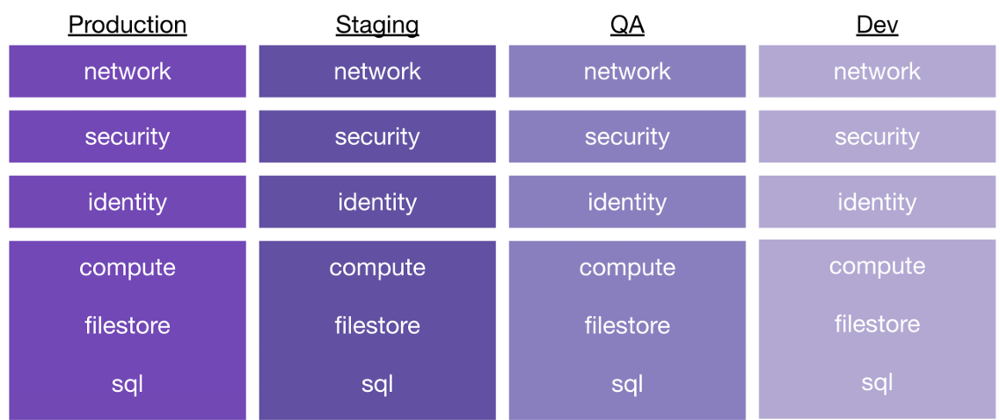
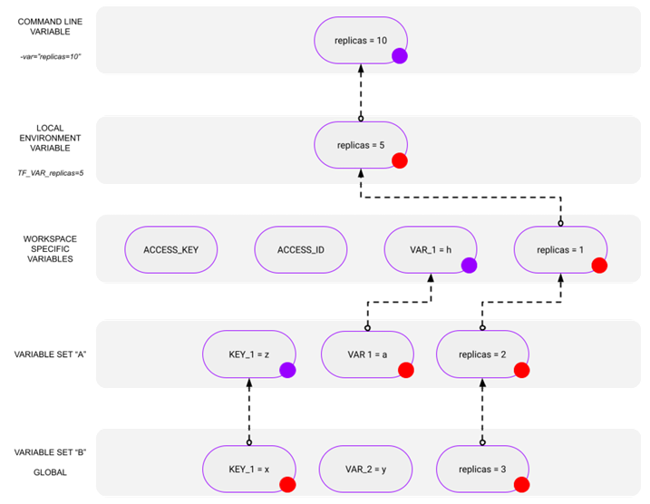

# Terraform Enterprise Course

## Base Concept Review

**Terraform's primary function is to create, modify, and destroy infrastructure resources** to match the desired state described in a Terraform configuration. It follows a **declarative** approach – you define *what* you want, Terraform figures out *how* to achieve it.
The Terraform lifecycle consists of four primary phases:
- **`init`** (initialize backend, download providers/modules)
- **`plan`** (determine changes needed)
- **`apply`** (execute planned changes)
- **`destroy`** (remove managed resources).


### State
**State is a key component of Terraform**, storing the mapping between your configuration and the real-world resources it manages. Terraform uses this state to create plans and make changes.

It's critical that state is maintained appropriately, ideally remotely, for collaboration and consistency.

**State locking** is crucial for team environments to prevent concurrent runs from corrupting the state file. Most remote backends provide locking.

### Providers
Plugins that allow Terraform to interact with various infrastructure platforms and services (AWS, Azure, GCP, Kubernetes, etc.). They abstract API interactions.

### Respirces
Declare infrastructure objects Terraform will manage (e.g., `aws_instance`, `azurerm_resource_group`). Resource blocks have a type, a local name, arguments, and potentially nested blocks.

### Data Sources (`data`)
 Fetch information *from* a provider about existing resources or compute data for use elsewhere in the configuration (e.g., `data "aws_ami" "latest_ubuntu"`).

### Variables (`variable`)
 Parameterize configurations, removing hard-coded values. Define inputs to your configuration or modules. Commonly declared in `variables.tf`. (See *Variables* section for more detail).

### Outputs (`output`)
 Expose values from your configuration (e.g., an IP address, a resource ID) for use by other Terraform configurations or for user information.

### Modules (`module`)
 Reusable containers of Terraform resources. Promote code reuse, organization, and standardization. Can be sourced from registries (Public/Private) or local paths.

### Locals (`locals`)
 Define named expressions within a module to simplify complex logic or avoid repetition. (See *Locals Block* section).

## State Management

### Local State
 Default mode, stores state in a `terraform.tfstate` file locally. Suitable for solo projects but problematic for teams (risk of divergence, no locking).

### Remote State
Storing state in a shared location (backend).

#### Benefits
Collaboration, locking, versioning (often), secure storage, separation from code.
#### Common Backends
* **HCP Terraform / Terraform Cloud:** Managed service offering remote state, collaboration features, RBAC, Policy as Code, etc.
* **AWS S3:** Requires an S3 bucket and often a DynamoDB table for locking.
* **Azure Blob Storage:** Uses an Azure Storage Account container.
* **Google Cloud Storage (GCS):** Uses a GCS bucket.
* *(Others exist)*

### HCP Terraform Cloud

Stores state remotely per Workspace. Offers state versioning, resource counts, easy sharing.
#### Sharing State
* `terraform_remote_state` data source: Shares output values but requires read access to the *entire* source state file.
* `tfe_outputs` data source (HCP Terraform): Shares *only* output values, requiring workspace-specific permissions. **Preferred method**.

### Migration
 Migrate local state using `terraform init` after adding a `cloud {}`.
* Security: HCP Terraform securely stores state, but state can contain sensitive data. Use RBAC appropriately.

#### Importing Existing Infrastructure
* `terraform import <resource_address> <provider_id>`: Command to bring existing resources under Terraform management. Requires manually writing the configuration block first.
* `import {}` block (Terraform 1.5+): Configuration-driven import, allowing `plan` and `apply` to handle import generation and state updates.

## Workspaces

### Terraform CLI Workspaces
* Managed via `terraform workspace new/select/list/delete`.
* Allows managing multiple state files for the *same* configuration using the *same* backend configuration.
* Useful for creating parallel, distinct environments (e.g., dev, staging, prod) of a single setup without copying code.
* The current workspace name is available via `terraform.workspace`.

### HCP Terraform Workspaces
* More comprehensive environments within HCP Terraform.
* Each workspace has its **own separate state, variables, run history, and permissions**.
* Can be linked to specific VCS branches (UI/VCS workflow), driven by the CLI, or managed via API.
* Can be grouped into **Projects** for organization.
* UI provides filtering, run history, state versions, logs, and overview metrics.
* **Segmentation Strategy:** Recommended to break down large configurations into smaller workspaces to reduce blast radius, manage change rates, apply least privilege, ease maintenance, and enable team delegation.

#### Example
From Monolithic 

to isolated environment and component. Start in a simple isolated configuration and then split more if needed.


## Variables

### Declaration (`variables.tf`)
* Define input variables using `variable "name" { ... }`.
* **`type`:** Specifies the expected data type (`string`, `number`, `bool`, `list(...)`, `set(...)`, `map(...)`, `object({...})`, `tuple([...])`). Enforces type constraints.
* **`description`:** Explains the variable's purpose. Crucial for documentation and module usability.
* **`default`:** Provides a default value if none is supplied. Makes the variable optional.
* **`sensitive = true`:** Prevents the variable's value from being shown in CLI output or UI logs.
* **`validation { ... }`:** Defines custom rules (`condition`, `error_message`) to validate input values.

### Setting Variable Values (Precedence Order - Lowest to Highest)
1.  Defaults within `variable` blocks.
2.  Values from `terraform.tfvars` file (or `*.auto.tfvars`).
3.  Values from `-var-file=<filename>.tfvars` CLI argument.
4.  Values from `-var='name=value'` CLI argument.
5.  Environment variables prefixed with `TF_VAR_` (e.g., `TF_VAR_region=us-east-1`).
6.  *For HCP Terraform:* Run Specific Variables (API triggered runs)
7.  *For HCP Terraform:* Workspace-Specific Variables (Terraform or Environment).
8.  *For HCP Terraform:* Variables from applied Variable Sets (last applied wins in case of conflict).



### HCP Terraform Variables
* **Terraform Variables:** Standard input variables for the configuration.
* **Environment Variables:** Set environment variables for the Terraform execution environment (e.g., provider credentials like `AWS_ACCESS_KEY_ID`, Terraform behavior like `TF_LOG`).
* **Scope:** Set at Workspace level or via **Variable Sets**.
* **Variable Sets:** Reusable collections of variables applied to multiple workspaces. Can be global or specific to projects.
* Management: Via UI, API, or `tfe` provider (`tfe_variable`, `tfe_variable_set`).
* Permissions: Specific permissions required for viewing/managing variables.
* Storage Considerations: Choose between Workspace Vars, Variable Sets, or checked-in `*.auto.tfvars` based on scope, sensitivity, and sharing needs. Avoid hardcoding secrets; use sensitive variables and secure storage (like HCP Vars or Vault).

## HCP Terraform Workflows & Runs

Runs always occur within a **Workspace** context.

### Three Main Workflows
#### CLI-driven
Use local Terraform CLI (`plan`, `apply`) integrated with HCP Terraform for state, variables, policy checks. Requires `cloud {}` block. Supports local or remote execution mode. `terraform apply` disallowed if VCS connection exists.

#### UI/VCS-driven
Primary mode. Workspace linked to a VCS repo branch. Commits/PRs automatically trigger runs in HCP Terraform. Runs always associated with a commit.

#### API-driven
Trigger runs programmatically via HCP Terraform API. For integration with external systems/pipelines.

### Run Modes
* Plan and apply (standard workflow).
* Plan only (speculative plans). Automatically triggered for PRs in VCS workflow.
* Refresh state only (`terraform plan/apply -refresh-only`). Checks for drift.
* Destroy mode (`terraform plan/apply -destroy`).
### Workspace UI
Shows run history, status, logs, plan output, policy check results, apply confirmation steps.

## HCP Terraform User Management and RBAC

### Components
Users (individual accounts), Teams (groups of users), Organizations (top-level container).
### Teams
Often map to org structure. Can have API tokens. Assigned permissions. Default `owners` team exists.
### Management
Via UI, API, or `tfe` provider (recommended for IaC approach to permissions).
### Workspace Permissions
Granular control (Read/Write State, Queue/Apply Runs, Manage Variables, etc.). Can use fixed sets (Read, Plan, Write, Admin) or custom permissions. Align with organizational needs and least privilege.
### Organization Permissions
Control org-level settings (Manage Policies, Workspaces, VCS Settings, Private Registry, etc.).

## Private Module Registry (HCP Terraform)

* Allows publishing **private modules and providers** within an organization.
* **Secure distribution** for reusable components, versioned, searchable.
* Managed via **VCS repositories** following specific naming (`terraform-<PROVIDER>-<NAME>`) and structure conventions.
* **Publishing:** Connect VCS provider in HCP Terraform UI, select repo, tag releases (`x.y.z`) in VCS.
* **Usage Syntax:** `<HOSTNAME>/<ORGANIZATION>/<MODULE_NAME>/<PROVIDER_NAME>` (e.g., `app.terraform.io/my-org/vpc/aws`).
* **Governance:** Sentinel policies can restrict module usage (e.g., mandate private modules, specific versions).
* **No-Code Provisioning:** (Plus Edition) Deploy modules from the private registry via UI without writing HCL.

## Operation and Governance (Policy as Code)

### Policies
Rules enforced on Terraform runs, typically between plan and apply.
#### Purpose
Enforce security standards, compliance, cost controls, best practices.
### Frameworks (HCP Terraform)
#### Sentinel
HashiCorp's proprietary framework. Uses Sentinel language. Fine-grained, logic-based policies. There is a policy library.


**Enforcement Levels:**
* **Advisory:** Logs violations, doesn't block apply.
* **Soft Mandatory:** Blocks apply but can be overridden by authorized users.
* **Hard Mandatory:** Blocks apply, cannot be overridden.

**Workflow Integration:** Checks run between `plan` and `apply` stages.

#### OPA (Open Policy Agent)
Open-source standard. Uses Rego language.


### Testing Policies:
Crucial before enforcement.
#### Sentinel
Use `sentinel test` command with mock data generated from HCP Terraform plans (`Download Sentinel mocks` button or Plan Export API).
#### OPA
Test with `opa test` using JSON plan data gathered via API or `terraform show -json plan.out`.
#### Scope
Policies check the *plan* against configuration, state, and run data. They don't continuously monitor live infrastructure or prevent non-Terraform changes.


## Terraform Language: Expressions, Loops, Conditionals

### Expressions

Used on the right side of assignments (`=`) and within blocks.

Range from simple literals (`"hello"`, `123`, `true`, `["a", "b"]`, `{key = "value"}`) to complex computations.

#### Types
* **References:** `var.name`, `local.name`, `aws_instance.example.id`, `module.mymodule.output_value`, `data.source.attr`, `path.module`, `terraform.workspace`.
* **Arithmetic:** `+`, `-`, `*`, `/`, `%`.
* **Equality:** `==`, `!=`.
* **Comparison:** `>`, `<`, `>=`, `<=`.
* **Logical:** `&&` (AND), `||` (OR), `!` (NOT).
* **Function Calls:** `max(5, 12)`, `file("${path.module}/myfile.txt")`, `jsonencode({...})`. (See *Functions*).
* **Conditional:** `condition ? true_val : false_val`. (See *Conditional Expressions*).
* **Collection Transformations:** `for` expressions, splat (`[*]`) expressions. (See below).
* **String Templates/Interpolation:** `"Hello, ${var.name}!"`.

### Conditional Expressions

Enable conditional logic within assignments. Ternary operator style.

`condition ? value_if_true : value_if_false`.


```hcl
locals {
  instance_type = var.environment == "prod" ? "m5.large" : "t3.micro"
}
```

### For Expressions

Transform one collection (list, set, map, tuple) into another (list or map). Powerful for manipulating complex data structures.

#### Syntax (List Output)
 `[for item in collection : output_expression(item) if condition(item)]`
* Example: `[for s in var.list : upper(s)]` (Uppercase all strings in a list).
* Example (Filtering): `[for u in var.users : u.id if u.is_active]` (Get IDs of active users).
#### Syntax (Map Output)
`{for key, value in map : output_key(key, value) => output_value(key, value) if condition(key, value)}`
* Example: `{for k, v in var.tags : upper(k) => v}` (Uppercase tag keys).
* Example (Grouping): `{for inst in aws_instance.web : inst.availability_zone => inst.id...}` (Group instance IDs by AZ).

### Splat Expressions (`[*]`)

A shorthand syntax for a common `for` expression operating on lists Gets a specific attribute from *all* elements in a list.


`resource_type.name[*].attribute`
* Equivalent to: `[for item in resource_type.name : item.attribute]`
* Example: `aws_instance.server[*].id` (Get a list of all server instance IDs).

Can access nested attributes: `aws_instance.server[*].network_interface[0].private_ip`. Primarily for lists. Use `for` expressions for maps or more complex transformations.

## Meta-Arguments (`count`, `for_each`, `depends_on`, `lifecycle`, etc.)

Special arguments applicable to `resource` and `module` blocks that change their behavior.

### `count`

Creates multiple instances of a resource or module based on a whole number.


`count = <number>` (e.g., `count = 3`, `count = var.num_servers`, `count = var.enabled ? 1 : 0`).

Instances are tracked as a **list** (e.g., `aws_instance.server[0]`, `aws_instance.server[1]`). Access the index within the resource block using `count.index`.

**Use Case:** Creating multiple *identical* or near-identical resources where instance identity doesn't need to be tied to a specific key.

**Caution:** Adding/removing items in the middle of the count range can cause subsequent resources to be recreated or re-identified. Generally, prefer `for_each` for non-trivial cases.
```hcl
resource "aws_iam_user" "users" {
  count = 3
  name  = "user-${count.index}"
}
```

### `for_each`

Creates multiple instances based on the elements of a **map** or a **set of strings**.

`for_each = <map_or_set>`


Instances are tracked as a **map** where keys are from the input map/set (e.g., `aws_iam_user.users["alice"]`, `aws_iam_user.users["bob"]`). Access keys/values within the resource block using `each.key` and `each.value`.
#### Use Case
Creating multiple resources where each instance corresponds to a specific identifier (username, region name, subnet ID, etc.).
#### Advantage:
More stable than `count`. Adding/removing items doesn't affect unrelated instances because they are tracked by persistent keys, not list indices. **Generally preferred over `count`**.
 ```hcl
resource "aws_iam_user" "users" {
  for_each = toset(["alice", "bob", "charlie"]) # Input must be map or set
  name     = each.key # 'each.value' is same as 'each.key' for sets
}

resource "aws_route53_record" "records" {
  for_each = {
     "www" = "1.2.3.4"
     "db"  = "5.6.7.8"
  }
  zone_id = data.aws_route53_zone.primary.zone_id
  name    = "${each.key}.${data.aws_route53_zone.primary.name}" # each.key is "www", "db"
  type    = "A"
  records = [each.value] # each.value is "1.2.3.4", "5.6.7.8"
  ttl     = 300
}
```

### `depends_on`

Specify explicit dependencies when Terraform cannot automatically infer them (e.g., dependencies on actions performed by a `local-exec` provisioner, or when one resource implicitly depends on another without referencing its attributes).

`depends_on = [resource.type.name, module.name]`

Use sparingly; rely on implicit dependencies via attribute references whenever possible.

### `lifecycle` Block

Customizes the lifecycle behavior of a resource.
* **`create_before_destroy = true`:** Creates the replacement resource before destroying the old one during updates that require replacement. Useful for minimizing downtime but requires temporary naming conflicts to be handled.
* **`prevent_destroy = true`:** Prevents Terraform from accidentally destroying critical resources. `apply` will fail if the plan includes destroying this resource.
* **`ignore_changes = [attribute_name, ...]`:** Tells Terraform to ignore changes to specific attributes made outside of Terraform or managed by other processes. Can also use `all` to ignore all attributes (rarely advisable).
* **`replace_triggered_by = [resource.type.name, ...]`:** Forces replacement of the resource if any of the listed resources change.
* **`precondition { ... }`:** (Testing/Validation) Checks condition *before* resource is created/updated. Fails `apply` if false.
* **`postcondition { ... }`:** (Testing/Validation) Checks condition *after* resource is created/updated. Fails `apply` if false.

### `provider` Meta-Argument

*Specifies which provider configuration to use for a resource or module when multiple configurations exist for the same provider (e.g., deploying to multiple AWS regions using provider aliases).

`provider = aws.secondary_region`

## Functions

Built-in tools for transforming or combining values within expressions. Cannot define custom functions.

`function_name(arg1, arg2, ...)`


### Common Categories & Examples
* **Numeric:** `max()`, `min()`, `abs()`, `ceil()`, `floor()`, `log()`, `pow()`
* **String:** `upper()`, `lower()`, `replace()`, `split()`, `join()`, `substr()`, `trimspace()`, `format()`, `regex()`
* **Collection:** `length()`, `lookup()`, `element()`, `keys()`, `values()`, `contains()`, `flatten()`, `merge()`, `range()`, `slice()`, `sort()`, `zipmap()`
* **Encoding:** `jsonencode()`, `jsondecode()`, `yamlencode()`, `yamldecode()`, `csvdecode()`, `base64encode()`, `base64decode()`, `urlencode()`
* **Type Conversion:** `tostring()`, `tonumber()`, `tobool()`, `tolist()`, `toset()`, `tomap()`
* **Filesystem:** `file()`, `templatefile()`, `pathexpand()`, `dirname()`, `basename()`, `fileset()` (Use `path.module`, `path.root`, `path.cwd` for paths).
* **Date/Time:** `timestamp()`, `formatdate()`, `timeadd()` (**Caution:** `timestamp()` produces a new value on each run, potentially causing plan diffs).
* **Hashing/Crypto:** `md5()`, `sha1()`, `sha256()`, `uuid()` (**Caution:** `uuid()` produces a new value on each run).
* **IP Network:** `cidrhost()`, `cidrnetmask()`, `cidrsubnet()`

## Locals Block (`locals {}`)

Defines named expressions within a module scope. 

Assign a short name to a complex expression, make code DRY (Don't Repeat Yourself), improve readability. 

Can reference variables (`var.`), other locals (`local.`), resource attributes (`resource.type.name.attr`), etc.

Evaluated *after* variables but *before* resources.

**Referenced using:** `local.NAME`.

**Use Case:** Constructing complex strings, deriving values conditionally, creating reusable data structures.
```hcl
locals {
  common_tags = {
    Environment = var.environment
    Project     = "MyWebApp"
    ManagedBy   = "Terraform"
  }
  instance_name = "server-${var.environment}-${random_id.server.hex}"
}

resource "aws_instance" "web" {
  # ...
  tags = local.common_tags
  name = local.instance_name
}
```

## Dynamic Blocks

Dynamically construct multiple **nested blocks** (like `ingress`, `setting`, `rule`) within a `resource`, `data`, `provider`, or `provisioner` block.

Iterates over a collection (list or map) using `for_each`.


```hcl
dynamic "NESTED_BLOCK_TYPE" { # e.g., "ingress", "setting"
  for_each = COLLECTION # Map or List/Set
  iterator = ITERATOR_NAME # Optional, defaults to NESTED_BLOCK_TYPE
  labels   = [ ... ] # Optional, for blocks with labels (rare)

  content {
    # Arguments for the nested block
    # Access iterator using: ITERATOR_NAME.key, ITERATOR_NAME.value, ITERATOR_NAME.index (index only if for_each is list/set)
    attribute = ITERATOR_NAME.value.some_property
    another   = ITERATOR_NAME.key
  }
}
```

### Use Case
Defining multiple security group rules, firewall rules, disk configurations, etc., based on input variables or computed data.

```hcl
variable "allowed_ports" {
  type    = list(number)
  default =
}

resource "aws_security_group" "web_sg" {
  # ... other SG config ...

  dynamic "ingress" {
    for_each = var.allowed_ports
    content {
      from_port   = ingress.value # ingress.value is the port number
       to_port     = ingress.value
       protocol    = "tcp"
      cidr_blocks = ["0.0.0.0/0"]
    }
  }
}
```
**Consider Alternatives:** While powerful, dynamic blocks can sometimes reduce clarity. Ask if defining multiple distinct resource blocks or using a different resource type might be simpler. Use them to create clean abstractions or handle truly dynamic nested configurations.

## Terraform Testing (v1.6+)

Native framework for validating module behavior and configurations. Tests run against short-lived resources or mocked providers.

**Test Files:** End with `.tftest.hcl` or `.tftest.json`. Located in a `tests` subdirectory.
### Key Blocks
`variables {}`: Define input variables for the test run.

`provider {}`: Configure providers needed for the test (can use environment variables).

`run {}`: Define a test case, executing a Terraform command (`plan`, `apply`, `destroy`). `command = plan | apply | destroy`

`expect_failures = [ ... ]`: Assert that specific validation errors are expected (for testing `variable validation`, `precondition`, `postcondition`).

`assert { ... }`: Define assertions within a `run` block.

* `condition`: The expression to evaluate (should be true).

* `error_message`: Message shown if the condition is false.

### Test Mocking (v1.7+):

Allows testing modules without provisioning real infrastructure. Define mock providers, resources, and data sources. Useful for unit testing module logic quickly and cheaply.

**Blocks:** `override_resource {}`, `override_data {}`, `override_module {}`. Provide fake attribute values.

**Commands:** `terraform test` (runs tests), `terraform test -update` (updates mock data).

### Racap

| **Test Everything** | **Assert Yourself** | **Fix It Before Post** | **Test Mocking** |
|:---------------------------------------------:|:--------------------------------------------------:|:--------------------------------------------------:|:--------------------------------------------------:|
| Use a **variety of test types** to check functionality across the Terraform lifecycle | The `assert` block is **the cornerstone** of testing in Terraform | Use **postcondition checks** to make sure modules are configured correctly | **Mimic** resources, providers, and data sources |
| A good series of tests will check **for both** success and failure conditions | Exist within the **lifecycle blocks** of variables, resources, and even data sources | It is **better to fail early** in a build than produce broken infrastructure | Create attributes **without** making API calls |
| | | | Only usable with `terraform test` |

## Terraform Security and Compliance Tools

Integrate static analysis and compliance tools into your workflow (e.g., pre-commit hooks, CI/CD pipelines).

**Tflint:** Linter focusing on potential errors, best practices, and provider-specific checks (e.g., valid instance types). Doesn't focus primarily on security vulnerabilities.

**Checkov:** Scans IaC files (Terraform, CloudFormation, etc.) for security risks and compliance violations based on a large policy library (CIS benchmarks, GDPR, etc.).

**Terrascan:** Similar to Checkov, scans IaC for security vulnerabilities and policy violations.

**tfsec:** Static analysis security scanner for Terraform code.

**OPA / Rego:** Use OPA with tools like Conftest to apply custom policies written in Rego against Terraform plan JSON output.

**Sentinel/OPA (HCP Terraform):** Enforce policies centrally during runs (see *Policy as Code* sections).

**Secrets Management:** Integrate with tools like HashiCorp Vault, AWS Secrets Manager, Azure Key Vault, GCP Secret Manager to securely inject secrets at runtime rather than storing them in state or variables.

## Ecosystem Tools

**Terragrunt:** A popular thin wrapper for Terraform. Helps manage configurations for multiple environments/modules, keeps backend and provider configurations DRY, and orchestrates module dependencies. Useful for larger projects.

**Infracost:** CLI tool and CI/CD integration that shows cloud cost estimates for Terraform changes *before* they are applied. Helps manage budgets.

**Atlantis:** Open-source application for Terraform pull request automation. Allows teams to collaborate on infrastructure changes via Git pull requests.


## Infrastructure Validation & Health Checks

### `check` Blocks (Terraform v1.5+)
Define infrastructure health checks or data validation rules *outside* the normal resource lifecycle.

Run during the `plan` phase (after resources are evaluated).

Failed assertions generate **warnings**, not errors, so they don't block `apply`.

Useful for verifying conditions on existing infrastructure or external data sources.

Can contain nested `data` blocks.
### `lifecycle` `precondition` & `postcondition`
Validate resource state *before* (`precondition`) or *after* (`postcondition`) changes are planned/applied.

Failed conditions **halt** the Terraform run with an error.

Use for enforcing critical invariants on resource configuration or state.
### `variable` `validation` blocks

Validate user-provided input values *before* Terraform attempts to use them.

Provide early feedback on invalid inputs.

## Code Structure 

### Recommended File Structure (Root Module):
* `main.tf`: Core resources, module calls.
* `variables.tf`: Input variable definitions.
* `outputs.tf`: Output value definitions.
* `terraform.tf`: `terraform {}` block (required version, provider requirements, backend config).
* `providers.tf`: Provider configurations (optional, can be in `main.tf`).
* `versions.tf`: (Alternative to `terraform.tf` for `terraform {}` block).
* `*.auto.tfvars`: Automatic variable definitions (optional).
* `terraform.tfvars`: Default variable values (optional, often gitignored).

### Module Structure

Similar structure within a `modules/my-module/` directory. Add a `README.md`.

### Others
**Formatting:** Use `terraform fmt` consistently.

**Validation:** Use `terraform validate` for syntax checks.

**Naming Conventions:** Use consistent, descriptive names for resources, variables, outputs, etc. (`snake_case` is conventional).

## Best Practices

### Least Privilege
Configure providers with the minimum necessary permissions. Avoid hardcoding credentials; use environment variables, provider-specific methods (e.g., instance profiles, workload identity), or tools like Vault.

### Drift Detection
Regularly run `terraform plan` (or `terraform plan -refresh-only`) to detect changes made outside Terraform. HCP Terraform offers automated drift detection. Address drift promptly.
### Manual vs. Auto Approve
 Use manual approval (`terraform apply plan.out`) during development/review. Automate approvals (`terraform apply -auto-approve`) in CI/CD pipelines *after* thorough review and testing stages.

