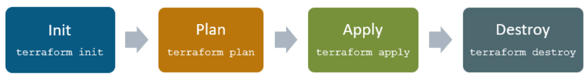
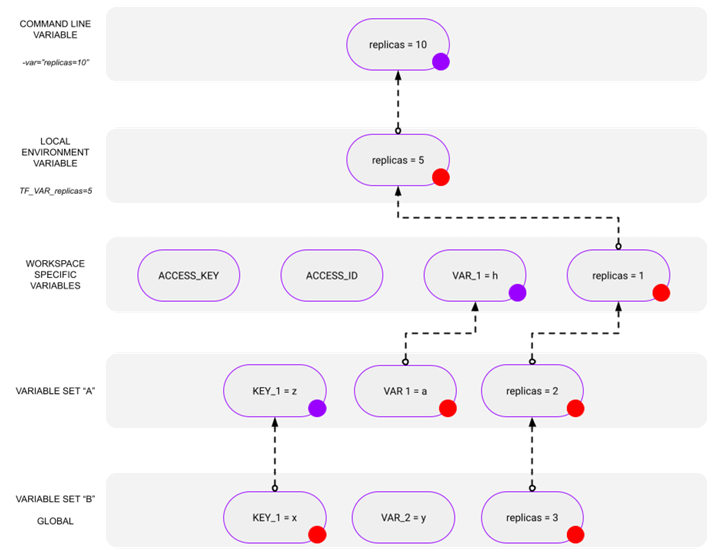
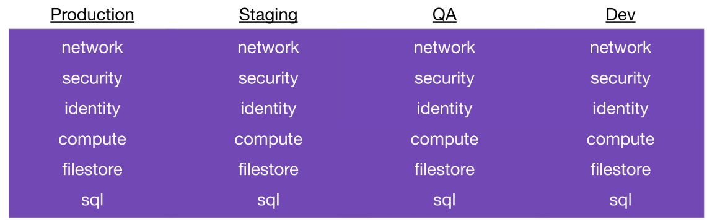
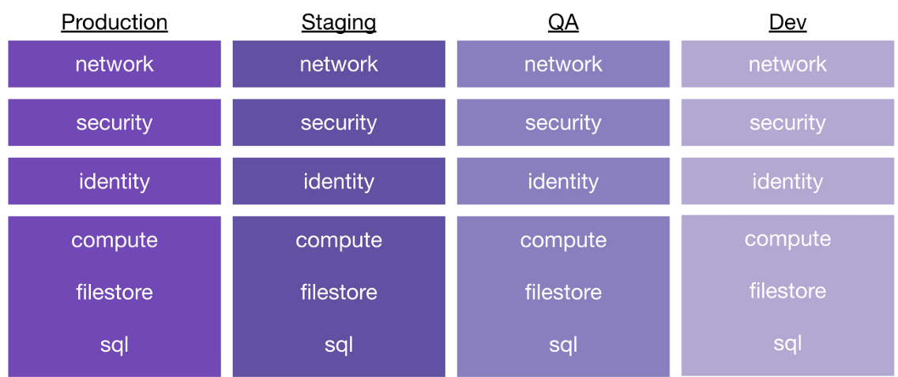
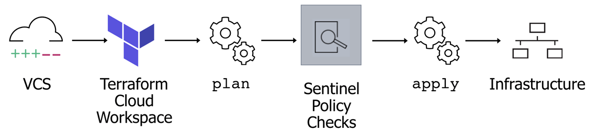
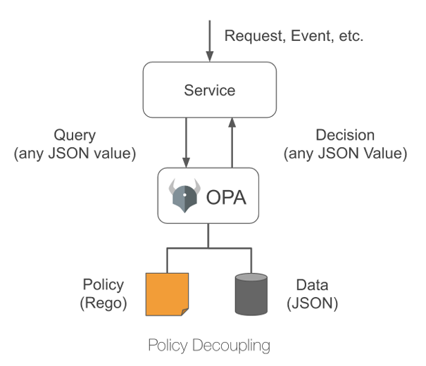

# Introduction & Fundamentals

*   **Terraform is a tool for building, changing, and versioning infrastructure safely and efficiently.**
*   It falls under the category of **Infrastructure as Code (IaC) tools.**
*   IaC allows you to define your entire cloud infrastructure as a set of config files.
*   Terraform interacts with cloud provider APIs to provision and manage resources on your behalf.
*   The course assumes familiarity with basic programming and Amazon Web Services (AWS).
*   The course covers a progression from basics to modular, automated infrastructure code deploying to staging and production.
*   It alternates between theory and hands-on examples.
*   A reference architecture of a basic web application on AWS is used throughout the course, including EC2, ELB, RDS, S3, and Route 53 within the default VPC.
*   The choice of AWS is for simplicity, **Terraform is cloud-agnostic and can interact with anything with an API.**
*   A companion GitHub repository contains the code examples organised by module.

## Infrastructure as Code (IaC)

*   IaC allows you to define your entire infrastructure within your codebase.
*   Benefits of IaC:
    *   Knowing exactly what is provisioned at any time.
    *   Easy to reason about the state of your infrastructure.
    *   Confidence that multiple environments (staging, production) are the same.
    *   Using the power of programming languages for configuration.
*   Categories of IaC tools:
    *   Ad hoc scripts (e.g., shell scripts) - borderline IaC.
    *   Configuration Management tools (Ansible, Puppet, Chef) - focus on software configuration, more suited for on-prem.
    *   Server Templating tools (e.g., Packer for AMIs) - building templates for server images.
    *   Orchestration tools (e.g., Kubernetes) - defining application deployment, less about the underlying servers.
    *   **Provisioning tools (e.g., Terraform) - focused on provisioning cloud resources.**
*   **Declarative vs. Imperative tools:**
    *   **Declarative (e.g., Terraform): Define the desired end state, and the tool manages how to achieve it.**
    *   Imperative: Tell the system what to do and the sequence.
*   **Cloud-specific vs. Cloud-agnostic tools:**
    *   Cloud-specific (CloudFormation, Azure Resource Manager, Google Cloud Deployment Manager) - work within a single cloud.
    *   **Cloud-agnostic (Terraform, Pulumi) - can be used across multiple clouds and services with APIs.** Useful for multi-cloud or third-party services.

# Core Concepts
## Terraform Architecture (Core, Providers, State, Registry)
*   **Terraform Architecture:**
    *   **Terraform Core:** The engine that parses config and state.
    *   **Terraform State File:** Contains the current state of provisioned infrastructure.
    *   **Providers:** Plugins that tell Terraform how to interact with specific cloud provider APIs. Many providers are available.
*   **Installation:** Different methods for various operating systems (Homebrew, Chocolatey, direct binary download).
*   **AWS Authentication for Terraform:**
    *   Create an IAM user with necessary permissions.
    *   Configure AWS CLI with access key ID, secret access key, and region (`aws configure`). Terraform uses these credentials by default.
*   **Basic Terraform Configuration (main.tf):**
    *   `terraform` block to specify required providers (and versions).
    *   `provider` block to configure the provider (e.g., AWS region).
    *   `resource` block to define infrastructure resources (e.g., `aws_instance`) with attributes (AMI, instance type).
## Declarative vs Imperative; Cloud-agnostic vs Cloud-native
*   **Cloud-agnostic and compatible with many clouds and services with APIs.**
*   Terraform can be used with other IaC tools:
    *   Terraform (provisioning) + Ansible (configuration management).
    *   Terraform (provisioning) + Packer (image templating).
    *   Terraform (provisioning) + Kubernetes (orchestration).
# Getting Started
## Install & CLI Basics
* Download the Terraform CLI binary for your OS from developer.hashicorp.com/terraform/downloads, unzip it, and place it on your `PATH`.
* Verify installation with `terraform version`; enable shell completion with `terraform -install-autocomplete`.
* Use `terraform -help` to list commands and `terraform <command> -help` for command-specific flags.
* Authenticate to HCP Terraform with `terraform login`; remove local credentials with `terraform logout`. Tokens are stored in `~/.terraformrc` (or `terraform.rc` on Windows).
* Customize provider downloads with the CLI config block `provider_installation { direct {} mirror { url = "..." } }` in the CLI config file.
## Authentication (AWS/Azure/GCP patterns)
* Providers handle credentials; follow each provider’s documented auth methods.
* **AWS:** Environment variables (`AWS_ACCESS_KEY_ID`, `AWS_SECRET_ACCESS_KEY`, `AWS_SESSION_TOKEN`), shared config/credentials files, or IAM roles; Terraform follows the AWS SDK chain.
* **AzureRM:** Environment variables (`ARM_SUBSCRIPTION_ID`, `ARM_CLIENT_ID`, `ARM_CLIENT_SECRET`, `ARM_TENANT_ID`) or Azure CLI `az login` when `use_azuread_auth = true`.
* **Google:** Application Default Credentials (`gcloud auth application-default login`) or a service account JSON via `GOOGLE_APPLICATION_CREDENTIALS`.
## File Layout & Naming Conventions
* Terraform loads all files ending in `.tf` and `.tf.json` in a directory, regardless of name.
* Common convention: `main.tf` for resources, `variables.tf`, `outputs.tf`, `providers.tf`/`terraform.tf` (required versions/backend), plus `*.tfvars` for inputs.
* Keep separate directories per configuration; use `modules/` for reusable code.

# CLI Lifecycle
## init / plan / apply / destroy
**Terraform's primary function is to create, modify, and destroy infrastructure resources** to match the desired state described in a Terraform configuration. It follows a **declarative** approach – you define *what* you want, Terraform figures out *how* to achieve it.
The Terraform lifecycle consists of four primary phases:
- **`init`** (initialize backend, download providers/modules)
- **`plan`** (determine changes needed)
- **`apply`** (execute planned changes)
- **`destroy`** (remove managed resources).


*   **General workflow:**
    1.  **`terraform init`:** Initialises the project, downloads providers and modules.
    2.  **`terraform plan`:** Shows the changes that will be applied to reach the desired state.
    3.  **`terraform apply`:** Provisions or modifies the infrastructure.
    4.  **`terraform destroy`:** Tears down all the resources managed by Terraform.
*   **Terraform Provider Registry (registry.terraform.io):** A list of available providers (official and community). Official providers have a higher level of trust.
*   Providers are used in code by specifying them in the `required_providers` block within the `terraform` block and can be version-pinned. Each provider may have required configuration (e.g., region for AWS).


## Terraform Init Deep Dive

*   When you run `terraform init` in a directory with Terraform code:
    *   It downloads the providers specified in the `terraform` block from the Terraform Registry or other configured registries.
    *   The provider code is stored in a `.terraform` hidden directory within the working directory.
    *   A **lock file** is created (`.terraform.lock.hcl`) which contains information about the specific provider versions and dependencies used.
    *   If any modules are used in the configuration, `terraform init` will also download those into a `.terraform/modules` subdirectory.
## Plan/Apply nuances (-refresh-only, destroy plans)
*   **`terraform plan`:**
    *   Takes your Terraform configuration (desired state).
    *   Compares it with the Terraform state (actual deployed state).
    *   Determines the necessary actions (create, update, delete) to make the actual state match the desired state.
    *   The plan can be reviewed before applying.
*   **`terraform apply`:**
    *   Takes the execution plan generated by `terraform plan`.
    *   Makes the necessary API calls to the cloud provider to provision or modify the resources.
    *   Updates the Terraform state file to reflect the new state of the infrastructure.
*   **Targeted and replacement changes:**
    *   `-replace=ADDR` (plan/apply) forces replacement of a resource; preferred over manual tainting.
    *   `-target=ADDR` applies only part of the graph and is discouraged except for break-glass scenarios because it can create partial state.
*   **Refresh control and locking:**
    *   `-refresh-only` checks for drift without changing resources.
    *   `-refresh=false` skips state refresh (discouraged unless you need a fast, known-good plan).
    *   `-lock` and `-lock-timeout` control backend locking when supported.
## Terraform Destroy Deep Dive

*   **`terraform destroy`:**
    *   Reverses the actions of `terraform apply`.
    *   Deletes all the resources managed by the current Terraform configuration.
    *   **Use this command with extreme caution, especially in live production environments.** It's typically used for cleaning up test environments or decommissioning infrastructure.

## Common CLI Helpers
* `terraform output` prints output values; use `-json` for machine-readable output.
* `terraform console` evaluates expressions against the current configuration and state for debugging.
* `terraform graph` emits the dependency graph in DOT format (often piped to `dot` or `xdot` to visualize).
* `terraform state` subcommands inspect and manipulate state; prefer configuration-driven moves (`moved` blocks) over direct state edits when possible.
# Configuration Building Blocks
## Providers
Plugins that allow Terraform to interact with various infrastructure platforms and services (AWS, Azure, GCP, Kubernetes, etc.). They abstract API interactions.
## Resources & Data Sources
* **Resources:** Manage lifecycle of infrastructure objects. Declared with `resource "<PROVIDER>_<TYPE>" "<NAME>" { ... }` and tracked in state.
* **Data Sources:** Read-only views of existing objects or helper data. Declared with `data "<PROVIDER>_<TYPE>" "<NAME>" { ... }` and do not create or manage resources.
## Variables, Locals, Outputs (types, sensitivity, precedence)
### Data Sources (`data`)
 Fetch information *from* a provider about existing resources or compute data for use elsewhere in the configuration (e.g., `data "aws_ami" "latest_ubuntu"`).

### Variables (`variable`)
 Parameterize configurations, removing hard-coded values. Define inputs to your configuration or modules. Commonly declared in `variables.tf`. (See *Variables* section for more detail).

### Declaration (`variables.tf`)
* Define input variables using `variable "name" { ... }`.
* **`type`:** Specifies the expected data type (`string`, `number`, `bool`, `list(...)`, `set(...)`, `map(...)`, `object({...})`, `tuple([...])`). Enforces type constraints.
* **`description`:** Explains the variable's purpose. Crucial for documentation and module usability.
* **`default`:** Provides a default value if none is supplied. Makes the variable optional.
* **`sensitive = true`:** Prevents the variable's value from being shown in CLI output or UI logs.
* **`validation { ... }`:** Defines custom rules (`condition`, `error_message`) to validate input values.

### Setting Variable Values (Precedence Order - Lowest to Highest)
1.  Prompted at the command line (if no default).
2.  Defaults within `variable` blocks.
3.  Values from `terraform.tfvars` file (or `*.auto.tfvars`).
4.  Values from `-var-file=<filename>.tfvars` CLI argument.
5.  Values from `-var='name=value'` CLI argument.
6.  Environment variables prefixed with `TF_VAR_` (e.g., `TF_VAR_region=us-east-1`).
7.  *For HCP Terraform:* Run Specific Variables (API triggered runs)
8.  *For HCP Terraform:* Workspace-Specific Variables (Terraform or Environment).
9.  *For HCP Terraform:* Variables from applied Variable Sets (last applied wins in case of conflict).



### HCP Terraform Variables
* **Terraform Variables:** Standard input variables for the configuration.
* **Environment Variables:** Set environment variables for the Terraform execution environment (e.g., provider credentials like `AWS_ACCESS_KEY_ID`, Terraform behavior like `TF_LOG`).
* **Scope:** Set at Workspace level or via **Variable Sets**.
* **Variable Sets:** Reusable collections of variables applied to multiple workspaces. Can be global or specific to projects.
* Management: Via UI, API, or `tfe` provider (`tfe_variable`, `tfe_variable_set`).
* Permissions: Specific permissions required for viewing/managing variables.
* Storage Considerations: Choose between Workspace Vars, Variable Sets, or checked-in `*.auto.tfvars` based on scope, sensitivity, and sharing needs. Avoid hardcoding secrets; use sensitive variables and secure storage (like HCP Vars or Vault).

### Outputs (`output`)
 Expose values from your configuration (e.g., an IP address, a resource ID) for use by other Terraform configurations or for user information.

### Modules (`module`)
 Reusable containers of Terraform resources. Promote code reuse, organization, and standardization. Can be sourced from registries (Public/Private) or local paths.
## Locals Block (`locals {}`)

Defines named expressions within a module scope. 

Assign a short name to a complex expression, make code DRY (Don't Repeat Yourself), improve readability. 

Can reference variables (`var.`), other locals (`local.`), resource attributes (`resource.type.name.attr`), etc.

Evaluated *after* variables but *before* resources.

**Referenced using:** `local.NAME`.

**Use Case:** Constructing complex strings, deriving values conditionally, creating reusable data structures.
```hcl
locals {
  common_tags = {
    Environment = var.environment
    Project     = "MyWebApp"
    ManagedBy   = "Terraform"
  }
  instance_name = "server-${var.environment}-${random_id.server.hex}"
}

resource "aws_instance" "web" {
  #...
  tags = local.common_tags
  name = local.instance_name
}
```
### Locals (`locals`)
 Define named expressions within a module to simplify complex logic or avoid repetition. (See *Locals Block* section).

*   **Variables (Input Variables):**
    *   Used to make Terraform configurations more flexible and reusable.
    *   Referenced using `var.variable_name`.
    *   Declared in `variable` blocks with a name and optionally a type and default value.
    *   Like input parameters to a function.
*   **Local Variables:**
    *   Defined within `locals` block (plural) and referenced using `local.variable_name`.
    *   Like temporary variables within a function's scope.
    *   Useful for reusing values within a configuration.
*   **Output Variables:**
    *   Declared in `output` blocks with a name and a value (expression).
    *   Like the return value of a function.
    *   Allow you to expose values from your infrastructure (e.g., IP addresses).
*   **Sensitive Data:** Mark sensitive variables with `sensitive = true` in the `variable` block. Avoid putting sensitive values in `.tfvars` files; use environment variables or `-var` flags, potentially retrieving from secret stores. Sensitive outputs are masked in the Terraform plan.
*   **Examples:** Demonstrates defining variables in `variables.tf`, providing default values in `terraform.tfvars`, and passing sensitive values via `-var`. Outputs for instance and database IPs are shown.
*   **Refactoring Web App with Variables:** Shows how the hardcoded values in the web app configuration are replaced with variables (region, instance type, bucket name, domain, database credentials). This allows for deploying multiple similar environments by just changing variable values.
# Provisioners

*   **Provisioners allow you to execute actions on a local or remote machine after a resource is created.**
*   Different types of provisioners:
    *   `file`: Copy files onto a remote resource.
    *   `local-exec`: Execute a command on the machine running Terraform.
    *   `remote-exec`: Execute a command on the newly created resource (requires SSH or other remote access).
    *   Vendor-specific provisioners (e.g., for Ansible) may also exist.
*   Use cases:
    *   Running a startup script on an EC2 instance.
    *   Integrating with configuration management tools like Ansible.
*   Provisioners should be used sparingly as they can make infrastructure management less predictable. Consider using cloud-init or baked-in configurations instead where possible (note: this last part is implied but not explicitly stated in the source).

## Functions & Expressions

*   **Expressions:**
    *   Template strings (string interpolation).
    *   Operators (arithmetic, comparison, logical).
    *   Conditionals (ternary syntax).
    *   Collections (for loops for lists, splat operator for expanding lists).
    *   Dynamic blocks.
    *   Type and version constraints.
*   **Functions:** Built-in functions for math, date/time, hash and crypto, string manipulation, collections, etc.. Refer to Terraform documentation for details.

### Expressions

Used on the right side of assignments (`=`) and within blocks.

Range from simple literals (`"hello"`, `123`, `true`, `["a", "b"]`, `{key = "value"}`) to complex computations.

#### Types
* **References:** `var.name`, `local.name`, `aws_instance.example.id`, `module.mymodule.output_value`, `data.source.attr`, `path.module`, `terraform.workspace`.
* **Arithmetic:** `+`, `-`, `*`, `/`, `%`.
* **Equality:** `==`, `!=`.
* **Comparison:** `>`, `<`, `>=`, `<=`.
* **Logical:** `&&` (AND), `||` (OR), `!` (NOT).
* **Function Calls:** `max(5, 12)`, `file("${path.module}/myfile.txt")`, `jsonencode({...})`. (See *Functions*).
* **Conditional:** `condition ? true_val: false_val`. (See *Conditional Expressions*).
* **Collection Transformations:** `for` expressions, splat (`[*]`) expressions. (See below).
* **String Templates/Interpolation:** `"Hello, ${var.name}!"`.

### Conditional Expressions

Enable conditional logic within assignments. Ternary operator style.

`condition ? value_if_true: value_if_false`.


```hcl
locals {
  instance_type = var.environment == "prod" ? "m5.large": "t3.micro"
}
```

### For Expressions

Transform one collection (list, set, map, tuple) into another (list or map). Powerful for manipulating complex data structures.

#### Syntax (List Output)
 `[for item in collection: output_expression(item) if condition(item)]`
* Example: `[for s in var.list: upper(s)]` (Uppercase all strings in a list).
* Example (Filtering): `[for u in var.users: u.id if u.is_active]` (Get IDs of active users).
#### Syntax (Map Output)
`{for key, value in map: output_key(key, value) => output_value(key, value) if condition(key, value)}`
* Example: `{for k, v in var.tags: upper(k) => v}` (Uppercase tag keys).
* Example (Grouping): `{for inst in aws_instance.web: inst.availability_zone => inst.id...}` (Group instance IDs by AZ).

### Splat Expressions (`[*]`)

A shorthand syntax for a common `for` expression operating on lists Gets a specific attribute from *all* elements in a list.


`resource_type.name[*].attribute`
* Equivalent to: `[for item in resource_type.name: item.attribute]`
* Example: `aws_instance.server[*].id` (Get a list of all server instance IDs).

Can access nested attributes: `aws_instance.server[*].network_interface[0].private_ip`. Primarily for lists. Use `for` expressions for maps or more complex transformations.

## Meta-Arguments (`count`, `for_each`, `depends_on`, `lifecycle`, etc.)

Special arguments applicable to `resource` and `module` blocks that change their behavior.

### `count`

Creates multiple instances of a resource or module based on a whole number.


`count = <number>` (e.g., `count = 3`, `count = var.num_servers`, `count = var.enabled ? 1: 0`).

Instances are tracked as a **list** (e.g., `aws_instance.server[0]`, `aws_instance.server[1]`). Access the index within the resource block using `count.index`.

**Use Case:** Creating multiple *identical* or near-identical resources where instance identity doesn't need to be tied to a specific key.

**Caution:** Adding/removing items in the middle of the count range can cause subsequent resources to be recreated or re-identified. Generally, prefer `for_each` for non-trivial cases.
```hcl
resource "aws_iam_user" "users" {
  count = 3
  name  = "user-${count.index}"
}
```

### `for_each`

Creates multiple instances based on the elements of a **map** or a **set of strings**.

`for_each = <map_or_set>`


Instances are tracked as a **map** where keys are from the input map/set (e.g., `aws_iam_user.users["alice"]`, `aws_iam_user.users["bob"]`). Access keys/values within the resource block using `each.key` and `each.value`.
#### Use Case
Creating multiple resources where each instance corresponds to a specific identifier (username, region name, subnet ID, etc.).
#### Advantage:
More stable than `count`. Adding/removing items doesn't affect unrelated instances because they are tracked by persistent keys, not list indices. **Generally preferred over `count`**.
 ```hcl
resource "aws_iam_user" "users" {
  for_each = toset(["alice", "bob", "charlie"]) # Input must be map or set
  name     = each.key # 'each.value' is same as 'each.key' for sets
}

resource "aws_route53_record" "records" {
  for_each = {
     "www" = "1.2.3.4"
     "db"  = "5.6.7.8"
  }
  zone_id = data.aws_route53_zone.primary.zone_id
  name    = "${each.key}.${data.aws_route53_zone.primary.name}" # each.key is "www", "db"
  type    = "A"
  records = [each.value] # each.value is "1.2.3.4", "5.6.7.8"
  ttl     = 300
}
```

### `depends_on`

Specify explicit dependencies when Terraform cannot automatically infer them (e.g., dependencies on actions performed by a `local-exec` provisioner, or when one resource implicitly depends on another without referencing its attributes).

`depends_on = [resource.type.name, module.name]`

Use sparingly; rely on implicit dependencies via attribute references whenever possible.

### `lifecycle` Block

Customizes the lifecycle behavior of a resource.
* **`create_before_destroy = true`:** Creates the replacement resource before destroying the old one during updates that require replacement. Useful for minimizing downtime but requires temporary naming conflicts to be handled.
* **`prevent_destroy = true`:** Prevents Terraform from accidentally destroying critical resources. `apply` will fail if the plan includes destroying this resource.
* **`ignore_changes = [attribute_name,...]`:** Tells Terraform to ignore changes to specific attributes made outside of Terraform or managed by other processes. Can also use `all` to ignore all attributes (rarely advisable).
* **`replace_triggered_by = [resource.type.name,...]`:** Forces replacement of the resource if any of the listed resources change.
* **`precondition { ... }`:** (Testing/Validation) Checks condition *before* resource is created/updated. Fails `apply` if false.
* **`postcondition { ... }`:** (Testing/Validation) Checks condition *after* resource is created/updated. Fails `apply` if false.

### `provider` Meta-Argument

*Specifies which provider configuration to use for a resource or module when multiple configurations exist for the same provider (e.g., deploying to multiple AWS regions using provider aliases).

`provider = aws.secondary_region`


## Functions

Built-in tools for transforming or combining values within expressions. Cannot define custom functions.

`function_name(arg1, arg2,...)`


### Common Categories & Examples
* **Numeric:** `max()`, `min()`, `abs()`, `ceil()`, `floor()`, `log()`, `pow()`
* **String:** `upper()`, `lower()`, `replace()`, `split()`, `join()`, `substr()`, `trimspace()`, `format()`, `regex()`
* **Collection:** `length()`, `lookup()`, `element()`, `keys()`, `values()`, `contains()`, `flatten()`, `merge()`, `range()`, `slice()`, `sort()`, `zipmap()`
* **Encoding:** `jsonencode()`, `jsondecode()`, `yamlencode()`, `yamldecode()`, `csvdecode()`, `base64encode()`, `base64decode()`, `urlencode()`
* **Type Conversion:** `tostring()`, `tonumber()`, `tobool()`, `tolist()`, `toset()`, `tomap()`
* **Filesystem:** `file()`, `templatefile()`, `pathexpand()`, `dirname()`, `basename()`, `fileset()` (Use `path.module`, `path.root`, `path.cwd` for paths).
* **Date/Time:** `timestamp()`, `formatdate()`, `timeadd()` (**Caution:** `timestamp()` produces a new value on each run, potentially causing plan diffs).
* **Hashing/Crypto:** `md5()`, `sha1()`, `sha256()`, `uuid()` (**Caution:** `uuid()` produces a new value on each run).
* **IP Network:** `cidrhost()`, `cidrnetmask()`, `cidrsubnet()`
## Dynamic Blocks

Dynamically construct multiple **nested blocks** (like `ingress`, `setting`, `rule`) within a `resource`, `data`, `provider`, or `provisioner` block.

Iterates over a collection (list or map) using `for_each`.


```hcl
dynamic "NESTED_BLOCK_TYPE" { # e.g., "ingress", "setting"
  for_each = COLLECTION # Map or List/Set
  iterator = ITERATOR_NAME # Optional, defaults to NESTED_BLOCK_TYPE
  labels   = [ ... ] # Optional, for blocks with labels (rare)

  content {
    # Arguments for the nested block
    # Access iterator using: ITERATOR_NAME.key, ITERATOR_NAME.value, ITERATOR_NAME.index (index only if for_each is list/set)
    attribute = ITERATOR_NAME.value.some_property
    another   = ITERATOR_NAME.key
  }
}
```

### Use Case
Defining multiple security group rules, firewall rules, disk configurations, etc., based on input variables or computed data.

```hcl
variable "allowed_ports" {
  type    = list(number)
  default =
}

resource "aws_security_group" "web_sg" {
  # ... other SG config ...

  dynamic "ingress" {
    for_each = var.allowed_ports
    content {
      from_port   = ingress.value # ingress.value is the port number
      to_port     = ingress.value
      protocol    = "tcp"
      cidr_blocks = ["0.0.0.0/0"]
    }
  }
}
```
**Consider Alternatives:** While powerful, dynamic blocks can sometimes reduce clarity. Ask if defining multiple distinct resource blocks or using a different resource type might be simpler. Use them to create clean abstractions or handle truly dynamic nested configurations.
# State & Backends

### State
**State is a key component of Terraform**, storing the mapping between your configuration and the real-world resources it manages. Terraform uses this state to create plans and make changes.

It's critical that state is maintained appropriately, ideally remotely, for collaboration and consistency.

**State locking** is crucial for team environments to prevent concurrent runs from corrupting the state file. Most remote backends provide locking.
### Local State
Default mode, stores state in a `terraform.tfstate` file locally. Suitable for solo projects but problematic for teams (risk of divergence, no locking).

### Remote State
Storing state in a shared location (backend).
## Local vs Remote (S3+DynamoDB, GCS, Azure, HCP Terraform)
*   **The Terraform state file is a JSON file that Terraform uses to understand the current state of your infrastructure.**
*   It contains metadata about every resource (e.g., IP address, ARN for an AWS instance) and data object provisioned by Terraform.
*   **State files can contain sensitive information (e.g., database passwords).** Therefore, they need to be protected with encryption and proper permissions.
*   State can be stored **locally (default)** or **remotely.**
*   **Local Backend:**
    *   Pros: Super easy to get started, works out of the box.
    *   Cons: Sensitive values in plain text, uncollaborative (hard to share state), manual operation.
*   **Remote Backend:**
    *   Separates the developer from the state file stored on a remote server.
    *   Options:
        *   **Terraform Cloud (managed by HashiCorp):** Hosts state files, manages permissions. Free for up to five users, then costs per user.
        *   **Self-managed (e.g., AWS S3 and DynamoDB):** S3 bucket to store the state file (encryption recommended), DynamoDB table for state locking (prevents concurrent applies).
    *   Benefits of Remote Backend:
        *   Encrypts sensitive data and gets it off local systems.
        *   Enables collaboration with multiple engineers.
        *   Allows for automation through CI/CD pipelines.
    *   **Bootstrapping Remote Backend:**
        1.  Configure Terraform with no remote backend (local by default).
        2.  Define the S3 bucket and DynamoDB table resources in your Terraform code. The DynamoDB table's hash key must be `LockID`.
        3.  Run `terraform apply` to provision these backend resources.
        4.  Update your Terraform configuration to use the remote backend (S3 type, specify bucket and DynamoDB table).
        5.  Run `terraform init` again. Terraform will detect the backend change and prompt to import the local state to the remote backend.
## Remote Backends in Detail

*   **Terraform Cloud Backend:**
    *   Managed service by HashiCorp.
    *   Configured in the `terraform` block with `backend "remote"` and specifying `organization` and `workspace`.
    *   Web UI for managing state, permissions, etc..
    *   Free for up to 5 users, then $20/user/month.
*   **Self-managed AWS Backend:**
    *   Uses an **S3 bucket** to store the state file. Encryption should be enabled.
    *   Uses a **DynamoDB table** for state locking to prevent concurrent modifications. The hash key must be `LockID`.
    *   Requires a bootstrapping process to manage the backend resources with Terraform.
	* Configuration options:
		You can hardcode the backend settings in backend.tf, or leave the backend block empty and pass values during terraform init using -backend-config.


#### Benefits
Collaboration, locking, versioning (often), secure storage, separation from code.
#### Common Backends
* **HCP Terraform / Terraform Cloud:** Managed service offering remote state, collaboration features, RBAC, Policy as Code, etc.
* **AWS S3:** Requires an S3 bucket and often a DynamoDB table for locking.
* **Azure Blob Storage:** Uses an Azure Storage Account container.
* **Google Cloud Storage (GCS):** Uses a GCS bucket.
* *(Others exist)*

### HCP Terraform Cloud

Stores state remotely per Workspace. Offers state versioning, resource counts, easy sharing.
#### Sharing State
* `terraform_remote_state` data source: Shares output values but requires read access to the *entire* source state file.
* `tfe_outputs` data source (HCP Terraform): Shares *only* output values, requiring workspace-specific permissions. **Preferred method**.

### Migration
 Migrate local state using `terraform init` after adding a `cloud {}`.
* Security: HCP Terraform securely stores state, but state can contain sensitive data. Use RBAC appropriately.

#### Importing Existing Infrastructure
* `terraform import <resource_address> <provider_id>`: Command to bring existing resources under Terraform management. Requires manually writing the configuration block first.
* `import {}` block (Terraform 1.5+): Configuration-driven import, allowing `plan` and `apply` to handle import generation and state updates.

## Workspaces

### Terraform CLI Workspaces
* Managed via `terraform workspace new/select/list/delete`.
* Allows managing multiple state files for the *same* configuration using the *same* backend configuration.
* Useful for creating parallel, distinct environments (e.g., dev, staging, prod) of a single setup without copying code.
* The current workspace name is available via `terraform.workspace`.

### HCP Terraform Workspaces
* More comprehensive environments within HCP Terraform.
* Each workspace has its **own separate state, variables, run history, and permissions**.
* Can be linked to specific VCS branches (UI/VCS workflow), driven by the CLI, or managed via API.
* Can be grouped into **Projects** for organization.
* UI provides filtering, run history, state versions, logs, and overview metrics.
* **Segmentation Strategy:** Recommended to break down large configurations into smaller workspaces to reduce blast radius, manage change rates, apply least privilege, ease maintenance, and enable team delegation.

#### Example
From Monolithic

to isolated environment and component. Start in a simple isolated configuration and then split more if needed.

## Locking, Security, State Migration
* **State locking:** Many remote backends (e.g., Terraform Cloud, S3 with DynamoDB, GCS with locking enabled) prevent concurrent operations that could corrupt state.
* **Sensitive data:** State can contain secrets. Use encrypted backends, restrict access, and avoid checking state into VCS.
* **Migration:** When changing backends, update the `backend` block and run `terraform init -migrate-state` to move and reconfigure state safely.
## Sharing State (terraform_remote_state, tfe_outputs)
* `terraform_remote_state` data source reads outputs from another state; configure backend settings in the data block to point to the source workspace or backend.
* In HCP Terraform, `tfe_outputs` exposes outputs from another workspace with workspace-scoped permissions instead of full state access.
* Use shared outputs to decouple configurations while passing required values (e.g., VPC IDs to app stacks).

## State CLI Reference
* `terraform state list` shows tracked addresses; `terraform state show <addr>` inspects attributes stored in state.
* `terraform state mv` moves addresses within state; prefer a `moved` block when refactoring config.
* `terraform state rm` removes addresses from state (stops managing them).
* `terraform state pull` downloads the current state; `terraform state push` uploads a modified state (use sparingly and only with care).

## Move/Remove/Import

### Moved Blocks in Terraform

A **`moved` block** tells Terraform that a resource/data/module was **renamed or relocated**, so it can update the state without destroying and recreating the resource.

#### **Example: renaming a resource**

```hcl
# Inform Terraform that the resource address changed
moved {
  from = aws_s3_bucket.old_name
  to   = aws_s3_bucket.new_name
}

# New resource name
resource "aws_s3_bucket" "new_name" {
  bucket = "my-bucket"
}
```

This prevents Terraform from deleting the old resource and creating a new one.

### Removed Blocks in Terraform

A **`removed` block** tells Terraform that a resource was **deliberately removed** from the configuration and should also be removed from state (and optionally deleted from the provider).

Useful when cleaning up old resources or when you want to ensure Terraform no longer manages something.

#### **Example: removing a resource cleanly**

```hcl
# Inform Terraform that this resource is intentionally removed
removed {
  from = aws_s3_bucket.legacy
  lifecycle {
    destroy = true
  }
}
```

This:

* removes `aws_s3_bucket.legacy` from state
* deletes it from the provider (because `destroy = true`)

If `destroy = false`, the resource stays in the cloud but is removed from Terraform’s state.

### Import Blocks in Terraform

An **`import` block** tells Terraform to **import an existing resource** into the state and associate it with a resource defined in your configuration.

This replaces the old `terraform import` CLI command.

#### **Example: import an existing S3 bucket**

```hcl
# Resource you want Terraform to manage
resource "aws_s3_bucket" "example" {
  bucket = "my-existing-bucket"
}

# Import instruction
import {
  to = aws_s3_bucket.example
  id = "my-existing-bucket"
}
```

Terraform will:

* read the real bucket from AWS
* map it to `aws_s3_bucket.example` in the state
* no resource is created or destroyed

# Modules & Composition
## Module Design Principles
*   **A module is a container for multiple resources that are bundled together for reusability.**
*   Consists of a collection of `.tf` or `.tf.json` files within a single directory.
*   The root module is the main directory containing your Terraform configuration.
*   Child modules are referenced from the root module.
*   **Benefits of using modules:**
    *   Raises the level of abstraction.
    *   Allows infrastructure specialisation.
    *   Promotes reusability across projects and environments.
    *   Hides complexity from application developers.
    *   Encapsulates best practices.
*   **What Makes a Good Module?:**
    *   Raises the abstraction level from basic resources.
    *   Groups logically related resources.
    *   Exposes necessary input variables.
    *   Provides useful default values.
    *   Returns relevant outputs.

## Code Structure 

### Recommended File Structure (Root Module):
* `main.tf`: Core resources, module calls.
* `variables.tf`: Input variable definitions.
* `outputs.tf`: Output value definitions.
* `terraform.tf`: `terraform {}` block (required version, provider requirements, backend config).
* `providers.tf`: Provider configurations (optional, can be in `main.tf`).
* `versions.tf`: (Alternative to `terraform.tf` for `terraform {}` block).
* `*.auto.tfvars`: Automatic variable definitions (optional).
* `terraform.tfvars`: Default variable values (optional, often gitignored).

### Module Structure

Similar structure within a `modules/my-module/` directory. Add a `README.md`.

### Others
**Formatting:** Use `terraform fmt` consistently.

**Validation:** Use `terraform validate` for syntax checks.

**Naming Conventions:** Use consistent, descriptive names for resources, variables, outputs, etc. (`snake_case` is conventional).

## Best Practices

### Least Privilege
Configure providers with the minimum necessary permissions. Avoid hardcoding credentials; use environment variables, provider-specific methods (e.g., instance profiles, workload identity), or tools like Vault.

### Drift Detection
Regularly run `terraform plan` (or `terraform plan -refresh-only`) to detect changes made outside Terraform. HCP Terraform offers automated drift detection. Address drift promptly.
### Manual vs. Auto Approve
 Use manual approval (`terraform apply plan.out`) during development/review. Automate approvals (`terraform apply -auto-approve`) in CI/CD pipelines *after* thorough review and testing stages.

## Managing Multiple Environments

*   The need to manage different environments (dev, staging, production) with similar configurations.
*   **Two main approaches:**
    *   **Terraform Workspaces:**
        *   Use named sections within a single remote backend to manage different environments.
        *   Managed with the `terraform workspace` command.
        *   Can reference the current workspace using `terraform.workspace` in configurations (e.g., for naming resources).
        *   Pros: Easy to get started, minimises code duplication.
        *   Cons: Easy to forget the current workspace and apply changes to the wrong environment, state files are all in the same remote backend (potential permission issues), less explicit about what is deployed in each environment just by looking at the code.
    *   **Directory Structure:**
        *   Create separate subdirectories for each environment (e.g., `dev`, `staging`, `production`).
        *   Each directory contains its own Terraform configuration (potentially consuming shared modules).
        *   Pros: Isolated backends (different S3 buckets, DynamoDB tables) for each environment, reduces potential for human error (less chance of applying to the wrong environment), fully represents the deployed state in the codebase.
        *   Cons: More code duplication compared to workspaces, requires navigating between directories to apply changes.
*   As infrastructure grows, consider breaking down configurations into logical component groups (e.g., compute, networking) rather than one massive config.
*   **Terraform Remote State:** Allows referencing the state (outputs) of a completely separate Terraform configuration. Useful for decoupling infrastructure components while still being able to share information (e.g., referencing the IP addresses of compute instances from a networking configuration).
*   **Meta-tooling (TerraGrant):** Tools like TerraGrant can help manage complexity with the directory structure approach, reduce code repetition, and simplify operations across multiple environments and accounts.

## Module Sources (local, Registry, git) & Version Pinning
*   **Module Sources:**
    *   Local paths (relative paths to directories on the local filesystem).
    *   Terraform Registry (public and private registries). Source format: `<namespace>/<name>/<provider>`. Version pinning is important.
    *   Git repositories (HTTPS or SSH URLs to GitHub or other Git hosts). Specific syntax for GitHub. Version pinning via tags/commits.
    *   S3 buckets (less common).
*   **Referencing Modules:** Use the `module` block with a `source` argument specifying the location.
*   **Module Inputs:** Input variables defined in the module can be passed in the `module` block. This allows for customising module behaviour.
*   **Meta-Arguments in Modules:** `count`, `for_each`, `providers`, and `depends_on` can also be used within `module` blocks.
*   **Terraform Registry:** Contains both providers and modules. Many modules available for various providers and use cases (e.g., a security group module).
## Private Module Registry / No-Code Provisioning
* HCP Terraform/Enterprise offers a private registry for modules and providers. Connect a VCS repo with `terraform-<PROVIDER>-<NAME>` naming, tag releases (`x.y.z`) to publish versions, and consume via `<HOSTNAME>/<ORG>/<NAME>/<PROVIDER>`.
* No-code provisioning lets operators deploy registry modules from the UI by exposing module inputs as form fields without writing configuration.

# Environments & Workspaces

## HCP Terraform Workflows & Runs

Runs always occur within a **Workspace** context.

### Three Main Workflows
#### CLI-driven
Use local Terraform CLI (`plan`, `apply`) integrated with HCP Terraform for state, variables, policy checks. Requires `cloud {}` block. Supports local or remote execution mode. `terraform apply` disallowed if VCS connection exists.

#### UI/VCS-driven
Primary mode. Workspace linked to a VCS repo branch. Commits/PRs automatically trigger runs in HCP Terraform. Runs always associated with a commit.

#### API-driven
Trigger runs programmatically via HCP Terraform API. For integration with external systems/pipelines.

### Run Modes
* Plan and apply (standard workflow).
* Plan only (speculative plans). Automatically triggered for PRs in VCS workflow.
* Refresh state only (`terraform plan/apply -refresh-only`). Checks for drift.
* Destroy mode (`terraform plan/apply -destroy`).
### Workspace UI
Shows run history, status, logs, plan output, policy check results, apply confirmation steps.

## CLI Workspaces vs Directory-per-env
* CLI workspaces keep one configuration with multiple named state instances (`terraform workspace new/select/list/delete`). Good for small sets of similar environments.
* Directory-per-environment keeps separate configuration directories/backends per env, making targets explicit in code and isolating state.
* Provider aliases and input variables are used to switch accounts/regions in either model.
## Multi-account/region patterns; Terragrunt overview
* Use multiple provider configurations with `alias` to target additional accounts or regions, and pass the desired provider to resources/modules via the `providers` meta-argument.
* Separate backends per account/region avoid cross-environment impact. Third-party wrappers like Terragrunt automate patterns but are outside the core Terraform CLI.

# HCP Terraform / Terraform Enterprise

## Private Module Registry (HCP Terraform)

* Allows publishing **private modules and providers** within an organization.
* **Secure distribution** for reusable components, versioned, searchable.
* Managed via **VCS repositories** following specific naming (`terraform-<PROVIDER>-<NAME>`) and structure conventions.
* **Publishing:** Connect VCS provider in HCP Terraform UI, select repo, tag releases (`x.y.z`) in VCS.
* **Usage Syntax:** `<HOSTNAME>/<ORGANIZATION>/<MODULE_NAME>/<PROVIDER_NAME>` (e.g., `app.terraform.io/my-org/vpc/aws`).
* **Governance:** Sentinel policies can restrict module usage (e.g., mandate private modules, specific versions).
* **No-Code Provisioning:** (Plus Edition) Deploy modules from the private registry via UI without writing HCL.
## Workspaces, Projects, Variable Sets
* **Workspaces:** Top-level units in HCP Terraform; each has its own runs, state, variables, and permissions.
* **Projects:** Optional grouping for workspaces to organize access and visibility.
* **Variable Sets:** Reusable collections of Terraform and environment variables attachable to multiple workspaces; later sets override earlier ones for conflicts.
## Run Workflows (CLI, VCS/UI, API), remote exec
* **CLI-driven:** Local CLI with `cloud {}` block; runs recorded in HCP Terraform, execution mode can be local or remote.
* **VCS/UI-driven:** Linked repo/branch triggers speculative plans on commits/PRs and applies on merge/confirm.
* **API-driven:** Create runs via API tokens; automation can supply configuration uploads or reference VCS branches.
* Set `execution_mode = remote` to run Terraform in HCP Terraform’s workers; `local` keeps execution on the client.
## RBAC and Permissions Model
* HCP Terraform uses teams and workspaces; assign workspace access (Admin/Write/Read/Plan-only) or custom permissions covering runs, state, and variables.
* Organization-level permissions cover settings like VCS connections, policies, and registry publishing. Follow least-privilege by scoping teams to only required workspaces and actions.

## HCP Terraform User Management and RBAC

### Components
Users (individual accounts), Teams (groups of users), Organizations (top-level container).
### Teams
Often map to org structure. Can have API tokens. Assigned permissions. Default `owners` team exists.
### Management
Via UI, API, or `tfe` provider (recommended for IaC approach to permissions).
### Workspace Permissions
Granular control (Read/Write State, Queue/Apply Runs, Manage Variables, etc.). Can use fixed sets (Read, Plan, Write, Admin) or custom permissions. Align with organizational needs and least privilege.
### Organization Permissions
Control org-level settings (Manage Policies, Workspaces, VCS Settings, Private Registry, etc.).

# Policy as Code

## Operation and Governance (Policy as Code)

### Policies
Rules enforced on Terraform runs, typically between plan and apply.
#### Purpose
Enforce security standards, compliance, cost controls, best practices.
### Frameworks (HCP Terraform)
#### Sentinel
HashiCorp's proprietary framework. Uses Sentinel language. Fine-grained, logic-based policies. There is a policy library.



**Enforcement Levels:**
* **Advisory:** Logs violations, doesn't block apply.
* **Soft Mandatory:** Blocks apply but can be overridden by authorized users.
* **Hard Mandatory:** Blocks apply, cannot be overridden.

**Workflow Integration:** Checks run between `plan` and `apply` stages.

#### OPA (Open Policy Agent)
Open-source standard. Uses Rego language.


### Testing Policies:
Crucial before enforcement.
#### Sentinel
Use `sentinel test` command with mock data generated from HCP Terraform plans (`Download Sentinel mocks` button or Plan Export API).
#### OPA
Test with `opa test` using JSON plan data gathered via API or `terraform show -json plan.out`.
#### Scope
Policies check the *plan* against configuration, state, and run data. They don't continuously monitor live infrastructure or prevent non-Terraform changes.


## Sentinel (levels, testing)
* Sentinel policies in HCP Terraform/Enterprise run between plan and apply with enforcement levels: `advisory`, `soft-mandatory`, `hard-mandatory`.
* Test policies locally with `sentinel test` using mocks exported from Terraform plans (Plan Export API or UI download).
## OPA/Rego (Conftest, plan JSON)
* Terraform can render plan JSON via `terraform show -json plan.out`; this output can be evaluated by external policy engines like OPA/Conftest.
* Rego policies typically evaluate planned resources and changes to enforce guardrails before apply.

# Testing & Validation

## Terraform Testing (v1.6+)

Native framework for validating module behavior and configurations. Tests run against short-lived resources or mocked providers.

**Test Files:** End with `.tftest.hcl` or `.tftest.json`. Located in a `tests` subdirectory.
### Key Blocks
`variables {}`: Define input variables for the test run.

`provider {}`: Configure providers needed for the test (can use environment variables).

`run {}`: Define a test case, executing a Terraform command (`plan`, `apply`, `destroy`). `command = plan | apply | destroy`

`expect_failures = [... ]`: Assert that specific validation errors are expected (for testing `variable validation`, `precondition`, `postcondition`).

`assert {... }`: Define assertions within a `run` block.

* `condition`: The expression to evaluate (should be true).

* `error_message`: Message shown if the condition is false.

### Test Mocking (v1.7+):

Allows testing modules without provisioning real infrastructure. Define mock providers, resources, and data sources. Useful for unit testing module logic quickly and cheaply.

**Blocks:** `override_resource {}`, `override_data {}`, `override_module {}`. Provide fake attribute values.

**Commands:** `terraform test` (runs tests), `terraform test -update` (updates mock data).

### Recap

| **Test Everything** | **Assert Yourself** | **Fix It Before Post** | **Test Mocking** |
|:---------------------------------------------:|:--------------------------------------------------:|:--------------------------------------------------:|:--------------------------------------------------:|
| Use a **variety of test types** to check functionality across the Terraform lifecycle | The `assert` block is **the cornerstone** of testing in Terraform | Use **postcondition checks** to make sure modules are configured correctly | **Mimic** resources, providers, and data sources |
| A good series of tests will check **for both** success and failure conditions | Exist within the **lifecycle blocks** of variables, resources, and even data sources | It is **better to fail early** in a build than produce broken infrastructure | Create attributes **without** making API calls |
| | | | Only usable with `terraform test` |

*   **Code Rot:** The concept that infrastructure code can degrade over time due to out-of-band changes, unpinned versions, deprecated resources, and unapplied changes.
*   **Testing prevents code rot.**
*   **Types of Tests:**
    *   **Static Checks:**
        *   `terraform fmt`: Opinionated code formatting. `terraform fmt check` to verify.
        *   `terraform validate`: Checks for syntactical correctness and required arguments.
        *   `terraform plan`: Shows potential changes, can be used to detect out-of-band modifications.
    *   **Custom Validation Rules:** Define constraints on variable values within the `variable` block using the `validation` argument.
    *   **Third-Party Tools:** TFLint (additional linting), Checkov/TFSec/Terascan (security scanning), Terraform Sentinel (enterprise policy enforcement).
    *   **Manual Testing:** Running `init`, `plan`, `apply`, `destroy` manually.
*   **Automated Testing:**
    *   **Bash Scripts:** Automating the manual testing cycle (e.g., apply, wait, curl endpoint, destroy). A basic example is shown.
    *   **Terratest (Go):** Framework for writing infrastructure tests in Go, allowing for more complex assertions and retries. An example testing HTTP endpoint availability is demonstrated.
*   **Repo Layout for Testing:** Suggested structure: `modules/`, `examples/`, `deployed/`, `test/`.
*   **Automated Testing with GitHub Actions:** Running tests as part of a CI/CD pipeline. Periodically running `terraform plan` in CI to detect drift.

## Infrastructure Validation & Health Checks

### `check` Blocks (Terraform v1.5+)
Define infrastructure health checks or data validation rules *outside* the normal resource lifecycle.

Run during the `plan` phase (after resources are evaluated).

Failed assertions generate **warnings**, not errors, so they don't block `apply`.

Useful for verifying conditions on existing infrastructure or external data sources.

Can contain nested `data` blocks.
### `lifecycle` `precondition` & `postcondition`
Validate resource state *before* (`precondition`) or *after* (`postcondition`) changes are planned/applied.

Failed conditions **halt** the Terraform run with an error.

Use for enforcing critical invariants on resource configuration or state.
### `variable` `validation` blocks

Validate user-provided input values *before* Terraform attempts to use them.

Provide early feedback on invalid inputs.

## fmt / validate / plan; check blocks; pre/postconditions; variable validation
* `terraform fmt` rewrites configuration to canonical style; use `terraform fmt -check` in CI.
* `terraform validate` performs static syntax and argument checks without contacting providers.
* `terraform plan` shows proposed changes; `-refresh-only` detects drift; `-destroy` prepares a destroy plan.
* Use `check` blocks for advisory assertions, `precondition`/`postcondition` for mandatory checks, and `validation` blocks on variables to fail fast on bad input.
## Terraform Test (.tftest.hcl/.json, mocks)
* `terraform test` runs test files in `tests/` ending with `.tftest.hcl/.json`, supporting `plan`, `apply`, and `destroy` commands inside `run` blocks.
* Define inputs in `variables {}`, configure providers, and add `assert` blocks to verify outputs or resource attributes.
* Mock providers/resources/data with `override_*` blocks (v1.7+) to avoid real API calls; refresh mocks with `terraform test -update`.
## Terratest and CI integration
* HashiCorp guidance encourages integrating Terraform checks into CI: `terraform fmt -check`, `terraform init`, `terraform validate`, and `terraform plan`.
* Language-based testing (e.g., Terratest) can exercise deployed infrastructure alongside `terraform test` for deeper coverage.

# Reference Architecture
## Example: AWS web app with LB/RDS/Route53/S3

# Operations & Automation
*   **General Developer Workflow:** Write/update code -> local testing -> create Pull Request (PR) -> code review -> CI tests (e.g., Terratest) -> merge PR -> CD pipeline to staging (automated) -> promotion to production (potentially manual or automated after tagging release).
*   **Testing Schedule:** Run `terraform plan` periodically in CI to detect out-of-band changes.
*   **Working with Multiple Accounts:** Beneficial for security, isolation, and avoiding naming conflicts. Terminology varies by cloud (AWS accounts, GCP projects). Adds complexity but generally worth it. Reference to a HashiCorp talk on multi-account AWS with Terraform.
*   **Third-Party Tools:**
    *   TerraGrant: Minimise code repetition, helps with multi-account setups.
    *   Cloud Nuke: Easily clean up all resources in a cloud account (useful for test environments).
*   **Local Scripting:** Use Makefiles or shell scripts to store and run frequently used Terraform commands to reduce human error.
*   **CI/CD Tools:** GitHub Actions (demonstrated later), CircleCI, GitLab CI, Atlantis (Terraform-specific) are all viable options for automating IaC workflows.

## CI/CD patterns, drift detection schedule
* Typical pipeline: `terraform fmt -check` -> `terraform init` -> `terraform validate` -> `terraform plan`; require human or policy approval before `terraform apply` (or `-auto-approve` in controlled stages).
* Store state in a remote backend with locking so CI agents never handle local state files.
* Use speculative plans on pull requests (HCP Terraform VCS workflow) and promote applies after review.
* Detect drift with scheduled `terraform plan -refresh-only` or Drift Detection in HCP Terraform workspaces.
## Scripts/Makefiles; Atlantis overview
* Use wrapper scripts or Makefiles to standardize `init/plan/apply/destroy` arguments (backend config, var files) and reduce operator error.
* Terraform Cloud/Enterprise offers native PR automation and run tasks; community tools like Atlantis provide similar plan/apply workflows via VCS comments.

# Security & Compliance

## Terraform Security and Compliance Tools

Integrate static analysis and compliance tools into your workflow (e.g., pre-commit hooks, CI/CD pipelines).

**Tflint:** Linter focusing on potential errors, best practices, and provider-specific checks (e.g., valid instance types). Doesn't focus primarily on security vulnerabilities.

**Checkov:** Scans IaC files (Terraform, CloudFormation, etc.) for security risks and compliance violations based on a large policy library (CIS benchmarks, GDPR, etc.).

**Terrascan:** Similar to Checkov, scans IaC for security vulnerabilities and policy violations.

**tfsec:** Static analysis security scanner for Terraform code.

**OPA / Rego:** Use OPA with tools like Conftest to apply custom policies written in Rego against Terraform plan JSON output.

**Sentinel/OPA (HCP Terraform):** Enforce policies centrally during runs (see *Policy as Code* sections).

**Secrets Management:** Integrate with tools like HashiCorp Vault, AWS Secrets Manager, Azure Key Vault, GCP Secret Manager to securely inject secrets at runtime rather than storing them in state or variables.

## Ecosystem Tools

**Terragrunt:** A popular thin wrapper for Terraform. Helps manage configurations for multiple environments/modules, keeps backend and provider configurations DRY, and orchestrates module dependencies. Useful for larger projects.

**Infracost:** CLI tool and CI/CD integration that shows cloud cost estimates for Terraform changes *before* they are applied. Helps manage budgets.

**Atlantis:** Open-source application for Terraform pull request automation. Allows teams to collaborate on infrastructure changes via Git pull requests.


## Secrets handling; least privilege
* Avoid hardcoding secrets in configuration or state; use environment variables, supported cloud auth methods, or secret stores (Vault, cloud key managers).
* Mark sensitive inputs/outputs with `sensitive = true`; restrict state access and enable backend encryption.
* Grant providers only the permissions required (principle of least privilege) and prefer short-lived credentials.
## Scanners: TFLint, Checkov, Terrascan, tfsec; Infracost for cost visibility
* Community tools complement Terraform: **TFLint** for provider-specific linting and scanners such as **tfsec**, **Checkov**, or **Terrascan** for policy/security checks.
* Cost visibility can be added with tools like **Infracost** to surface estimates during plan review.

# Versioning & Upgrades
## Pinning providers/Terraform versions; state compatibility and upgrades
* Pin Terraform in the `terraform` block with `required_version` and pin providers with `required_providers` `version` constraints to ensure reproducible runs.
* Use `terraform init -upgrade` to move to newer provider releases after review; check provider and Terraform upgrade guides for breaking changes.
* State files are forward-compatible within a major version; avoid downgrades after upgrading state and keep teams aligned on the same CLI version.

# Move/Remove/Import
## Moved Blocks in Terraform

A **`moved` block** tells Terraform that a resource/data/module was **renamed or relocated**, so it can update the state without destroying and recreating the resource.

### **Example: renaming a resource**

```hcl
# Inform Terraform that the resource address changed
moved {
  from = aws_s3_bucket.old_name
  to   = aws_s3_bucket.new_name
}

# New resource name
resource "aws_s3_bucket" "new_name" {
  bucket = "my-bucket"
}
```

This prevents Terraform from deleting the old resource and creating a new one.


## Removed Blocks in Terraform

A **`removed` block** tells Terraform that a resource was **deliberately removed** from the configuration and should also be removed from state (and optionally deleted from the provider).

Useful when cleaning up old resources or when you want to ensure Terraform no longer manages something.

### **Example: removing a resource cleanly**

```hcl
# Inform Terraform that this resource is intentionally removed
removed {
  from = aws_s3_bucket.legacy
  lifecycle {
    destroy = true
  }
}
```

This:

* removes `aws_s3_bucket.legacy` from state
* deletes it from the provider (because `destroy = true`)

If `destroy = false`, the resource stays in the cloud but is removed from Terraform’s state.

Do you maybe mean **`import`** (the new Terraform 1.5+ block), not **“input”**?
Terraform has:

* `moved`
* `removed`
* **`import`**

…but **there is no “input block”** in Terraform.


## Import Blocks in Terraform

An **`import` block** tells Terraform to **import an existing resource** into the state and associate it with a resource defined in your configuration.

This replaces the old `terraform import` CLI command.

### **Example: import an existing S3 bucket**

```hcl
# Resource you want Terraform to manage
resource "aws_s3_bucket" "example" {
  bucket = "my-existing-bucket"
}

# Import instruction
import {
  to = aws_s3_bucket.example
  id = "my-existing-bucket"
}
```

Terraform will:

* read the real bucket from AWS
* map it to `aws_s3_bucket.example` in the state
* no resource is created or destroyed

# Troubleshooting & Gotchas
## Timeouts, renames causing recreation, naming conflicts, immutable params, forgetting destroys

*   **Changing Resource Names:** Can cause Terraform to delete the old resource and create a new one. Be careful when renaming.
*   **Sensitive Data in State Files:** Requires encryption and careful permission management.
*   **Cloud Timeouts:** Terraform might time out if cloud resource provisioning takes too long. Timeouts can be configured, and re-running `terraform apply` often resolves this.
*   **Naming Conflicts:** Resources within the same cloud account often require unique names, leading to potential conflicts if not managed properly.
*   **Forgetting to Destroy Test Infrastructures:** Can lead to unexpected cloud bills. Tools like Cloud Nuke can help.
*   **Unidirectional Version Upgrades:** State files are associated with the Terraform version used. Upgrading Terraform might prevent using older versions with the same state. Ensure team consistency in Terraform version.
*   **Multiple Ways to Accomplish the Same Configuration:** Choose the cleanest and most maintainable approach.
*   **Immutable Parameters:** Some resource parameters cannot be changed after creation, requiring deletion and recreation to modify.
*   **Out-of-Band Changes:** Making changes to infrastructure outside of Terraform will lead to the Terraform state becoming inaccurate and potentially dangerous if `terraform apply` is run.
